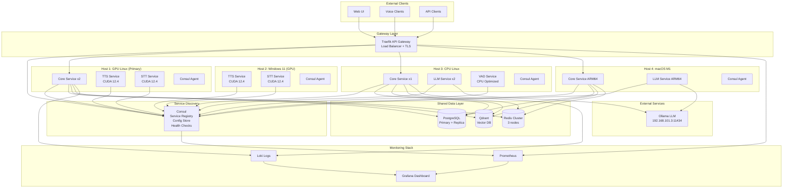
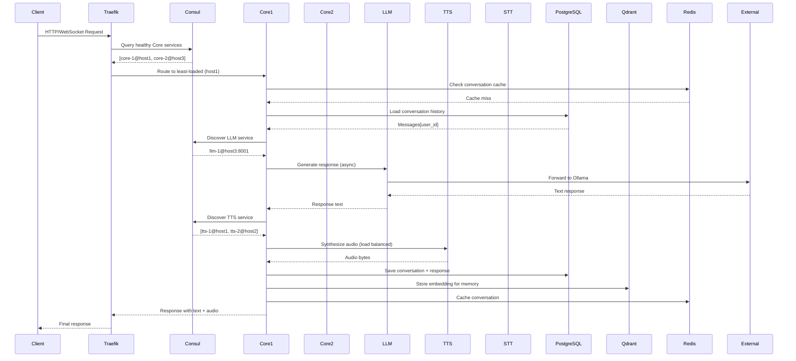
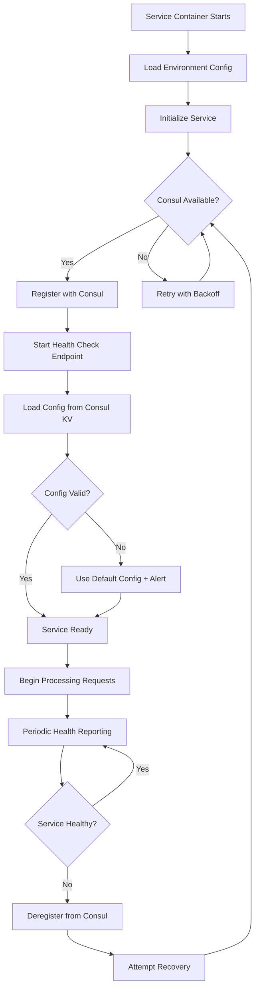
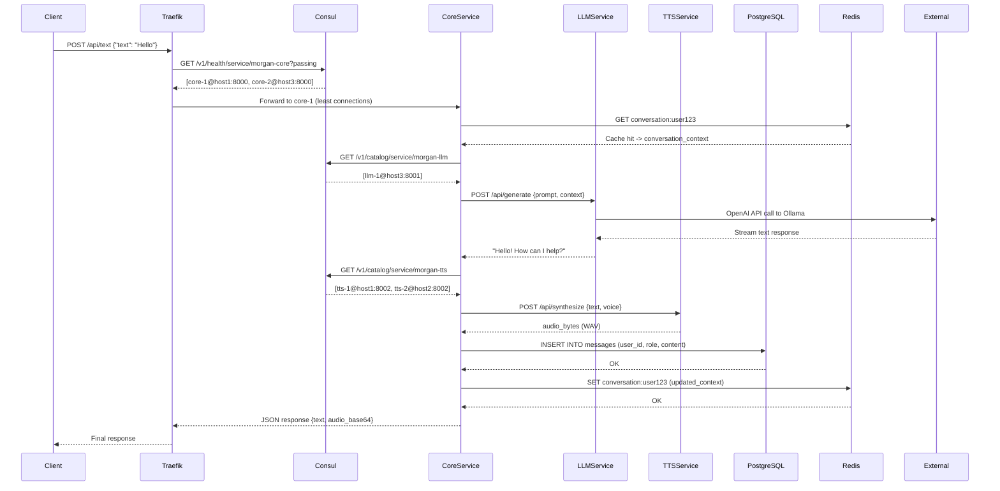
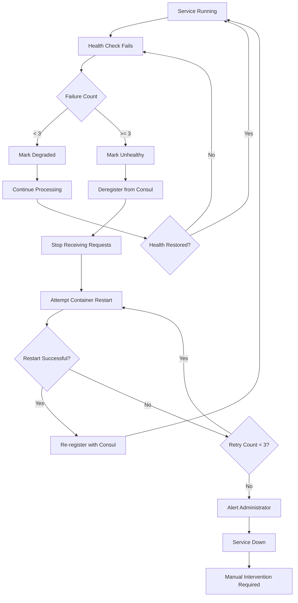

# Morgan Multi-Host MVP - Design Document

> **Version**: 1.0.0
> **Status**: Draft
> **Last Updated**: 2025-11-02
> **Feature**: Multi-Host Self-Hosted AI Assistant

---

## Overview

This design document outlines the architecture for transforming Morgan from a single-host Docker Compose deployment into a distributed multi-host system. The design leverages industry-standard tools for service discovery (Consul), configuration management (Consul KV), container orchestration (Docker Swarm), and load balancing (Traefik) to create a production-ready, self-hosted AI assistant platform.

### Design Goals

1. **Minimal Infrastructure Complexity**: Use lightweight, proven tools instead of heavyweight orchestrators (Kubernetes)
2. **OS-Agnostic**: Support Windows 11, Debian-based Linux, and macOS M1 with platform-specific optimizations
3. **Gradual Migration**: Enable incremental migration from existing single-host setup
4. **Self-Healing**: Automatic service recovery and failover
5. **Developer-Friendly**: Maintain familiar Docker Compose-like experience

---

## Architecture Design

### System Architecture Diagram



### Data Flow Diagram



---

## Component Design

### 1. Service Discovery with Consul

**Responsibilities**:
- Service registration and health monitoring
- DNS-based service discovery
- Key-value configuration store
- Distributed consensus for cluster coordination

**Deployment**:
- 3-node Consul cluster for high availability
- Consul agents on each Docker host
- Services register via Docker labels or API calls

**Configuration Example**:
```yaml
# Consul server (Host 1 - Primary)
services:
  consul-server:
    image: hashicorp/consul:1.17
    command: agent -server -bootstrap-expect=3 -ui -client=0.0.0.0
    environment:
      - CONSUL_BIND_INTERFACE=eth0
    ports:
      - "8500:8500"  # HTTP API + UI
      - "8600:8600/udp"  # DNS
    volumes:
      - consul-data:/consul/data

  # Consul agent (on each host)
  consul-agent:
    image: hashicorp/consul:1.17
    command: agent -retry-join=consul-server -client=0.0.0.0
```

**Service Registration**:
```python
# Core service registration on startup
import consul

consul_client = consul.Consul(host='localhost', port=8500)

service_def = {
    'name': 'morgan-core',
    'id': f'core-{socket.gethostname()}',
    'address': get_host_ip(),
    'port': 8000,
    'tags': ['api', 'core', 'v0.2.0'],
    'check': {
        'http': 'http://localhost:8000/health',
        'interval': '30s',
        'timeout': '5s'
    }
}

consul_client.agent.service.register(**service_def)
```

---

### 2. API Gateway with Traefik

**Responsibilities**:
- Unified entry point for all client requests
- Automatic service discovery via Consul
- TLS termination and certificate management
- Load balancing across service instances
- WebSocket support for real-time audio

**Configuration**:
```yaml
# traefik.yml (static config)
entryPoints:
  web:
    address: ":80"
    http:
      redirections:
        entryPoint:
          to: websecure
          scheme: https
  websecure:
    address: ":443"

providers:
  consulCatalog:
    endpoint:
      address: "consul-server:8500"
    exposedByDefault: false

certificatesResolvers:
  letsencrypt:
    acme:
      email: admin@morgan.local
      storage: /letsencrypt/acme.json
      tlsChallenge: {}

# Dynamic routing via service labels
services:
  core:
    image: morgan-core:latest
    labels:
      - "traefik.enable=true"
      - "traefik.http.routers.core.rule=Host(`morgan.local`)"
      - "traefik.http.routers.core.entrypoints=websecure"
      - "traefik.http.services.core.loadbalancer.server.port=8000"
      - "traefik.http.services.core.loadbalancer.healthcheck.path=/health"
```

---

### 3. Multi-Host Container Orchestration

**Option A: Docker Swarm (Recommended for MVP)**

Docker Swarm provides simple, built-in orchestration without the complexity of Kubernetes.

**Advantages**:
- Native Docker integration (familiar docker-compose.yml syntax)
- Built-in load balancing and service discovery
- Overlay networking for cross-host communication
- Rolling updates and rollbacks
- Windows, Linux, and macOS support

**Setup**:
```bash
# On primary host (Host 1 - GPU Linux)
docker swarm init --advertise-addr 192.168.1.10

# On each additional host
docker swarm join --token <worker-token> 192.168.1.10:2377

# Label nodes for service placement
docker node update --label-add gpu=true --label-add cuda=12.4 host1
docker node update --label-add gpu=true --label-add cuda=12.4 --label-add os=windows host2
docker node update --label-add gpu=false --label-add os=linux host3
docker node update --label-add gpu=false --label-add os=macos --label-add arch=arm64 host4
```

**Service Deployment**:
```yaml
# docker-stack.yml
version: '3.8'

services:
  core:
    image: harbor.in.lazarev.cloud/morgan/core:latest
    deploy:
      mode: replicated
      replicas: 3
      placement:
        constraints:
          - node.labels.os!=windows  # Avoid Windows for core (Python compatibility)
      update_config:
        parallelism: 1
        delay: 10s
      restart_policy:
        condition: on-failure
    environment:
      - CONSUL_HTTP_ADDR=consul-server:8500
    networks:
      - morgan-overlay

  tts-service:
    image: harbor.in.lazarev.cloud/morgan/tts-service:latest
    deploy:
      mode: replicated
      replicas: 2
      placement:
        constraints:
          - node.labels.gpu==true
          - node.labels.cuda==12.4
      resources:
        reservations:
          devices:
            - driver: nvidia
              capabilities: [gpu]
    networks:
      - morgan-overlay

  stt-service:
    image: harbor.in.lazarev.cloud/morgan/stt-service:latest
    deploy:
      mode: replicated
      replicas: 2
      placement:
        constraints:
          - node.labels.gpu==true
    networks:
      - morgan-overlay

  llm-service:
    image: harbor.in.lazarev.cloud/morgan/llm-service:latest
    deploy:
      mode: replicated
      replicas: 3
      placement:
        constraints:
          - node.labels.gpu==false  # CPU-only service
    environment:
      - OLLAMA_BASE_URL=http://192.168.101.3:11434
    networks:
      - morgan-overlay

networks:
  morgan-overlay:
    driver: overlay
    attachable: true
```

**Option B: Docker Compose on Each Host (Simpler Alternative)**

For MVP, we can use separate docker-compose.yml files per host with Consul for service discovery.

---

### 4. Shared Data Layer

#### PostgreSQL with Streaming Replication

**Primary Database (Host 1)**:
- Handles all write operations
- Streaming replication to standby (Host 3)

**Standby Database (Host 3)**:
- Hot standby for read queries
- Automatic failover with `pg_auto_failover` or `Patroni`

**Configuration**:
```yaml
# docker-compose-database.yml (Host 1)
services:
  postgres-primary:
    image: postgres:17-alpine
    environment:
      - POSTGRES_DB=morgan
      - POSTGRES_USER=morgan
      - POSTGRES_PASSWORD=${POSTGRES_PASSWORD}
      - POSTGRES_REPLICATION_USER=replicator
      - POSTGRES_REPLICATION_PASSWORD=${REPLICATION_PASSWORD}
    volumes:
      - postgres-data:/var/lib/postgresql/data
      - ./postgres-primary.conf:/etc/postgresql/postgresql.conf
    command: postgres -c config_file=/etc/postgresql/postgresql.conf
    ports:
      - "5432:5432"

# postgres-primary.conf
wal_level = replica
max_wal_senders = 3
wal_keep_size = 64MB
```

#### Redis Cluster

**3-Node Redis Cluster** for high availability and data sharding:

```yaml
# docker-compose-redis.yml
services:
  redis-1:
    image: redis:7-alpine
    command: redis-server --cluster-enabled yes --cluster-config-file nodes.conf --appendonly yes
    ports:
      - "7001:6379"
    volumes:
      - redis-1-data:/data

  redis-2:
    image: redis:7-alpine
    command: redis-server --cluster-enabled yes --cluster-config-file nodes.conf --appendonly yes
    ports:
      - "7002:6379"
    volumes:
      - redis-2-data:/data

  redis-3:
    image: redis:7-alpine
    command: redis-server --cluster-enabled yes --cluster-config-file nodes.conf --appendonly yes
    ports:
      - "7003:6379"
    volumes:
      - redis-3-data:/data

# Initialize cluster
# docker exec -it redis-1 redis-cli --cluster create \
#   192.168.1.10:7001 192.168.1.11:7002 192.168.1.12:7003 \
#   --cluster-replicas 0
```

#### Qdrant Vector Database

**Single Qdrant Instance** with persistent storage (can scale to cluster later):

```yaml
services:
  qdrant:
    image: qdrant/qdrant:latest
    ports:
      - "6333:6333"  # HTTP
      - "6334:6334"  # gRPC
    volumes:
      - qdrant-data:/qdrant/storage
```

---

### 5. Platform-Specific Adaptations

#### Windows 11 Deployment

**Challenges**:
- NVIDIA Container Toolkit requires WSL2
- Different path separators and networking

**Solution**:
```powershell
# setup-windows.ps1
# Check WSL2 is installed
wsl --list --verbose

# Install Docker Desktop with WSL2 backend
winget install Docker.DockerDesktop

# Install NVIDIA Container Toolkit in WSL2
wsl -d Ubuntu-22.04
curl -fsSL https://nvidia.github.io/libnvidia-container/gpgkey | sudo gpg --dearmor -o /usr/share/keyrings/nvidia-container-toolkit-keyring.gpg
sudo apt-get update
sudo apt-get install -y nvidia-container-toolkit

# Configure Docker to use NVIDIA runtime
sudo nvidia-ctk runtime configure --runtime=docker
sudo systemctl restart docker

# Deploy services
docker compose -f docker-compose-windows.yml up -d
```

**Windows-Specific docker-compose.yml**:
```yaml
# docker-compose-windows.yml
services:
  tts-service:
    image: morgan-tts:latest
    deploy:
      resources:
        reservations:
          devices:
            - driver: nvidia
              count: 1
              capabilities: [gpu]
    environment:
      - CUDA_VISIBLE_DEVICES=0
      - LD_LIBRARY_PATH=/usr/local/cuda/lib64  # Inside WSL2 container
    volumes:
      - //c/Morgan/data:/app/data  # Windows path mapping
```

#### macOS M1 Deployment

**Challenges**:
- No NVIDIA GPU support
- ARM64 architecture requires different images

**Solution**:
```bash
# setup-macos.sh
#!/bin/bash

# Install Homebrew
/bin/bash -c "$(curl -fsSL https://raw.githubusercontent.com/Homebrew/install/HEAD/install.sh)"

# Install Docker
brew install docker docker-compose colima

# Start Docker with Rosetta emulation for x86_64 images (optional)
colima start --cpu 4 --memory 8 --arch aarch64

# Pull ARM64-compatible images
docker pull --platform linux/arm64 morgan-core:latest-arm64
docker pull --platform linux/arm64 morgan-llm:latest-arm64

# Deploy CPU-only services
docker compose -f docker-compose-macos.yml up -d
```

**macOS-Specific docker-compose.yml**:
```yaml
# docker-compose-macos.yml
services:
  core:
    image: morgan-core:latest-arm64
    platform: linux/arm64
    environment:
      - CONSUL_HTTP_ADDR=http://192.168.1.10:8500  # Remote Consul
    networks:
      - morgan-net

  llm-service:
    image: morgan-llm:latest-arm64
    platform: linux/arm64
    environment:
      - OLLAMA_BASE_URL=http://192.168.101.3:11434
    networks:
      - morgan-net

networks:
  morgan-net:
    driver: bridge
```

#### Debian/Ubuntu Linux Deployment

**Standard setup** (already well-supported):
```bash
#!/bin/bash
# setup-linux.sh

# Install Docker
curl -fsSL https://get.docker.com -o get-docker.sh
sudo sh get-docker.sh

# Install NVIDIA Container Toolkit (for GPU hosts)
if lspci | grep -i nvidia; then
    distribution=$(. /etc/os-release;echo $ID$VERSION_ID)
    curl -fsSL https://nvidia.github.io/libnvidia-container/gpgkey | sudo gpg --dearmor -o /usr/share/keyrings/nvidia-container-toolkit-keyring.gpg
    curl -s -L https://nvidia.github.io/libnvidia-container/$distribution/libnvidia-container.list | \
        sed 's#deb https://#deb [signed-by=/usr/share/keyrings/nvidia-container-toolkit-keyring.gpg] https://#g' | \
        sudo tee /etc/apt/sources.list.d/nvidia-container-toolkit.list

    sudo apt-get update
    sudo apt-get install -y nvidia-container-toolkit
    sudo nvidia-ctk runtime configure --runtime=docker
    sudo systemctl restart docker
fi

# Deploy services
docker compose up -d
```

---

## Business Process

### Process 1: Service Startup and Registration



### Process 2: Client Request Processing



### Process 3: Service Failure and Automatic Recovery



---

## Error Handling Strategy

### 1. Network Failures

**Scenario**: Host loses network connectivity

**Handling**:
1. Services detect Consul unavailability
2. Use cached service endpoints for up to 5 minutes
3. Queue write operations to PostgreSQL/Redis
4. When network restores:
   - Re-register with Consul
   - Flush queued operations
   - Sync cached data

### 2. Service Failures

**Scenario**: TTS service crashes on Host 2

**Handling**:
1. Consul health check fails (3x within 90 seconds)
2. Consul removes service from registry
3. Core service queries Consul for healthy TTS instances
4. Requests route to remaining TTS service on Host 1
5. Docker Swarm/restart policy restarts failed container
6. Service re-registers when healthy

### 3. Database Failures

**Scenario**: PostgreSQL primary goes down

**Handling**:
1. Connection errors detected by Core service
2. Automatic failover to PostgreSQL standby (using Patroni)
3. Standby promoted to primary
4. DNS/Consul updated with new primary endpoint
5. Services reconnect to new primary
6. Old primary rejoins as standby when recovered

### 4. Overload Protection

**Scenario**: Sudden traffic spike overwhelms GPU services

**Handling**:
1. Request queue depth exceeds threshold (50 requests)
2. Core service returns HTTP 503 with Retry-After header
3. Clients back off and retry
4. If queue persists, Core service:
   - Enables CPU fallback for TTS/STT
   - Returns degraded responses with warning
   - Alerts administrators to scale GPU capacity

---

## Testing Strategy

### Unit Tests

- Test each service independently with mocked dependencies
- Use pytest for Python services
- Mock Consul, Redis, PostgreSQL clients

### Integration Tests

- Deploy full stack in Docker Compose
- Test service discovery and inter-service communication
- Verify data persistence and retrieval

### Multi-Host Simulation

- Use Docker Compose with multiple docker-compose.yml files
- Simulate network latency with `tc` (traffic control)
- Test failover scenarios by stopping containers

### Load Testing

- Use `locust` or `k6` to generate concurrent requests
- Measure latency and throughput under load
- Identify bottlenecks in service chain

### Chaos Engineering

- Randomly kill services with `chaos-monkey` or manual stops
- Verify automatic recovery and data integrity
- Test network partition scenarios

---

## Deployment Strategy

### Phase 1: Single-Host Baseline (Current State)

- All services on one host with docker-compose.yml
- Validate current functionality

### Phase 2: Add Service Discovery

- Deploy Consul on primary host
- Update services to register with Consul
- Test service discovery without distributing services

### Phase 3: Multi-Host with Docker Compose

- Deploy docker-compose.yml on each host
- Services discover each other via Consul
- Shared databases (PostgreSQL, Redis, Qdrant) on primary host

### Phase 4: Docker Swarm Orchestration (Optional)

- Initialize Swarm cluster
- Convert docker-compose.yml to docker-stack.yml
- Deploy with `docker stack deploy`

### Phase 5: Monitoring and Observability

- Deploy Prometheus, Grafana, Loki
- Configure dashboards for service health
- Set up alerting

---

## Security Considerations

### Mutual TLS (mTLS) for Service Communication

```yaml
# Generate certificates with consul-template or cert-manager
services:
  core:
    environment:
      - CONSUL_HTTP_SSL=true
      - CONSUL_CACERT=/certs/ca.crt
      - CONSUL_CLIENT_CERT=/certs/core.crt
      - CONSUL_CLIENT_KEY=/certs/core.key
    volumes:
      - ./certs:/certs:ro
```

### API Key Authentication

```python
# shared/utils/auth.py
from fastapi import Header, HTTPException

async def verify_api_key(x_api_key: str = Header(...)):
    valid_keys = await get_valid_keys_from_consul()
    if x_api_key not in valid_keys:
        raise HTTPException(status_code=401, detail="Invalid API key")
```

### Secrets Management

Use Consul KV with encryption or external vault:

```bash
# Store secrets in Consul KV
consul kv put -cas secret/postgres/password "secure_password"

# Retrieve in service
import consul
c = consul.Consul()
_, data = c.kv.get('secret/postgres/password')
password = data['Value'].decode('utf-8')
```

---

## Performance Optimizations

### 1. Connection Pooling

```python
# shared/utils/http_client.py
class MorganHTTPClient:
    def __init__(self, base_url: str):
        self.session = aiohttp.ClientSession(
            connector=aiohttp.TCPConnector(
                limit=100,  # Max connections
                limit_per_host=20,
                ttl_dns_cache=300
            )
        )
```

### 2. Caching Strategy

- **L1 Cache**: In-memory LRU cache per service (5 minutes TTL)
- **L2 Cache**: Redis cluster (1 hour TTL)
- **L3 Cache**: PostgreSQL (permanent)

### 3. GPU Memory Management

```python
# services/tts/service.py
import torch

def optimize_gpu_memory():
    if torch.cuda.is_available():
        torch.cuda.empty_cache()
        torch.backends.cudnn.benchmark = True  # Auto-tune kernels
```

---

## Monitoring and Observability

### Metrics to Track

1. **Service Metrics**:
   - Request count, latency (p50, p95, p99)
   - Error rate (4xx, 5xx)
   - Queue depth
   - GPU utilization (CUDA services)

2. **Infrastructure Metrics**:
   - Host CPU, RAM, disk usage
   - Network throughput between hosts
   - Container restart count

3. **Business Metrics**:
   - Active conversations
   - Messages per conversation
   - Average response time (end-to-end)

### Grafana Dashboard Example

```json
{
  "dashboard": {
    "title": "Morgan Multi-Host Overview",
    "panels": [
      {
        "title": "Service Health",
        "targets": [
          {
            "expr": "up{job='morgan-core'}",
            "legendFormat": "{{instance}}"
          }
        ]
      },
      {
        "title": "Request Latency",
        "targets": [
          {
            "expr": "histogram_quantile(0.95, rate(http_request_duration_seconds_bucket[5m]))"
          }
        ]
      }
    ]
  }
}
```

---

## Next Steps

1. ✅ Review and approve this design document
2. Create implementation tasks document (tasks.md)
3. Set up Consul on primary host
4. Update services to support Consul registration
5. Deploy multi-host setup with docker-compose per host
6. Implement monitoring stack
7. Test failover scenarios
8. Document operational runbooks

---

**Document Status**: Ready for review and task planning
**Dependencies**: Requires requirements.md approval
