# Morgan Multi-Host MVP - Implementation Tasks

> **Version**: 1.0.0
> **Status**: Ready for Implementation
> **Last Updated**: 2025-11-02
> **Feature**: Multi-Host Self-Hosted AI Assistant

---

## Implementation Plan

This document provides a comprehensive, step-by-step implementation plan for transforming Morgan into a multi-host distributed system. Each task is designed to be incremental, testable, and builds upon previous tasks.

---

## Phase 1: Foundation - Service Discovery

### Task 1: Set Up Consul Service Discovery

- [ ] 1.1 Deploy Consul server on primary host (Host 1 - GPU Linux)
  - Create `docker-compose-consul.yml` for Consul server
  - Configure Consul with 3-server cluster mode (dev mode acceptable for MVP)
  - Expose ports 8500 (HTTP), 8600 (DNS), 8300-8302 (cluster)
  - Mount persistent volume for Consul data
  - Verify Consul UI accessible at http://localhost:8500
  - _Requirements: 3.1, 3.2_

- [ ] 1.2 Create Consul agent configuration for worker hosts
  - Write `consul-agent-config.hcl` template for worker nodes
  - Configure retry-join to Consul server IP
  - Set datacenter and node metadata (OS, GPU capability)
  - _Requirements: 3.2, 10.1, 10.2, 10.3_

- [ ] 1.3 Implement service registration utility in shared package
  - Create `shared/utils/service_discovery.py` module
  - Write `ConsulRegistry` class with `register_service()` method
  - Implement automatic deregistration on service shutdown
  - Add health check configuration support
  - Write unit tests for registration logic
  - _Requirements: 3.1, 3.2, 3.3_

- [ ] 1.4 Update Core service to register with Consul
  - Import `ConsulRegistry` in `core/app.py`
  - Register Core service on startup with health check endpoint
  - Add graceful deregistration in shutdown handler
  - Test service appears in Consul UI
  - _Requirements: 3.1, 3.2_

- [ ] 1.5 Update LLM, TTS, STT services to register with Consul
  - Modify `services/llm/main.py` to register on startup
  - Modify `services/tts/main.py` to register on startup
  - Modify `services/stt/main.py` to register on startup
  - Add service metadata (version, capabilities) to registration
  - Write integration test to verify all services register correctly
  - _Requirements: 3.1, 3.2_

---

## Phase 2: Service Discovery Integration

### Task 2: Implement Dynamic Service Discovery

- [ ] 2.1 Create service discovery client utility
  - Write `ConsulServiceDiscovery` class in `shared/utils/service_discovery.py`
  - Implement `discover_service(service_name)` method that returns list of healthy endpoints
  - Add caching layer with 30-second TTL to reduce Consul load
  - Write unit tests with mocked Consul responses
  - _Requirements: 3.2, 3.3_

- [ ] 2.2 Update ServiceOrchestrator to use dynamic discovery
  - Modify `core/services/orchestrator.py`
  - Replace hardcoded service URLs with Consul discovery calls
  - Implement load balancing (round-robin) for multiple service instances
  - Add fallback to cached endpoints if Consul is unavailable
  - _Requirements: 3.2, 3.3, 5.1, 5.2_

- [ ] 2.3 Implement health-aware service routing
  - Add health check parsing in `ConsulServiceDiscovery`
  - Filter out services that failed health checks
  - Prefer services with lower response times (if available in Consul metadata)
  - Write integration test simulating service failures
  - _Requirements: 3.3, 5.4, 6.2_

- [ ] 2.4 Add automatic retry logic with failover
  - Modify `MorganHTTPClient` to support multiple endpoints
  - Implement retry on connection failure to next available service
  - Add exponential backoff for transient failures
  - Write unit tests for retry scenarios
  - _Requirements: 5.4, 11.2_

---

## Phase 3: Configuration Management

### Task 3: Centralized Configuration with Consul KV

- [ ] 3.1 Create configuration schema for Consul KV
  - Design key structure: `morgan/config/{service}/{key}`
  - Document all configuration keys in `docs/configuration.md`
  - Create JSON schema for configuration validation
  - _Requirements: 4.1, 4.2_

- [ ] 3.2 Implement Consul KV configuration loader
  - Write `ConsulConfigLoader` class in `shared/config/base.py`
  - Add `load_from_consul(service_name)` method
  - Merge Consul config with local YAML (Consul takes precedence)
  - Support environment variable overrides as highest priority
  - _Requirements: 4.1, 4.2, 4.4_

- [ ] 3.3 Migrate existing YAML configs to Consul KV
  - Write script `scripts/migrate-config-to-consul.py`
  - Read all `config/*.yaml` files
  - Upload to Consul KV under `morgan/config/` namespace
  - Verify configs accessible via Consul UI
  - _Requirements: 4.1_

- [ ] 3.4 Update services to load configuration from Consul
  - Modify `core/main.py` to use `ConsulConfigLoader`
  - Modify `services/llm/main.py` to use Consul config
  - Modify `services/tts/main.py` to use Consul config
  - Modify `services/stt/main.py` to use Consul config
  - Add fallback to local YAML if Consul unavailable
  - _Requirements: 4.2, 4.4_

- [ ] 3.5 Implement configuration change watchers
  - Add Consul watch capability to `ConsulConfigLoader`
  - Trigger service reload/restart on config change
  - Write integration test to verify live config updates
  - _Requirements: 4.1_

---

## Phase 4: API Gateway and Load Balancing

### Task 4: Deploy Traefik API Gateway

- [ ] 4.1 Create Traefik configuration
  - Write `traefik/traefik.yml` static configuration
  - Configure HTTP and HTTPS entry points
  - Enable Consul Catalog provider for service discovery
  - Set up Let's Encrypt for TLS (or self-signed for dev)
  - _Requirements: 12.1, 7.1, 7.2_

- [ ] 4.2 Deploy Traefik as Docker service
  - Create `docker-compose-traefik.yml`
  - Expose ports 80, 443, 8080 (dashboard)
  - Mount Traefik config and certificate storage
  - Verify Traefik dashboard accessible
  - _Requirements: 12.1_

- [ ] 4.3 Add Traefik labels to Core service
  - Update `docker-compose.yml` for Core service
  - Add labels for routing rules (hostname, path)
  - Configure load balancing and health checks
  - Test requests route through Traefik to Core
  - _Requirements: 12.1, 12.2, 5.1_

- [ ] 4.4 Implement sticky sessions for WebSocket connections
  - Add session affinity cookie configuration in Traefik
  - Test WebSocket connections maintain same backend
  - _Requirements: 12.3_

- [ ] 4.5 Add rate limiting middleware
  - Configure Traefik rate limiting plugin
  - Set limits: 100 requests/minute per IP for API
  - Set limits: 10 requests/minute per IP for audio processing
  - Write test to verify rate limiting works
  - _Requirements: 7.5_

---

## Phase 5: Multi-Host Database Setup

### Task 5: PostgreSQL High Availability

- [ ] 5.1 Deploy PostgreSQL primary on Host 1
  - Create `docker-compose-postgres.yml` with PostgreSQL 17
  - Configure streaming replication settings
  - Initialize Morgan database schema
  - Verify database accessible from all hosts
  - _Requirements: 8.1, 8.2_

- [ ] 5.2 Set up PostgreSQL standby replica on Host 3
  - Deploy PostgreSQL standby container
  - Configure streaming replication from primary
  - Test data replication with sample inserts
  - _Requirements: 11.2_

- [ ] 5.3 Implement automatic failover with Patroni (optional)
  - Deploy Patroni alongside PostgreSQL containers
  - Configure etcd for consensus (or use Consul)
  - Test automatic promotion of standby to primary
  - _Requirements: 11.2_

- [ ] 5.4 Update Core service to use connection pooling
  - Modify database client in `core/conversation/manager.py`
  - Use `asyncpg` connection pool with min=5, max=20
  - Add connection retry logic with exponential backoff
  - Write integration test for database failover
  - _Requirements: 8.1, 8.4_

---

### Task 6: Redis Cluster for Caching

- [ ] 6.1 Deploy Redis cluster (3 nodes)
  - Create `docker-compose-redis-cluster.yml`
  - Deploy Redis nodes on Hosts 1, 3, 4
  - Initialize cluster with `redis-cli --cluster create`
  - Verify cluster status
  - _Requirements: 8.3_

- [ ] 6.2 Update Core service to use Redis cluster client
  - Modify `core/conversation/manager.py` to use `redis-py-cluster`
  - Implement cache-aside pattern for conversation context
  - Add TTL of 1 hour for cached conversations
  - Write unit tests for cache operations
  - _Requirements: 8.3_

- [ ] 6.3 Implement cache warming on service startup
  - Load frequently accessed conversations into Redis on Core startup
  - Add background task to refresh hot cache entries
  - _Requirements: 8.3_

---

### Task 7: Qdrant Vector Database

- [ ] 7.1 Deploy Qdrant on Host 1
  - Create `docker-compose-qdrant.yml`
  - Configure persistent storage volume
  - Create Morgan collection with embedding dimensions
  - _Requirements: 8.2_

- [ ] 7.2 Update Core service to use Qdrant for semantic memory
  - Add `qdrant-client` dependency to `requirements-core.txt`
  - Implement `QdrantMemoryStore` in `core/memory/manager.py`
  - Add methods: `store_memory()`, `search_similar()`
  - Write integration test for vector search
  - _Requirements: 8.2_

---

## Phase 6: Platform-Specific Deployment Scripts

### Task 8: Windows 11 Setup Automation

- [ ] 8.1 Create Windows setup script
  - Write `scripts/setup-windows.ps1` PowerShell script
  - Check for WSL2 and prompt installation if missing
  - Install Docker Desktop with WSL2 backend
  - Verify NVIDIA drivers and install Container Toolkit in WSL2
  - _Requirements: 2.1, 9.1_

- [ ] 8.2 Create Windows-specific docker-compose file
  - Write `docker-compose-windows.yml`
  - Configure TTS and STT services with GPU support
  - Use Windows path syntax for volume mounts
  - Set environment variables for CUDA
  - _Requirements: 2.1, 10.1_

- [ ] 8.3 Test Windows deployment end-to-end
  - Run setup script on clean Windows 11 VM
  - Deploy services with `docker-compose -f docker-compose-windows.yml up`
  - Verify GPU utilization with `nvidia-smi`
  - Test TTS and STT API endpoints
  - _Requirements: 2.1, 9.5_

---

### Task 9: macOS M1 Setup Automation

- [ ] 9.1 Create macOS setup script
  - Write `scripts/setup-macos.sh` bash script
  - Install Homebrew if not present
  - Install Docker (via Colima or Docker Desktop)
  - Pull ARM64-compatible images from registry
  - _Requirements: 2.3, 9.3_

- [ ] 9.2 Build ARM64-compatible Docker images
  - Update Dockerfiles to support multi-arch builds
  - Use buildx to create `linux/arm64` images
  - Push images to Harbor with `-arm64` tag
  - _Requirements: 2.3, 10.3_

- [ ] 9.3 Create macOS-specific docker-compose file
  - Write `docker-compose-macos.yml`
  - Deploy Core and LLM services (CPU-only)
  - Configure network to connect to remote Consul
  - _Requirements: 2.3, 10.3_

- [ ] 9.4 Test macOS deployment end-to-end
  - Run setup script on macOS M1 device
  - Deploy services with `docker-compose -f docker-compose-macos.yml up`
  - Verify Core service registers with remote Consul
  - Test text processing API endpoint
  - _Requirements: 2.3, 9.5_

---

### Task 10: Debian/Ubuntu Linux Setup Automation

- [ ] 10.1 Create Linux setup script
  - Write `scripts/setup-linux.sh` bash script
  - Install Docker Engine using official repository
  - Detect GPU and install NVIDIA Container Toolkit if present
  - Configure Docker daemon for GPU support
  - _Requirements: 2.2, 9.2_

- [ ] 10.2 Create GPU-enabled docker-compose file
  - Write `docker-compose-linux-gpu.yml`
  - Deploy TTS, STT services with CUDA support
  - Configure NVIDIA runtime and device reservations
  - _Requirements: 2.2, 10.1, 10.2_

- [ ] 10.3 Create CPU-only docker-compose file
  - Write `docker-compose-linux-cpu.yml`
  - Deploy Core, LLM, VAD services without GPU requirements
  - Optimize for CPU performance (set thread counts)
  - _Requirements: 2.2, 10.3_

- [ ] 10.4 Test Linux deployment on GPU host
  - Run setup script on Ubuntu 22.04 with NVIDIA GPU
  - Deploy GPU services
  - Verify GPU utilization
  - _Requirements: 2.2, 9.5_

- [ ] 10.5 Test Linux deployment on CPU-only host
  - Run setup script on Debian without GPU
  - Deploy CPU services
  - Verify services register with Consul
  - _Requirements: 2.2, 9.5_

---

## Phase 7: Monitoring and Observability

### Task 11: Prometheus Metrics Collection

- [ ] 11.1 Add Prometheus instrumentation to services
  - Install `prometheus-client` library
  - Add metrics middleware to FastAPI in `shared/utils/middleware.py`
  - Expose `/metrics` endpoint on all services
  - Track request count, latency, error rate
  - _Requirements: 6.5_

- [ ] 11.2 Deploy Prometheus server
  - Create `docker-compose-monitoring.yml`
  - Configure Prometheus to scrape all service `/metrics` endpoints
  - Use Consul service discovery for dynamic targets
  - Set up retention period and storage
  - _Requirements: 6.5_

- [ ] 11.3 Configure Prometheus alerting rules
  - Create `prometheus/alerts.yml`
  - Define alerts: service down, high error rate, high latency
  - Configure Alertmanager for notifications (email, Slack)
  - _Requirements: 6.2_

---

### Task 12: Grafana Dashboards

- [ ] 12.1 Deploy Grafana
  - Add Grafana to `docker-compose-monitoring.yml`
  - Configure Prometheus as data source
  - Set up persistent storage for dashboards
  - _Requirements: 6.3_

- [ ] 12.2 Create system overview dashboard
  - Build Grafana dashboard showing:
    - All hosts with CPU, RAM, GPU metrics
    - All services with health status
    - Request throughput and latency graphs
  - Export dashboard JSON to `monitoring/dashboards/`
  - _Requirements: 6.3_

- [ ] 12.3 Create service-specific dashboards
  - Create dashboard for Core service (requests, conversations)
  - Create dashboard for GPU services (TTS/STT throughput, GPU utilization)
  - Create dashboard for databases (PostgreSQL, Redis, Qdrant)
  - _Requirements: 6.3_

---

### Task 13: Centralized Logging with Loki

- [ ] 13.1 Deploy Loki and Promtail
  - Add Loki and Promtail to `docker-compose-monitoring.yml`
  - Configure Promtail to collect logs from all containers
  - Set up log retention and compaction
  - _Requirements: 6.4_

- [ ] 13.2 Update services to output structured JSON logs
  - Modify logger in `shared/utils/logging.py` to output JSON format
  - Include metadata: service_name, host, request_id, user_id
  - _Requirements: 6.4_

- [ ] 13.3 Create Loki queries and alerts
  - Configure log-based alerts for errors (e.g., 5xx responses)
  - Create saved queries for common troubleshooting scenarios
  - Integrate Loki with Grafana
  - _Requirements: 6.4_

---

## Phase 8: Multi-Host Orchestration

### Task 14: Docker Swarm Setup (Recommended)

- [ ] 14.1 Initialize Docker Swarm on primary host
  - Run `docker swarm init` on Host 1
  - Note join token for worker nodes
  - _Requirements: 1.1_

- [ ] 14.2 Join worker hosts to Swarm
  - Run `docker swarm join` on Hosts 2, 3, 4
  - Verify all nodes with `docker node ls`
  - _Requirements: 1.1_

- [ ] 14.3 Label nodes with capabilities
  - Add labels for GPU, OS, architecture
  - Use labels: `gpu=true`, `os=linux`, `arch=amd64`, `cuda=12.4`
  - _Requirements: 10.1, 10.2, 10.3_

- [ ] 14.4 Convert docker-compose.yml to docker-stack.yml
  - Create `docker-stack.yml` for Swarm deployment
  - Add placement constraints based on node labels
  - Configure replicas and update strategy
  - _Requirements: 1.1, 1.2_

- [ ] 14.5 Deploy stack to Swarm
  - Run `docker stack deploy -c docker-stack.yml morgan`
  - Verify services distributed across nodes
  - Test service discovery and communication
  - _Requirements: 1.1, 1.3_

---

### Task 15: Alternative - Multi-Host Docker Compose

- [ ] 15.1 Create per-host docker-compose files
  - `docker-compose-host1.yml` (GPU Linux - Core, TTS, STT)
  - `docker-compose-host2.yml` (Windows GPU - TTS, STT)
  - `docker-compose-host3.yml` (CPU Linux - Core, LLM, VAD)
  - `docker-compose-host4.yml` (macOS M1 - Core, LLM)
  - _Requirements: 1.1, 1.2_

- [ ] 15.2 Configure services to use Consul for discovery
  - Set `CONSUL_HTTP_ADDR` environment variable in all compose files
  - Verify services on different hosts can discover each other
  - _Requirements: 3.2_

- [ ] 15.3 Create deployment script for multi-host setup
  - Write `scripts/deploy-multi-host.sh`
  - SSH to each host and run `docker-compose up -d`
  - Verify all services healthy via Consul
  - _Requirements: 9.4_

---

## Phase 9: Security Hardening

### Task 16: Mutual TLS for Service Communication

- [ ] 16.1 Generate TLS certificates for services
  - Use `cfssl` or `openssl` to create CA certificate
  - Generate service certificates signed by CA
  - Store certificates in `certs/` directory
  - _Requirements: 7.1, 7.3_

- [ ] 16.2 Configure services to use mTLS
  - Update `MorganHTTPClient` to load client certificates
  - Configure FastAPI to require client certificates
  - Test authenticated service communication
  - _Requirements: 7.1_

- [ ] 16.3 Configure Consul with TLS
  - Enable TLS for Consul HTTP API and gossip
  - Distribute CA certificate to all Consul agents
  - Verify encrypted Consul communication
  - _Requirements: 7.1, 7.3_

---

### Task 17: API Key Authentication

- [ ] 17.1 Implement API key middleware
  - Create `shared/utils/auth.py` module
  - Write `verify_api_key()` dependency for FastAPI
  - Store API keys in Consul KV (encrypted)
  - _Requirements: 7.2_

- [ ] 17.2 Add authentication to Core service endpoints
  - Protect `/api/text` and `/api/audio` with API key check
  - Allow health check endpoint to remain public
  - Return 401 for invalid/missing API keys
  - _Requirements: 7.2, 7.4_

- [ ] 17.3 Create API key management CLI
  - Write `scripts/manage-api-keys.py`
  - Support create, list, revoke operations
  - Store keys in Consul KV with metadata (user, expiry)
  - _Requirements: 7.2_

---

## Phase 10: High Availability and Failover

### Task 18: Service Redundancy

- [ ] 18.1 Deploy multiple Core service instances
  - Run 3 Core replicas across Hosts 1, 3, 4
  - Verify load balancing via Traefik
  - Test killing one instance and observing traffic shift
  - _Requirements: 11.1, 5.1_

- [ ] 18.2 Deploy redundant GPU services
  - Run TTS on Hosts 1 and 2 (both GPU-capable)
  - Run STT on Hosts 1 and 2
  - Test failover when one GPU service fails
  - _Requirements: 11.4, 5.4_

- [ ] 18.3 Implement graceful shutdown
  - Add signal handlers in `core/main.py` for SIGTERM
  - Drain in-flight requests before exiting
  - Deregister from Consul before shutdown
  - Write integration test for graceful shutdown
  - _Requirements: 11.5_

---

### Task 19: Database Failover Testing

- [ ] 19.1 Simulate PostgreSQL primary failure
  - Stop PostgreSQL primary container
  - Verify automatic promotion of standby (if using Patroni)
  - Check Core service reconnects to new primary
  - Verify no data loss
  - _Requirements: 11.2_

- [ ] 19.2 Implement database connection retry logic
  - Add retry logic in `core/conversation/manager.py`
  - Use exponential backoff with max 5 retries
  - Write unit test for database reconnection
  - _Requirements: 8.4_

---

## Phase 11: Performance Testing and Optimization

### Task 20: Load Testing

- [ ] 20.1 Set up load testing framework
  - Install `locust` or `k6`
  - Write load test scenarios: text requests, audio processing
  - Configure test to simulate 50 concurrent users
  - _Requirements: Performance non-functional requirements_

- [ ] 20.2 Run baseline performance tests
  - Measure p50, p95, p99 latency for text and audio requests
  - Identify bottlenecks (CPU, GPU, network, database)
  - Document baseline metrics
  - _Requirements: Performance non-functional requirements_

- [ ] 20.3 Optimize identified bottlenecks
  - Increase connection pool sizes if database is bottleneck
  - Add caching for frequently accessed data
  - Optimize GPU batch sizes for TTS/STT
  - _Requirements: 10.4, 10.5_

- [ ] 20.4 Re-run tests and validate improvements
  - Run same load tests after optimizations
  - Verify p95 latency < 2 seconds for text requests
  - Document performance improvements
  - _Requirements: Performance non-functional requirements_

---

## Phase 12: End-to-End Testing

### Task 21: Integration Testing

- [ ] 21.1 Write end-to-end test suite
  - Create `tests/e2e/test_multi_host.py`
  - Test text request flow across all services
  - Test audio processing flow (STT + LLM + TTS)
  - Test conversation persistence and retrieval
  - _Requirements: All functional requirements_

- [ ] 21.2 Write chaos engineering tests
  - Test service failure scenarios (kill random services)
  - Test network partition scenarios (block traffic between hosts)
  - Test database failover scenarios
  - Verify system recovers automatically
  - _Requirements: 11.1, 11.2, 11.3, 11.4_

- [ ] 21.3 Write multi-platform deployment tests
  - Automate deployment on Windows 11 VM
  - Automate deployment on Ubuntu VM with GPU
  - Automate deployment on macOS M1 VM
  - Verify all hosts join Consul cluster
  - _Requirements: 2.1, 2.2, 2.3_

---

## Phase 13: Documentation and Operations

### Task 22: Operational Documentation

- [ ] 22.1 Write deployment runbooks
  - Create `docs/operations/deployment.md`
  - Document step-by-step deployment for each OS
  - Include troubleshooting section
  - _Requirements: 9.1, 9.2, 9.3_

- [ ] 22.2 Write troubleshooting guide
  - Create `docs/operations/troubleshooting.md`
  - Document common issues and resolutions
  - Include log analysis examples
  - _Requirements: 6.3, 6.4_

- [ ] 22.3 Create architecture diagrams
  - Update `docs/architecture/ARCHITECTURE.md`
  - Include multi-host topology diagram
  - Document service dependencies
  - _Requirements: All design requirements_

- [ ] 22.4 Write operational procedures
  - Document backup and restore procedures
  - Document scaling procedures (add/remove hosts)
  - Document certificate rotation procedures
  - _Requirements: 11.5_

---

## Task Dependency Diagram

```mermaid
flowchart TD
    %% Phase 1: Service Discovery Foundation
    T1_1[1.1: Deploy Consul Server]
    T1_2[1.2: Consul Agent Config]
    T1_3[1.3: Service Registration Utility]
    T1_4[1.4: Core Service Registration]
    T1_5[1.5: All Services Registration]

    T1_1 --> T1_2
    T1_1 --> T1_3
    T1_3 --> T1_4
    T1_4 --> T1_5

    %% Phase 2: Service Discovery Integration
    T2_1[2.1: Service Discovery Client]
    T2_2[2.2: Update Orchestrator]
    T2_3[2.3: Health-Aware Routing]
    T2_4[2.4: Retry with Failover]

    T1_5 --> T2_1
    T2_1 --> T2_2
    T2_2 --> T2_3
    T2_3 --> T2_4

    %% Phase 3: Configuration Management
    T3_1[3.1: Config Schema Design]
    T3_2[3.2: Consul KV Loader]
    T3_3[3.3: Migrate YAML to Consul]
    T3_4[3.4: Update Services for Consul Config]
    T3_5[3.5: Config Change Watchers]

    T1_1 --> T3_1
    T3_1 --> T3_2
    T3_2 --> T3_3
    T3_3 --> T3_4
    T3_4 --> T3_5

    %% Phase 4: API Gateway
    T4_1[4.1: Traefik Configuration]
    T4_2[4.2: Deploy Traefik]
    T4_3[4.3: Add Traefik Labels to Core]
    T4_4[4.4: Sticky Sessions]
    T4_5[4.5: Rate Limiting]

    T1_1 --> T4_1
    T4_1 --> T4_2
    T4_2 --> T4_3
    T4_3 --> T4_4
    T4_3 --> T4_5

    %% Phase 5: PostgreSQL HA
    T5_1[5.1: PostgreSQL Primary]
    T5_2[5.2: PostgreSQL Standby]
    T5_3[5.3: Patroni Failover]
    T5_4[5.4: Connection Pooling]

    T5_1 --> T5_2
    T5_2 --> T5_3
    T5_1 --> T5_4

    %% Phase 6: Redis Cluster
    T6_1[6.1: Redis Cluster Deploy]
    T6_2[6.2: Redis Cluster Client]
    T6_3[6.3: Cache Warming]

    T6_1 --> T6_2
    T6_2 --> T6_3

    %% Phase 7: Qdrant
    T7_1[7.1: Qdrant Deploy]
    T7_2[7.2: Qdrant Integration]

    T7_1 --> T7_2

    %% Phase 8: Platform Scripts - Windows
    T8_1[8.1: Windows Setup Script]
    T8_2[8.2: Windows docker-compose]
    T8_3[8.3: Test Windows Deployment]

    T8_1 --> T8_2
    T8_2 --> T8_3

    %% Phase 9: Platform Scripts - macOS
    T9_1[9.1: macOS Setup Script]
    T9_2[9.2: ARM64 Docker Images]
    T9_3[9.3: macOS docker-compose]
    T9_4[9.4: Test macOS Deployment]

    T9_1 --> T9_2
    T9_2 --> T9_3
    T9_3 --> T9_4

    %% Phase 10: Platform Scripts - Linux
    T10_1[10.1: Linux Setup Script]
    T10_2[10.2: Linux GPU docker-compose]
    T10_3[10.3: Linux CPU docker-compose]
    T10_4[10.4: Test Linux GPU Deployment]
    T10_5[10.5: Test Linux CPU Deployment]

    T10_1 --> T10_2
    T10_1 --> T10_3
    T10_2 --> T10_4
    T10_3 --> T10_5

    %% Phase 11: Monitoring - Prometheus
    T11_1[11.1: Prometheus Instrumentation]
    T11_2[11.2: Deploy Prometheus]
    T11_3[11.3: Alerting Rules]

    T11_1 --> T11_2
    T11_2 --> T11_3

    %% Phase 12: Monitoring - Grafana
    T12_1[12.1: Deploy Grafana]
    T12_2[12.2: System Dashboard]
    T12_3[12.3: Service Dashboards]

    T11_2 --> T12_1
    T12_1 --> T12_2
    T12_2 --> T12_3

    %% Phase 13: Logging
    T13_1[13.1: Deploy Loki]
    T13_2[13.2: Structured JSON Logs]
    T13_3[13.3: Loki Queries]

    T13_1 --> T13_2
    T13_2 --> T13_3

    %% Phase 14: Orchestration - Docker Swarm
    T14_1[14.1: Init Swarm]
    T14_2[14.2: Join Workers]
    T14_3[14.3: Label Nodes]
    T14_4[14.4: Create Stack File]
    T14_5[14.5: Deploy Stack]

    T14_1 --> T14_2
    T14_2 --> T14_3
    T14_3 --> T14_4
    T14_4 --> T14_5

    %% Phase 15: Alternative - Multi-Host Compose
    T15_1[15.1: Per-Host Compose Files]
    T15_2[15.2: Configure Consul Discovery]
    T15_3[15.3: Deployment Script]

    T2_4 --> T15_1
    T3_5 --> T15_1
    T15_1 --> T15_2
    T15_2 --> T15_3

    %% Phase 16: Security - mTLS
    T16_1[16.1: Generate TLS Certs]
    T16_2[16.2: Configure mTLS]
    T16_3[16.3: Consul TLS]

    T16_1 --> T16_2
    T16_1 --> T16_3

    %% Phase 17: Security - API Keys
    T17_1[17.1: API Key Middleware]
    T17_2[17.2: Protect Endpoints]
    T17_3[17.3: Key Management CLI]

    T17_1 --> T17_2
    T17_2 --> T17_3

    %% Phase 18: High Availability
    T18_1[18.1: Multiple Core Instances]
    T18_2[18.2: Redundant GPU Services]
    T18_3[18.3: Graceful Shutdown]

    T4_3 --> T18_1
    T2_4 --> T18_2
    T18_1 --> T18_3

    %% Phase 19: Database Failover
    T19_1[19.1: Test PostgreSQL Failover]
    T19_2[19.2: DB Retry Logic]

    T5_3 --> T19_1
    T5_4 --> T19_2

    %% Phase 20: Performance Testing
    T20_1[20.1: Setup Load Testing]
    T20_2[20.2: Baseline Tests]
    T20_3[20.3: Optimize Bottlenecks]
    T20_4[20.4: Validate Improvements]

    T18_3 --> T20_1
    T20_1 --> T20_2
    T20_2 --> T20_3
    T20_3 --> T20_4

    %% Phase 21: E2E Testing
    T21_1[21.1: E2E Test Suite]
    T21_2[21.2: Chaos Tests]
    T21_3[21.3: Multi-Platform Tests]

    T20_4 --> T21_1
    T19_1 --> T21_2
    T8_3 --> T21_3
    T9_4 --> T21_3
    T10_5 --> T21_3

    %% Phase 22: Documentation
    T22_1[22.1: Deployment Runbooks]
    T22_2[22.2: Troubleshooting Guide]
    T22_3[22.3: Architecture Diagrams]
    T22_4[22.4: Operational Procedures]

    T21_3 --> T22_1
    T13_3 --> T22_2
    T14_5 --> T22_3
    T19_1 --> T22_4

    %% Styling
    style T1_1 fill:#e1f5fe
    style T2_1 fill:#e1f5fe
    style T3_1 fill:#e1f5fe
    style T4_1 fill:#e1f5fe
    style T5_1 fill:#fff3e0
    style T6_1 fill:#fff3e0
    style T7_1 fill:#fff3e0
    style T8_1 fill:#f3e5f5
    style T9_1 fill:#f3e5f5
    style T10_1 fill:#f3e5f5
    style T11_1 fill:#e8f5e9
    style T12_1 fill:#e8f5e9
    style T13_1 fill:#e8f5e9
    style T14_1 fill:#fff9c4
    style T15_1 fill:#fff9c4
    style T16_1 fill:#fce4ec
    style T17_1 fill:#fce4ec
    style T18_1 fill:#ffebee
    style T19_1 fill:#ffebee
    style T20_1 fill:#e0f2f1
    style T21_1 fill:#e0f7fa
    style T22_1 fill:#f1f8e9
```

---

## MVP Acceptance Criteria

The multi-host MVP is considered complete when all of the following are verified:

- [ ] ✅ Morgan operates across at least 3 hosts (1 GPU Linux, 1 Windows 11, 1 CPU Linux or macOS)
- [ ] ✅ All services automatically register with Consul on startup
- [ ] ✅ Services discover each other dynamically via Consul (no hardcoded URLs)
- [ ] ✅ Configuration is stored in Consul KV and loaded by services
- [ ] ✅ Traefik API gateway routes requests to Core services with load balancing
- [ ] ✅ PostgreSQL primary-standby replication is working
- [ ] ✅ Redis cluster is operational with 3 nodes
- [ ] ✅ Conversation history is accessible from any Core instance
- [ ] ✅ Grafana dashboard shows all hosts, services, and metrics
- [ ] ✅ Centralized logging with Loki aggregates logs from all services
- [ ] ✅ Automated deployment scripts work for Windows 11, Debian, and macOS M1
- [ ] ✅ End-to-end integration tests pass (text and audio processing)
- [ ] ✅ Chaos tests demonstrate automatic recovery from service failures
- [ ] ✅ System achieves <2 second p95 latency for text requests under load
- [ ] ✅ GPU services utilize NVIDIA GPUs on Windows and Linux hosts
- [ ] ✅ macOS M1 host runs ARM64-optimized services successfully

---

## Post-MVP Enhancements (Out of Scope)

The following enhancements are **not required** for MVP but can be implemented in future iterations:

- Kubernetes migration for advanced orchestration
- Automatic scaling based on load metrics
- Advanced GPU scheduling with multi-GPU support
- Geographic distribution across multiple data centers
- Mobile client applications
- Advanced NLP features (sentiment analysis, entity recognition)
- Integration with additional smart home platforms
- Web-based administration UI
- Advanced security (WAF, IDS/IPS, DDoS mitigation)
- Multi-tenancy support

---

**Document Status**: Ready for implementation
**Estimated Effort**: 4-6 weeks for full MVP (with 1 developer)
**Dependencies**: Requires approval of requirements.md and design.md

---

## Notes for Implementation

1. **Incremental Approach**: Each task is designed to be completed independently and adds value
2. **Testing**: Write tests for each task before moving to the next
3. **Documentation**: Update documentation as you implement features
4. **Version Control**: Commit after completing each task
5. **Validation**: Verify each task's acceptance criteria before marking complete

Start with Phase 1 (Service Discovery) as it's foundational for all other phases.
