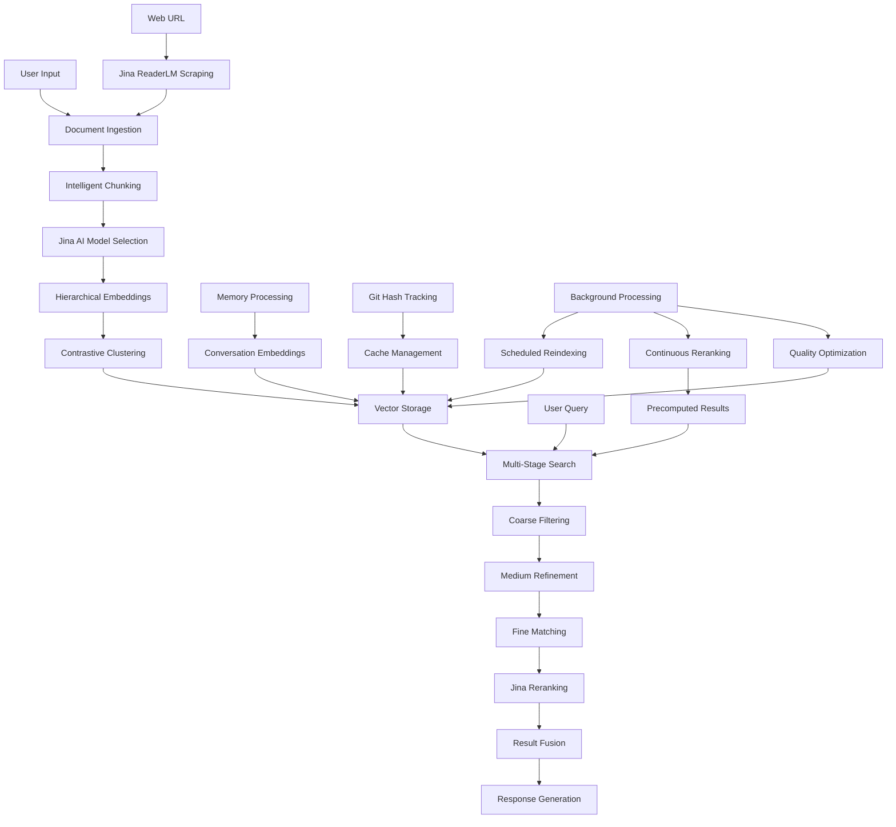
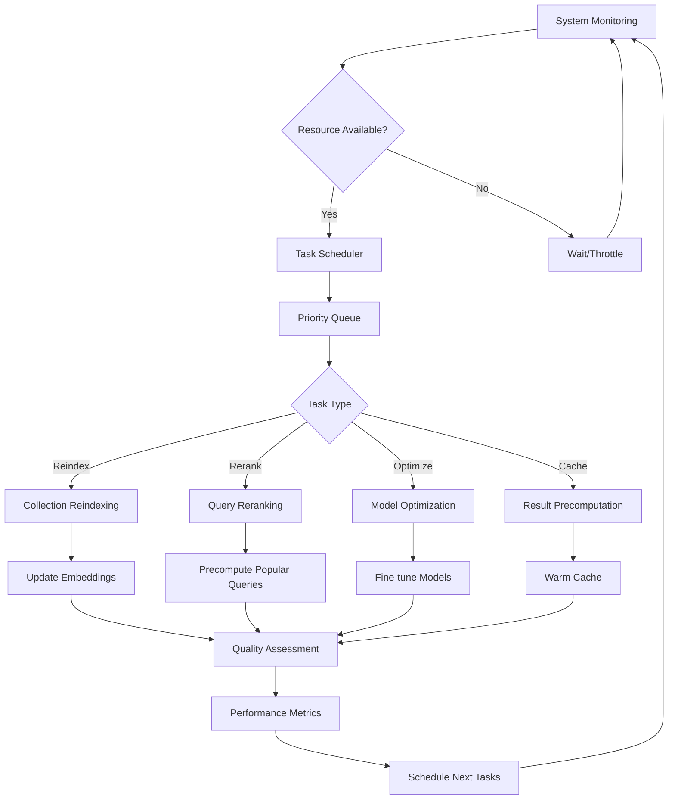
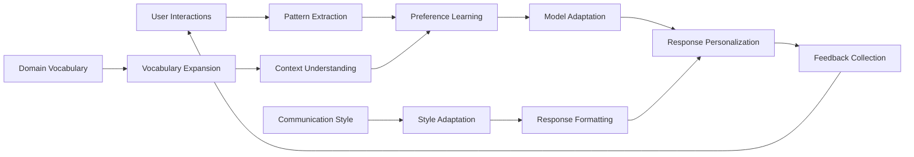
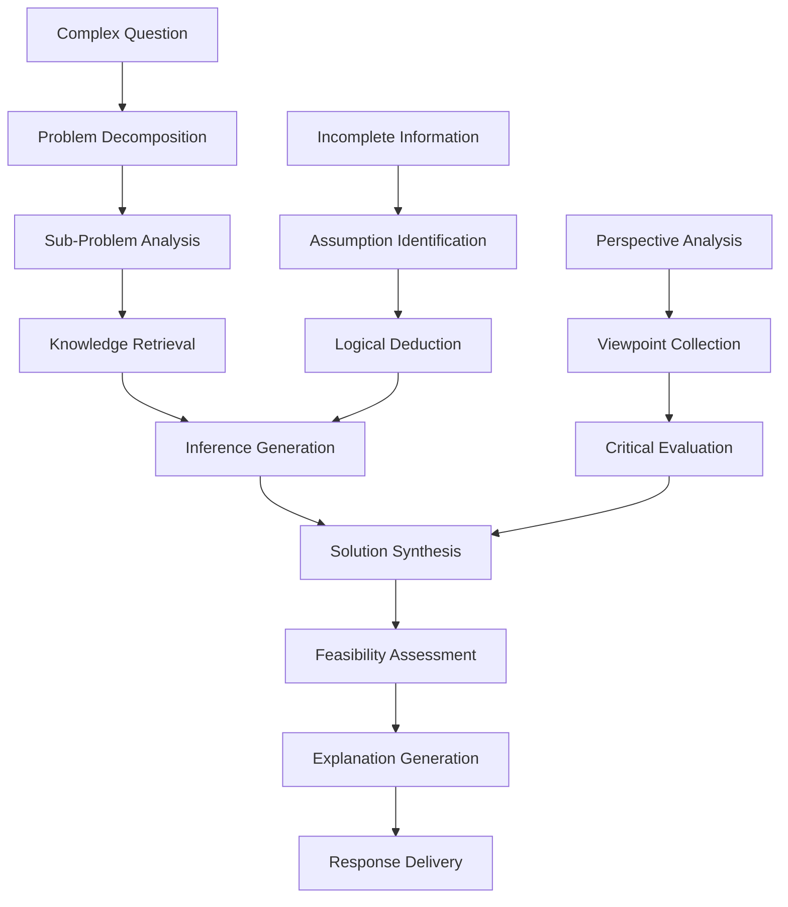

# Design Document

## Overview

This design document outlines the architecture for enhancing Morgan RAG - a **companion AI assistant** - with an advanced vectorization and search system inspired by InspecTor's proven production patterns. Morgan is designed to be a helpful, empathetic companion that learns from interactions, remembers personal context, and builds meaningful relationships with users over time.

The system will implement state-of-the-art 2025 vectorization techniques including hierarchical embeddings, contrastive clustering, multi-stage search, and intelligent caching while maintaining Morgan's KISS principles and **human-first companion approach**. 

The enhanced system will provide Morgan with sophisticated document processing capabilities AND emotional intelligence, achieving 90% search candidate reduction, 6x-180x performance improvements through caching, and production-grade accuracy while keeping interactions natural, empathetic, and personally meaningful.

## Architecture

### High-Level System Flow



### Core Architecture Components

The system follows a modular architecture with clear separation of concerns:

1. **Document Processing Layer**: Handles ingestion, chunking, and preprocessing
2. **Vectorization Layer**: Creates hierarchical embeddings with contrastive clustering
3. **Storage Layer**: Manages vector database with intelligent caching
4. **Search Layer**: Implements multi-stage search with result fusion
5. **Memory Layer**: Processes and stores conversation memories with emotional context
6. **Emotional Intelligence Layer**: Tracks user mood, preferences, and relationship dynamics
7. **Companion Layer**: Provides empathetic, personalized interactions and relationship building
8. **Jina AI Integration Layer**: Manages advanced embedding models, reranking, and web scraping
9. **API Layer**: Provides simple, human-friendly interfaces with emotional awareness

## Components and Interfaces

### Modular Architecture Principles

**KISS Design Philosophy:**
- **Single Responsibility**: Each component has one clear purpose
- **Simple Interfaces**: Minimal, focused APIs
- **Composition over Inheritance**: Build complex behavior from simple parts
- **Clear Separation**: Distinct modules for distinct concerns

### Module Organization

```
morgan/
├── jina/                    # Jina AI integration (NEW)
├── background/              # Background processing (NEW)  
├── local/                   # Local model management (NEW)
├── personalization/         # Learning and adaptation (NEW)
├── reasoning/               # Deep thinking engine (NEW)
├── ingestion/              # Document processing (EXISTING)
├── vectorization/          # Embedding generation (EXISTING)
├── search/                 # Search functionality (EXISTING)
├── memory/                 # Memory processing (EXISTING)
├── companion/              # Companion features (EXISTING)
├── emotional/              # Emotional intelligence (EXISTING)
├── caching/                # Caching system (EXISTING)
├── vector_db/              # Database client (EXISTING)
├── monitoring/             # System monitoring (EXISTING)
└── core/                   # Core orchestration (EXISTING)
```

### Operational Constraints

- **OpenAI-Compatible Endpoints**: All embedding/LLM requests MUST target the configured OpenAI-compatible API base URL/IP when reachable. The system MAY fall back to approved local HuggingFace/`sentence-transformers` models (e.g., self-hosted Jina checkpoints) but MUST log the fallback decision.
- **CLI-First Workflows**: Ingestion, search, and validation flows MUST remain fully operable via CLI/bash commands (`morgan learn`, `morgan ask`, background management scripts) so that operators can run Morgan headlessly without GUI dependencies.

### 1. Enhanced Document Processor

**Purpose**: Intelligent document processing with semantic-aware chunking

**Location**: `morgan/ingestion/enhanced_processor.py`

**Key Features**:
- Multi-format support (PDF, Markdown, Code, Web)
- Semantic boundary detection
- Context-preserving chunking
- Metadata extraction and enrichment

**Interface**:
```python
class EnhancedDocumentProcessor:
    def process_documents(
        self, 
        source_path: str,
        document_type: str = "auto",
        chunk_strategy: str = "semantic"
    ) -> ProcessingResult
    
    def chunk_document(
        self,
        content: str,
        document_type: str,
        max_chunk_size: int = 1000,
        overlap_size: int = 50
    ) -> List[DocumentChunk]
    
    def extract_metadata(
        self,
        content: str,
        source_path: str
    ) -> Dict[str, Any]
```

**Chunking Strategies**:
- **Semantic**: Respects paragraph and section boundaries
- **Code**: Respects function and class boundaries
- **Structured**: Preserves headers and hierarchical context
- **Hybrid**: Combines multiple strategies based on content type

### 2. Hierarchical Embedding Service

**Purpose**: Generate multi-scale embeddings for efficient search

**Location**: `morgan/vectorization/hierarchical_embeddings.py`

**Key Features**:
- Three-scale embedding generation (coarse, medium, fine)
- Matryoshka-inspired architecture
- Category-aware text construction
- Batch processing optimization

**Interface**:
```python
class HierarchicalEmbeddingService:
    def create_hierarchical_embeddings(
        self,
        content: str,
        metadata: Dict[str, Any],
        category: str
    ) -> HierarchicalEmbedding
    
    def build_coarse_text(
        self,
        content: str,
        category: str,
        metadata: Dict[str, Any]
    ) -> str
    
    def build_medium_text(
        self,
        content: str,
        category: str,
        metadata: Dict[str, Any]
    ) -> str
    
    def build_fine_text(
        self,
        content: str,
        category: str,
        metadata: Dict[str, Any]
    ) -> str
```

**Embedding Scales**:
- **Coarse**: Category + high-level topics (fast filtering)
- **Medium**: Section headers + key concepts (pattern matching)
- **Fine**: Full content with complete context (precise retrieval)

### 3. Contrastive Clustering Engine

**Purpose**: Apply category-specific bias for improved clustering

**Location**: `morgan/vectorization/contrastive_clustering.py`

**Key Features**:
- Category-specific bias vectors
- Reproducible clustering (same category = same bias)
- Scale-aware bias strength
- Normalized embedding output

**Interface**:
```python
class ContrastiveClusteringEngine:
    def apply_contrastive_bias(
        self,
        embedding: List[float],
        category: str,
        scale: str
    ) -> List[float]
    
    def generate_category_bias(
        self,
        category: str,
        embedding_dim: int
    ) -> List[float]
    
    def normalize_embedding(
        self,
        embedding: List[float]
    ) -> List[float]
```

**Bias Strengths**:
- **Coarse**: 1.5x multiplier (strongest for category filtering)
- **Medium**: 1.0x multiplier (balanced for pattern matching)
- **Fine**: 0.5x multiplier (weakest for precise retrieval)

### 4. Multi-Stage Search Engine

**Purpose**: Comprehensive search using multiple strategies with result fusion

**Location**: `morgan/search/multi_stage_search.py`

**Key Features**:
- Six search strategies with specialized focus
- Reciprocal Rank Fusion for result merging
- Intelligent deduplication
- Performance optimization

**Interface**:
```python
class MultiStageSearchEngine:
    def search(
        self,
        query: str,
        max_results: int = 10,
        strategies: List[str] = None
    ) -> SearchResults
    
    def semantic_search(
        self,
        query: str,
        collection: str,
        scale: str = "hierarchical"
    ) -> List[SearchResult]
    
    def fusion_results(
        self,
        result_lists: List[List[SearchResult]],
        k: int = 60
    ) -> List[SearchResult]
```

**Search Strategies**:
1. **Semantic Search**: Vector similarity across all scales
2. **Keyword Search**: Traditional text matching
3. **Category Search**: Filter by document categories
4. **Temporal Search**: Weight by recency and relevance
5. **Memory Search**: Search conversation history
6. **Contextual Search**: Use conversation context for personalization

### 5. Intelligent Cache Manager

**Purpose**: Git hash-based caching for performance optimization

**Location**: `morgan/caching/intelligent_cache.py`

**Key Features**:
- Git hash tracking for change detection
- Collection-level caching
- Incremental updates
- Performance metrics

**Interface**:
```python
class IntelligentCacheManager:
    def check_cache_validity(
        self,
        source_path: str,
        collection_name: str
    ) -> CacheStatus
    
    def store_git_hash(
        self,
        source_path: str,
        collection_name: str,
        git_hash: str
    ) -> bool
    
    def get_cached_collection(
        self,
        collection_name: str
    ) -> Optional[Collection]
    
    def invalidate_cache(
        self,
        collection_name: str
    ) -> bool
```

### 6. Memory Processing System

**Purpose**: Automatic extraction and storage of conversation memories with emotional context

**Location**: `morgan/memory/memory_processor.py`

**Key Features**:
- Automatic insight extraction with emotional awareness
- Importance scoring based on user engagement and emotion
- Entity and relationship detection including personal preferences
- Temporal organization with relationship timeline tracking

**Interface**:
```python
class MemoryProcessor:
    def extract_memories(
        self,
        conversation_turn: ConversationTurn,
        feedback_rating: Optional[int] = None,
        emotional_context: Optional[EmotionalContext] = None
    ) -> List[Memory]
    
    def score_importance(
        self,
        content: str,
        context: Dict[str, Any],
        emotional_weight: float = 1.0
    ) -> float
    
    def detect_entities(
        self,
        content: str
    ) -> List[Entity]
    
    def extract_personal_preferences(
        self,
        conversation_history: List[ConversationTurn]
    ) -> UserPreferences
    
    def store_memory(
        self,
        memory: Memory
    ) -> bool
```

### 7. Emotional Intelligence Engine

**Purpose**: Track user emotions, mood patterns, and relationship dynamics

**Location**: `morgan/emotional/intelligence_engine.py`

**Key Features**:
- Real-time emotion detection from text
- Mood pattern analysis over time
- Relationship milestone tracking
- Empathy response generation
- Personal preference learning

**Interface**:
```python
class EmotionalIntelligenceEngine:
    def analyze_emotion(
        self,
        text: str,
        context: ConversationContext
    ) -> EmotionalState
    
    def track_mood_patterns(
        self,
        user_id: str,
        timeframe: str = "30d"
    ) -> MoodPattern
    
    def detect_relationship_milestones(
        self,
        conversation_history: List[ConversationTurn]
    ) -> List[RelationshipMilestone]
    
    def generate_empathetic_response(
        self,
        user_emotion: EmotionalState,
        context: str
    ) -> EmpatheticResponse
    
    def update_user_profile(
        self,
        user_id: str,
        interaction_data: InteractionData
    ) -> UserProfile
```

### 8. Jina AI Integration Module (SIMPLIFIED)

**Purpose**: Focused Jina AI model integration with clear separation of concerns

**Location**: `morgan/jina/`

#### 8.1 Model Selector (KISS Principle)
**Location**: `morgan/jina/models/selector.py`
```python
class ModelSelector:
    """Simple model selection based on content type."""
    
    def select_embedding_model(self, content_type: str) -> str:
        """Single responsibility: model selection only."""
        return {
            "text": "jina-embeddings-v4",
            "code": "jina-code-embeddings-1.5b", 
            "multimodal": "jina-clip-v2"
        }.get(content_type, "jina-embeddings-v4")
    
    def select_reranker_model(self, language: str) -> str:
        """Single responsibility: reranker selection only."""
        return "jina-reranker-v2-base-multilingual" if language != "en" else "jina-reranker-v3"
```

#### 8.2 Embedding Service (KISS Principle)
**Location**: `morgan/jina/embeddings/service.py`
```python
class JinaEmbeddingService:
    """Simple embedding generation service."""
    
    def generate_embeddings(
        self,
        texts: List[str],
        model_name: str,
        batch_size: int = 32
    ) -> List[List[float]]:
        """Single responsibility: embedding generation only."""
        pass
```

#### 8.3 Reranking Service (KISS Principle)  
**Location**: `morgan/jina/reranking/service.py`
```python
class JinaRerankingService:
    """Simple reranking service."""
    
    def rerank_results(
        self,
        query: str,
        results: List[SearchResult],
        model_name: str
    ) -> List[SearchResult]:
        """Single responsibility: reranking only."""
        pass
```

#### 8.4 Web Scraping Service (KISS Principle)
**Location**: `morgan/jina/scraping/service.py`
```python
class JinaWebScrapingService:
    """Simple web scraping service."""
    
    def scrape_url(self, url: str) -> WebContent:
        """Single responsibility: web scraping only."""
        pass
```

### 9. Advanced Reranking Engine

**Purpose**: Improve search result relevance using Jina AI reranking models with background optimization

**Location**: `morgan/jina/reranking/service.py`

**Key Features**:
- Multi-model reranking support
- Language detection for multilingual content
- Background reranking of popular content
- Performance optimization with caching
- Quality metrics and monitoring

**Interface**:
```python
class AdvancedRerankingEngine:
    def rerank_search_results(
        self,
        query: str,
        results: List[SearchResult],
        language: str = "auto"
    ) -> List[SearchResult]
    
    def detect_language(
        self,
        text: str
    ) -> str
    
    def calculate_rerank_improvement(
        self,
        original_results: List[SearchResult],
        reranked_results: List[SearchResult]
    ) -> float
    
    def batch_rerank(
        self,
        queries: List[str],
        result_sets: List[List[SearchResult]]
    ) -> List[List[SearchResult]]
    
    def start_background_reranking(
        self,
        collection_name: str,
        rerank_schedule: str = "daily"
    ) -> BackgroundTask
    
    def precompute_popular_queries(
        self,
        query_patterns: List[str],
        collection_name: str
    ) -> Dict[str, List[SearchResult]]
```

### 10. Intelligent Web Scraper

**Purpose**: Extract clean, structured content from web URLs using ReaderLM

**Location**: `morgan/jina/scraping/service.py`

**Key Features**:
- ReaderLM-v2 integration for content extraction
- Metadata preservation and enrichment
- Error handling and fallback mechanisms
- Content quality assessment

**Interface**:
```python
class IntelligentWebScraper:
    def scrape_url(
        self,
        url: str,
        extract_images: bool = True,
        preserve_structure: bool = True
    ) -> WebContent
    
    def extract_metadata(
        self,
        url: str,
        content: str
    ) -> WebMetadata
    
    def assess_content_quality(
        self,
        content: str
    ) -> ContentQuality
    
    def batch_scrape(
        self,
        urls: List[str],
        max_concurrent: int = 5
    ) -> List[WebContent]
```

### 11. Multimodal Content Processor

**Purpose**: Handle documents containing both text and images using CLIP-based embeddings

**Location**: `morgan/jina/embeddings/multimodal_service.py`

**Key Features**:
- jina-clip-v2 integration for text-image embeddings
- OCR integration for text extraction from images
- Image-text alignment and correlation
- Multimodal search capabilities

**Interface**:
```python
class MultimodalContentProcessor:
    def process_multimodal_document(
        self,
        content: str,
        images: List[Image],
        metadata: Dict[str, Any]
    ) -> MultimodalDocument
    
    def extract_text_from_images(
        self,
        images: List[Image]
    ) -> List[str]
    
    def create_multimodal_embeddings(
        self,
        text: str,
        images: List[Image]
    ) -> MultimodalEmbedding
    
    def search_multimodal_content(
        self,
        query: str,
        include_images: bool = True
    ) -> List[MultimodalSearchResult]
```

### 12. Code Intelligence Engine

**Purpose**: Advanced code understanding and search using specialized code embeddings

**Location**: `morgan/jina/embeddings/code_service.py`

**Key Features**:
- jina-code-embeddings-1.5b integration
- Programming language detection
- Code structure analysis (functions, classes, imports)
- Semantic code search beyond keyword matching

**Interface**:
```python
class CodeIntelligenceEngine:
    def analyze_code_structure(
        self,
        code: str,
        language: str
    ) -> CodeStructure
    
    def create_code_embeddings(
        self,
        code_segments: List[str],
        language: str
    ) -> List[List[float]]
    
    def search_code_semantically(
        self,
        query: str,
        code_collection: str
    ) -> List[CodeSearchResult]
    
    def extract_code_documentation(
        self,
        code: str,
        language: str
    ) -> CodeDocumentation
```

### 13. Background Processing Module (SIMPLIFIED)

**Purpose**: Simple, focused background processing with clear separation

**Location**: `morgan/background/`

#### 13.1 Task Scheduler (KISS Principle)
**Location**: `morgan/background/scheduler.py`
```python
class SimpleTaskScheduler:
    """Simple task scheduling without over-engineering."""
    
    def schedule_task(
        self,
        task_type: str,
        collection_name: str,
        schedule: str = "daily"
    ) -> str:
        """Single responsibility: task scheduling only."""
        pass
    
    def run_pending_tasks(self) -> List[str]:
        """Single responsibility: execute scheduled tasks."""
        pass
```

#### 13.2 Reindexing Task (KISS Principle)
**Location**: `morgan/background/tasks/reindexing.py`
```python
class ReindexingTask:
    """Simple reindexing task."""
    
    def reindex_collection(self, collection_name: str) -> bool:
        """Single responsibility: reindex a collection."""
        pass
```

#### 13.3 Reranking Task (KISS Principle)
**Location**: `morgan/background/tasks/reranking.py`
```python
class RerankingTask:
    """Simple reranking task."""
    
    def rerank_popular_queries(self, collection_name: str) -> bool:
        """Single responsibility: rerank popular queries."""
        pass
```

#### 13.4 Resource Monitor (KISS Principle)
**Location**: `morgan/background/monitor.py`
```python
class ResourceMonitor:
    """Simple resource monitoring."""
    
    def check_resources(self) -> Dict[str, float]:
        """Single responsibility: check system resources."""
        return {
            "cpu": self._get_cpu_usage(),
            "memory": self._get_memory_usage()
        }
    
    def can_run_task(self) -> bool:
        """Single responsibility: determine if task can run."""
        resources = self.check_resources()
        return resources["cpu"] < 0.8 and resources["memory"] < 0.8
```

### 15. Companion Relationship Manager

**Purpose**: Build and maintain meaningful relationships with users over time

**Location**: `morgan/companion/relationship_manager.py`

**Key Features**:
- Personal relationship timeline tracking
- Conversation style adaptation
- Milestone celebration and acknowledgment
- Long-term goal and interest tracking
- Personalized interaction patterns

**Interface**:
```python
class CompanionRelationshipManager:
    def build_user_profile(
        self,
        user_id: str,
        interactions: List[Interaction]
    ) -> CompanionProfile
    
    def adapt_conversation_style(
        self,
        user_profile: CompanionProfile,
        current_mood: EmotionalState
    ) -> ConversationStyle
    
    def track_relationship_milestones(
        self,
        user_id: str,
        milestone_type: str
    ) -> RelationshipMilestone
    
    def generate_personalized_greeting(
        self,
        user_profile: CompanionProfile,
        time_since_last_interaction: timedelta
    ) -> PersonalizedGreeting
    
    def suggest_conversation_topics(
        self,
        user_interests: List[str],
        recent_context: ConversationContext
    ) -> List[ConversationTopic]
```

### 16. Local Model Manager (NEW)

**Purpose**: Manage local AI models for completely offline operation

**Location**: `morgan/local/model_manager.py`

**Key Features**:
- Local model loading and management (Ollama, Transformers)
- Offline embedding generation without external APIs
- Local language model integration for reasoning
- Model caching and optimization for performance
- Fallback mechanisms when models are unavailable

**Interface**:
```python
class LocalModelManager:
    def load_local_embedding_model(
        self,
        model_name: str = "sentence-transformers/all-MiniLM-L6-v2"
    ) -> LocalEmbeddingModel
    
    def load_local_language_model(
        self,
        model_name: str = "ollama/gemma3"
    ) -> LocalLanguageModel
    
    def generate_embeddings_offline(
        self,
        texts: List[str],
        model_name: str
    ) -> List[List[float]]
    
    def generate_response_offline(
        self,
        prompt: str,
        context: str,
        model_name: str
    ) -> str
    
    def check_model_availability(
        self,
        model_name: str
    ) -> bool
    
    def optimize_model_performance(
        self,
        model_name: str,
        optimization_level: str = "balanced"
    ) -> ModelOptimizationResult
```

### 17. Personalization Engine (NEW)

**Purpose**: Continuously learn and adapt to user preferences and patterns

**Location**: `morgan/personalization/learning_engine.py`

**Key Features**:
- User interaction pattern analysis
- Preference learning from feedback
- Communication style adaptation
- Domain-specific vocabulary expansion
- Behavioral pattern recognition

**Interface**:
```python
class PersonalizationEngine:
    def analyze_interaction_patterns(
        self,
        user_id: str,
        interactions: List[Interaction]
    ) -> InteractionPatterns
    
    def learn_from_feedback(
        self,
        user_id: str,
        feedback: UserFeedback,
        context: InteractionContext
    ) -> LearningUpdate
    
    def adapt_communication_style(
        self,
        user_id: str,
        current_style: CommunicationStyle
    ) -> CommunicationStyle
    
    def expand_domain_vocabulary(
        self,
        user_id: str,
        domain_terms: List[str],
        context: str
    ) -> VocabularyExpansion
    
    def predict_user_needs(
        self,
        user_id: str,
        current_context: str
    ) -> List[PredictedNeed]
```

### 18. Reasoning Engine (NEW)

**Purpose**: Provide deep thinking and multi-step reasoning capabilities

**Location**: `morgan/reasoning/thinking_engine.py`

**Key Features**:
- Multi-step problem decomposition
- Critical thinking and perspective analysis
- Inference from incomplete information
- Solution generation and evaluation
- Reasoning process explanation

**Interface**:
```python
class ReasoningEngine:
    def decompose_problem(
        self,
        problem: str,
        context: str
    ) -> ProblemDecomposition
    
    def analyze_perspectives(
        self,
        topic: str,
        available_information: List[str]
    ) -> PerspectiveAnalysis
    
    def make_inferences(
        self,
        facts: List[str],
        context: str
    ) -> List[Inference]
    
    def generate_solutions(
        self,
        problem: ProblemDecomposition,
        constraints: List[str]
    ) -> List[Solution]
    
    def explain_reasoning(
        self,
        conclusion: str,
        reasoning_steps: List[ReasoningStep]
    ) -> ReasoningExplanation
    
    def evaluate_solution_feasibility(
        self,
        solution: Solution,
        context: str
    ) -> FeasibilityAssessment
```

## Data Models

### KISS Data Model Principles

**Simplified Design Philosophy:**
- **Composition over Complex Inheritance**: Use simple base classes with composition
- **Minimal Data Structures**: Avoid over-engineering with too many specialized classes
- **Clear Relationships**: Simple, obvious data relationships
- **Standard Types**: Use built-in Python types where possible
- **Local-First Design**: Support both online and offline operation modes
- **Privacy-Focused**: All data structures support local-only processing

### Simplified Core Data Structures

```python
# SIMPLIFIED: Base content class for composition
@dataclass
class BaseContent:
    """Simple base class for all content types."""
    content: str
    source: str
    metadata: Dict[str, Any] = field(default_factory=dict)

@dataclass
class ProcessedContent(BaseContent):
    """Content with embeddings - uses composition."""
    embeddings: Dict[str, List[float]] = field(default_factory=dict)  # Simple dict for different types
    chunk_id: Optional[str] = None
    category: Optional[str] = None

@dataclass
class SearchResult(BaseContent):
    """Simple search result."""
    score: float
    result_type: str = "document"
    
# SIMPLIFIED: Single embedding class instead of hierarchical complexity
@dataclass
class Embeddings:
    """Simple embedding container."""
    vectors: Dict[str, List[float]]  # e.g., {"coarse": [...], "medium": [...], "fine": [...]}
    model_name: str
    created_at: datetime
    
@dataclass
class Memory:
    """Extracted conversation memory."""
    content: str
    importance_score: float
    entities: List[str]
    concepts: List[str]
    conversation_id: str
    timestamp: datetime
    feedback_rating: Optional[int] = None
    
@dataclass
class CacheStatus:
    """Cache validity information."""
    is_valid: bool
    stored_hash: Optional[str]
    current_hash: str
    last_updated: datetime
    collection_exists: bool

@dataclass
class EmotionalState:
    """User's emotional state analysis."""
    primary_emotion: str  # joy, sadness, anger, fear, surprise, disgust
    intensity: float  # 0.0 to 1.0
    confidence: float  # 0.0 to 1.0
    secondary_emotions: List[str]
    emotional_indicators: List[str]  # text patterns that indicated emotion
    
@dataclass
class UserPreferences:
    """User's learned preferences and interests."""
    topics_of_interest: List[str]
    communication_style: str  # formal, casual, technical, friendly
    preferred_response_length: str  # brief, detailed, comprehensive
    learning_goals: List[str]
    personal_context: Dict[str, Any]
    
@dataclass
class CompanionProfile:
    """Complete companion relationship profile."""
    user_id: str
    relationship_duration: timedelta
    interaction_count: int
    preferred_name: str  # what user likes to be called
    communication_preferences: UserPreferences
    emotional_patterns: Dict[str, Any]
    shared_memories: List[Memory]
    relationship_milestones: List[RelationshipMilestone]
    last_interaction: datetime
    
@dataclass
class RelationshipMilestone:
    """Significant moments in the user-Morgan relationship."""
    milestone_type: str  # first_conversation, breakthrough_moment, goal_achieved
    description: str
    timestamp: datetime
    emotional_significance: float
    related_memories: List[str]  # memory IDs

@dataclass
class WebContent:
    """Extracted web content from ReaderLM."""
    url: str
    title: str
    content: str
    author: Optional[str]
    publication_date: Optional[datetime]
    metadata: Dict[str, Any]
    extraction_quality: float
    images: List[str]  # image URLs
    
@dataclass
class WebMetadata:
    """Metadata extracted from web content."""
    title: str
    description: str
    author: Optional[str]
    publication_date: Optional[datetime]
    language: str
    content_type: str
    word_count: int
    
@dataclass
class MultimodalDocument:
    """Document containing both text and visual content."""
    text_content: str
    images: List[Image]
    text_embeddings: List[float]
    image_embeddings: List[List[float]]
    combined_embedding: List[float]
    metadata: Dict[str, Any]
    
@dataclass
class MultimodalEmbedding:
    """Combined text and image embeddings."""
    text_embedding: List[float]
    image_embeddings: List[List[float]]
    combined_embedding: List[float]
    alignment_scores: List[float]
    
@dataclass
class CodeStructure:
    """Analyzed code structure and components."""
    language: str
    functions: List[Dict[str, Any]]
    classes: List[Dict[str, Any]]
    imports: List[str]
    docstrings: List[str]
    comments: List[str]
    complexity_metrics: Dict[str, float]
    
@dataclass
class CodeSearchResult:
    """Code search result with context."""
    code_snippet: str
    function_name: Optional[str]
    class_name: Optional[str]
    file_path: str
    line_numbers: Tuple[int, int]
    relevance_score: float
    context: str
    
@dataclass
class ContentQuality:
    """Assessment of web content quality."""
    readability_score: float
    completeness_score: float
    structure_score: float
    noise_level: float
    overall_quality: float

@dataclass
class BackgroundTask:
    """Background processing task definition."""
    task_id: str
    task_type: str  # reindex, rerank, optimize, cache_warm
    collection_name: str
    priority: int  # 1-10, higher is more important
    scheduled_time: datetime
    estimated_duration: timedelta
    resource_requirements: Dict[str, float]
    status: str  # pending, running, completed, failed
    
@dataclass
class ScheduledTask:
    """Scheduled recurring task."""
    task_id: str
    schedule: str  # cron-like schedule
    task_config: Dict[str, Any]
    next_run: datetime
    last_run: Optional[datetime]
    enabled: bool
    
@dataclass
class OptimizationConfig:
    """Configuration for background optimization."""
    reindex_frequency: str  # daily, weekly, monthly
    rerank_frequency: str  # hourly, daily
    max_cpu_usage: float  # 0.0 to 1.0
    max_memory_usage: float  # 0.0 to 1.0
    quiet_hours: List[Tuple[int, int]]  # [(start_hour, end_hour)]
    priority_collections: List[str]
    
@dataclass
class FreshnessReport:
    """Report on content freshness across collections."""
    collection_name: str
    total_documents: int
    stale_documents: int
    last_update: datetime
    freshness_score: float  # 0.0 to 1.0
    recommended_action: str
    
@dataclass
class OptimizationResult:
    """Result of background optimization process."""
    task_id: str
    collection_name: str
    optimization_type: str
    documents_processed: int
    processing_time: timedelta
    quality_improvement: float
    performance_improvement: float
    errors: List[str]
    
@dataclass
class ResourceStatus:
    """Current system resource usage."""
    cpu_usage: float
    memory_usage: float
    disk_usage: float
    network_usage: float
    active_tasks: int
    can_start_new_task: bool
    
@dataclass
class QualityMetrics:
    """Search and system quality metrics."""
    search_relevance: float
    response_time: float
    cache_hit_rate: float
    user_satisfaction: float
    error_rate: float
    timestamp: datetime
    
@dataclass
class ImprovementReport:
    """Report on quality improvements from optimization."""
    optimization_type: str
    before_metrics: QualityMetrics
    after_metrics: QualityMetrics
    improvement_percentage: Dict[str, float]
    statistical_significance: float
    recommendation: str
    
@dataclass
class EmpatheticResponse:
    """Emotionally aware response generation."""
    response_text: str
    emotional_tone: str
    empathy_level: float
    personalization_elements: List[str]
    relationship_context: str

@dataclass
class LocalEmbeddingModel:
    """Local embedding model configuration."""
    model_name: str
    model_path: str
    embedding_dimension: int
    max_sequence_length: int
    is_loaded: bool
    performance_metrics: Dict[str, float]
    
@dataclass
class LocalLanguageModel:
    """Local language model configuration."""
    model_name: str
    model_path: str
    context_length: int
    is_loaded: bool
    capabilities: List[str]  # reasoning, conversation, code_generation
    
@dataclass
class InteractionPatterns:
    """User interaction patterns and preferences."""
    preferred_response_length: str
    communication_style: str
    topic_preferences: List[str]
    interaction_frequency: Dict[str, int]
    feedback_patterns: Dict[str, float]
    
@dataclass
class LearningUpdate:
    """Update from user feedback learning."""
    preference_changes: Dict[str, Any]
    confidence_scores: Dict[str, float]
    adaptation_suggestions: List[str]
    
@dataclass
class ProblemDecomposition:
    """Structured problem breakdown."""
    main_problem: str
    sub_problems: List[str]
    dependencies: Dict[str, List[str]]
    complexity_score: float
    estimated_steps: int
    
@dataclass
class PerspectiveAnalysis:
    """Multiple perspective analysis of a topic."""
    perspectives: List[Dict[str, Any]]
    consensus_points: List[str]
    disagreement_areas: List[str]
    evidence_quality: Dict[str, float]
    
@dataclass
class Inference:
    """Logical inference from available information."""
    conclusion: str
    supporting_facts: List[str]
    confidence_level: float
    reasoning_chain: List[str]
    assumptions: List[str]
    
@dataclass
class Solution:
    """Generated solution to a problem."""
    description: str
    implementation_steps: List[str]
    required_resources: List[str]
    estimated_effort: str
    success_probability: float
    potential_risks: List[str]
    
@dataclass
class ReasoningExplanation:
    """Explanation of reasoning process."""
    reasoning_steps: List[str]
    logical_connections: List[str]
    assumptions_made: List[str]
    confidence_levels: List[float]
    alternative_paths: List[str]
```

### Vector Database Schema

**Collections Structure**:
```python
# Main knowledge collection
morgan_knowledge = {
    "vectors": {
        "coarse": 384,    # Dimensions for coarse embeddings
        "medium": 768,    # Dimensions for medium embeddings  
        "fine": 1536      # Dimensions for fine embeddings
    },
    "payload_schema": {
        "content": "text",
        "source": "keyword",
        "category": "keyword", 
        "chunk_id": "keyword",
        "metadata": "json",
        "git_hash": "keyword",
        "indexed_at": "datetime"
    }
}

# Conversation memory collection
morgan_memories = {
    "vectors": {
        "embedding": 1536
    },
    "payload_schema": {
        "content": "text",
        "importance_score": "float",
        "entities": "keyword[]",
        "concepts": "keyword[]",
        "conversation_id": "keyword",
        "timestamp": "datetime",
        "feedback_rating": "integer",
        "emotional_context": "json",
        "user_mood": "keyword",
        "relationship_significance": "float"
    }
}

# User companion profiles collection
morgan_companions = {
    "vectors": {
        "profile_embedding": 1536  # User's overall profile vector
    },
    "payload_schema": {
        "user_id": "keyword",
        "preferred_name": "text",
        "communication_style": "keyword",
        "interests": "keyword[]",
        "emotional_patterns": "json",
        "relationship_milestones": "json",
        "last_interaction": "datetime",
        "interaction_count": "integer",
        "relationship_duration_days": "integer"
    }
}

# Web content collection
morgan_web_content = {
    "vectors": {
        "jina_v4_embedding": 1536,  # Jina embeddings v4
        "multimodal_embedding": 768  # Jina CLIP v2 for text+image
    },
    "payload_schema": {
        "url": "keyword",
        "title": "text",
        "content": "text",
        "author": "text",
        "publication_date": "datetime",
        "language": "keyword",
        "content_quality": "float",
        "extraction_method": "keyword",  # readerlm, fallback
        "images": "keyword[]",
        "metadata": "json"
    }
}

# Code repository collection
morgan_code = {
    "vectors": {
        "code_embedding": 1536,  # Jina code embeddings 1.5b
        "function_embedding": 768,
        "class_embedding": 768
    },
    "payload_schema": {
        "file_path": "keyword",
        "language": "keyword",
        "function_name": "keyword",
        "class_name": "keyword",
        "code_snippet": "text",
        "docstring": "text",
        "complexity_score": "float",
        "line_start": "integer",
        "line_end": "integer",
        "repository": "keyword",
        "metadata": "json"
    }
}

# Multimodal content collection
morgan_multimodal = {
    "vectors": {
        "clip_embedding": 768,  # Jina CLIP v2
        "text_embedding": 1536,
        "image_embeddings": 768  # Multiple image embeddings
    },
    "payload_schema": {
        "content_type": "keyword",  # document, webpage, mixed
        "text_content": "text",
        "image_count": "integer",
        "image_urls": "keyword[]",
        "alignment_scores": "float[]",
        "source": "keyword",
        "metadata": "json"
    }
}

# Background processing tracking collection
morgan_background_tasks = {
    "vectors": {},  # No vectors needed for task tracking
    "payload_schema": {
        "task_id": "keyword",
        "task_type": "keyword",
        "collection_name": "keyword",
        "status": "keyword",
        "priority": "integer",
        "scheduled_time": "datetime",
        "started_time": "datetime",
        "completed_time": "datetime",
        "processing_duration": "float",
        "documents_processed": "integer",
        "quality_improvement": "float",
        "resource_usage": "json",
        "errors": "text[]",
        "metadata": "json"
    }
}

# Precomputed search results collection
morgan_precomputed_results = {
    "vectors": {
        "query_embedding": 1536  # Query embeddings for similarity
    },
    "payload_schema": {
        "query_text": "text",
        "query_hash": "keyword",
        "collection_name": "keyword",
        "results": "json",  # Serialized search results
        "rerank_scores": "float[]",
        "computed_at": "datetime",
        "access_count": "integer",
        "last_accessed": "datetime",
        "quality_score": "float",
        "language": "keyword"
    }
}
```

## Error Handling

### Comprehensive Error Management

**Error Categories**:
1. **Processing Errors**: Document parsing, chunking failures
2. **Vectorization Errors**: Embedding generation, clustering issues
3. **Storage Errors**: Vector database connectivity, capacity issues
4. **Search Errors**: Query processing, result fusion problems
5. **Cache Errors**: Git operations, hash validation failures

**Error Handling Strategy**:
```python
class VectorizationError(Exception):
    """Base exception for vectorization operations."""
    pass

class ProcessingError(VectorizationError):
    """Document processing failures."""
    pass

class EmbeddingError(VectorizationError):
    """Embedding generation failures."""
    pass

class SearchError(VectorizationError):
    """Search operation failures."""
    pass

# Error handling with retry logic
@retry(
    stop=stop_after_attempt(3),
    wait=wait_exponential(multiplier=1, min=4, max=10),
    retry=retry_if_exception_type(VectorizationError)
)
def process_with_retry(operation):
    try:
        return operation()
    except Exception as e:
        logger.error(f"Operation failed: {e}", exc_info=True)
        raise VectorizationError(f"Processing failed: {e}") from e
```

**Graceful Degradation**:
- **Embedding Service Down**: Use cached embeddings, fallback to keyword search
- **Vector Database Unavailable**: Queue operations, use local cache
- **Memory Processing Fails**: Continue with document search only
- **Cache Corruption**: Rebuild cache in background, serve from backup

## Testing Strategy

### Multi-Level Testing Approach

**1. Unit Tests**
- Individual component functionality
- Embedding generation accuracy
- Chunking boundary detection
- Cache validity checks

**2. Integration Tests**
- End-to-end document processing
- Search result quality validation
- Memory extraction accuracy
- Performance benchmarks

**3. Performance Tests**
- Vectorization throughput (target: 100+ docs/minute)
- Search latency (target: <500ms for 10K documents)
- Cache hit rates (target: >90% for unchanged content)
- Memory usage optimization

**4. Quality Tests**
- Search relevance scoring
- Hierarchical filtering effectiveness
- Result fusion accuracy
- Memory importance scoring
- Emotional intelligence accuracy
- Relationship milestone detection
- Empathetic response quality

**5. Companion Experience Tests**
- User satisfaction with emotional responses
- Relationship building effectiveness over time
- Personalization accuracy and relevance
- Long-term engagement and retention
- Emotional support quality assessment

### Test Data and Scenarios

**Test Document Types**:
- Technical documentation (Markdown, PDF)
- Code repositories (Python, JavaScript, Go)
- Web content (HTML, articles)
- Conversation transcripts
- Mixed format collections

**Performance Benchmarks**:
```python
# Target performance metrics
PERFORMANCE_TARGETS = {
    "document_processing": 100,  # docs per minute
    "search_latency": 500,       # milliseconds
    "cache_speedup": 6,          # times faster
    "search_reduction": 0.9,     # 90% candidate reduction
    "memory_usage": 2048,        # MB for 10K documents
}
```

### Validation Framework

**Search Quality Metrics**:
- **Precision@K**: Relevant results in top K positions
- **Recall**: Coverage of relevant documents
- **MRR (Mean Reciprocal Rank)**: Average rank of first relevant result
- **NDCG**: Normalized Discounted Cumulative Gain

**Memory Quality Metrics**:
- **Importance Accuracy**: Correlation with user feedback
- **Entity Extraction**: Precision and recall for named entities
- **Concept Coverage**: Breadth of extracted concepts
- **Temporal Relevance**: Decay of memory importance over time

**Self-Hosted Assistant Quality Metrics**:
- **Offline Operation**: 100% functionality without internet connectivity
- **Local Model Performance**: Response quality compared to cloud models
- **Learning Effectiveness**: Improvement in personalization over time
- **Reasoning Quality**: Accuracy of multi-step problem solving
- **Response Latency**: Local model inference times vs. performance targets

**Personalization Quality Metrics**:
- **Adaptation Accuracy**: How well system learns user preferences
- **Communication Style Match**: Alignment with user's preferred interaction style
- **Domain Vocabulary Growth**: Expansion of specialized terminology understanding
- **Preference Retention**: Long-term memory of user preferences and patterns

## Implementation Phases

### Phase 1: Core Vectorization Infrastructure (Weeks 1-2)

**Deliverables**:
- Enhanced document processor with semantic chunking
- Hierarchical embedding service
- Contrastive clustering engine
- Basic vector storage integration

**Success Criteria**:
- Process 100+ documents per minute
- Generate three-scale embeddings
- Apply category-specific clustering
- Store in Qdrant with proper schema

### Phase 2: Advanced Search System (Weeks 3-4)

**Deliverables**:
- Multi-stage search engine
- Reciprocal Rank Fusion implementation
- Search result deduplication
- Performance optimization

**Success Criteria**:
- Achieve 90% search candidate reduction
- Sub-500ms search latency
- Effective result fusion
- Quality search results

### Phase 3: Intelligent Caching (Week 5)

**Deliverables**:
- Git hash tracking system
- Cache validity management
- Incremental update processing
- Performance monitoring

**Success Criteria**:
- 6x-180x speedup for unchanged content
- Accurate change detection
- Efficient incremental updates
- Cache hit rate >90%

### Phase 4: Memory Processing with Emotional Context (Week 6)

**Deliverables**:
- Automatic memory extraction with emotional awareness
- Importance scoring algorithm with emotional weighting
- Entity and concept detection including personal preferences
- Memory-based search integration with relationship context

**Success Criteria**:
- Accurate importance scoring with emotional factors
- Effective entity extraction including personal details
- Seamless memory search with emotional context
- User feedback integration with mood tracking

### Phase 5: Emotional Intelligence and Companion Features (Week 7)

**Deliverables**:
- Emotional intelligence engine for mood detection
- Companion relationship manager
- User profile building and adaptation
- Empathetic response generation

**Success Criteria**:
- Accurate emotion detection from text
- Meaningful relationship milestone tracking
- Personalized conversation adaptation
- Empathetic and contextually appropriate responses

### Phase 6: Jina AI Models Integration (Week 8)

**Deliverables**:
- Jina AI model manager with automatic model selection
- Advanced reranking engine with multilingual support
- Intelligent web scraper using ReaderLM-v2
- Code intelligence engine with specialized embeddings

**Success Criteria**:
- Seamless integration of all Jina AI models
- 25% improvement in search relevance through reranking
- Clean web content extraction with high quality scores
- Advanced code understanding and semantic search

### Phase 7: Multimodal and Advanced Features (Week 9)

**Deliverables**:
- Multimodal content processor with CLIP integration
- Enhanced embedding generation with model selection
- Advanced search capabilities across all content types
- Performance optimization for new model integrations

**Success Criteria**:
- Effective multimodal content processing and search
- Optimal model selection based on content type
- Maintained performance targets with new features
- Quality improvements across all search scenarios

### Phase 8: Background Processing System (Week 10)

**Deliverables**:
- Background processing engine with task scheduling
- Continuous optimization manager with resource monitoring
- Automated reindexing and reranking workflows
- Precomputed search results caching system

**Success Criteria**:
- Automated background reindexing without user impact
- Continuous reranking of popular queries
- Resource-aware task scheduling and throttling
- Measurable quality improvements from background optimization

### Phase 9: Self-Hosted Assistant Implementation (Week 11)

**Deliverables**:
- Local Model Manager for offline operation with Ollama/Transformers integration
- Personalization Engine for continuous learning from user interactions
- Reasoning Engine for deep thinking and multi-step problem solving
- Complete offline functionality without external API dependencies

**Success Criteria**:
- 100% offline operation with local models (embeddings, language models)
- Continuous learning and adaptation to user preferences and patterns
- Multi-step reasoning capabilities with explanation of thought processes
- Full data privacy with no external service dependencies

### Phase 10: Integration and System Optimization (Week 12)

**Deliverables**:
- Complete system integration with all features (companion, Jina AI, self-hosted)
- Performance optimization for emotional processing, advanced embeddings, and local models
- Comprehensive error handling with graceful fallbacks for all components
- Production-ready deployment with full offline capabilities

**Success Criteria**:
- All performance targets met across all features
- Seamless integration between online and offline capabilities
- Production-ready stability with comprehensive error handling
- Complete test coverage for all scenarios including self-hosted operation

## Background Processing Workflow

### Continuous Optimization Cycle

The system implements a comprehensive background processing workflow that continuously improves search quality and performance without impacting user experience:



### Background Processing Types

**1. Scheduled Reindexing**
- **Frequency**: Weekly for main collections, daily for active collections
- **Process**: Full embedding regeneration with latest Jina AI models
- **Triggers**: Content changes, model updates, quality degradation
- **Resource Management**: Low priority during business hours, high priority during quiet hours

**2. Continuous Reranking**
- **Frequency**: Hourly for popular queries, daily for all queries
- **Process**: Precompute reranked results for common search patterns
- **Storage**: Cached in `morgan_precomputed_results` collection
- **Benefits**: Sub-100ms response times for popular queries

**3. Adaptive Model Optimization**
- **Frequency**: Based on user feedback accumulation
- **Process**: Fine-tune reranking models using user interaction data
- **Triggers**: Significant feedback volume, quality score changes
- **Validation**: A/B testing of model improvements

**4. Intelligent Cache Warming**
- **Frequency**: Continuous based on usage patterns
- **Process**: Preload frequently accessed content and embeddings
- **Strategy**: Predictive caching based on user behavior patterns
- **Eviction**: LRU with quality-based weighting

### Resource Management Strategy

**CPU Throttling**:
- Maximum 30% CPU usage during active hours (9 AM - 6 PM)
- Maximum 70% CPU usage during quiet hours (10 PM - 6 AM)
- Dynamic adjustment based on user activity

**Memory Management**:
- Reserved 20% memory for foreground operations
- Background tasks use remaining memory with spillover to disk
- Garbage collection optimization for embedding caches

**I/O Optimization**:
- Batch database operations to minimize connection overhead
- Async processing for non-blocking operations
- SSD-optimized access patterns for vector storage

## Performance Considerations

### Optimization Strategies

**Batch Processing**:
- Process embeddings in batches of 100 items
- Parallel processing for independent operations
- Connection pooling for database operations
- Async processing for non-blocking operations

**Memory Management**:
- Streaming processing for large documents
- Garbage collection for embedding cache
- Memory-mapped files for large collections
- Efficient data structures (numpy arrays)

**Caching Strategy**:
- Multi-level caching (memory, disk, database)
- LRU eviction for memory cache
- Git hash-based invalidation
- Precomputed similarity matrices

**Database Optimization**:
- HNSW indexing for fast vector search
- INT8 quantization for memory savings
- Batch upserts for bulk operations
- Connection pooling and reuse

### Scalability Architecture

**Horizontal Scaling**:
- Microservice architecture for independent scaling
- Load balancing for search requests
- Distributed vector storage
- Async task queues for processing

**Vertical Scaling**:
- GPU acceleration for embedding generation
- Multi-core processing for parallel operations
- SSD storage for fast vector access
- High-memory instances for large collections

## Security and Privacy

### Data Protection

**Privacy Measures**:
- Local processing by default
- Encrypted vector storage
- Secure API communications
- User data isolation

**Access Control**:
- Role-based permissions
- API key authentication
- Rate limiting
- Audit logging

**Data Retention**:
- Configurable retention policies
- Secure deletion procedures
- Backup encryption
- Compliance reporting

## Monitoring and Observability

### Metrics and Logging

**Performance Metrics**:
- Processing throughput (docs/minute)
- Search latency (percentiles)
- Cache hit rates
- Memory usage patterns
- Error rates and types
- Model inference times (embedding, reranking, web scraping)
- Reranking improvement scores
- Web content extraction quality
- Multimodal processing efficiency
- Background task completion rates
- Resource utilization during background processing
- Precomputed result cache hit rates
- Quality improvement trends from background optimization
- Local model performance and accuracy metrics
- Personalization effectiveness and user satisfaction scores
- Reasoning quality and explanation coherence metrics
- Offline operation reliability and performance

**Quality Metrics**:
- Search relevance scores
- User satisfaction ratings
- Memory extraction accuracy
- System availability
- Reranking effectiveness (relevance improvement)
- Web content extraction quality scores
- Code search accuracy for programming queries
- Multimodal search precision for text-image content
- Background optimization impact on search quality
- Content freshness scores across collections
- Automated quality improvement rates
- User experience impact from background processing
- Local model accuracy compared to cloud alternatives
- Personalization learning curve and adaptation speed
- Reasoning coherence and logical consistency scores
- Privacy compliance and data locality verification

**Operational Metrics**:
- Database connection health
- API response times
- Resource utilization
- Background job status

### Alerting and Monitoring

**Alert Conditions**:
- Processing failures >5%
- Search latency >1 second
- Cache hit rate <80%
- Memory usage >90%
- Database connectivity issues

**Monitoring Dashboard**:
- Real-time performance metrics
- System health indicators
- User activity patterns
- Resource utilization trends
- Error rate tracking

## Self-Hosted Assistant Architecture

### Local-First Design Principles

**Complete Offline Operation**:
The system is designed to function entirely without external dependencies, ensuring full data privacy and control:

```mermaid
graph TD
    A[User Input] --> B[Local Model Manager]
    B --> C{Model Type}
    
    C -->|Embedding| D[Local Embedding Models]
    C -->|Language| E[Local LLM (Ollama)]
    C -->|Reasoning| F[Local Reasoning Engine]
    
    D --> G[Local Vector Storage]
    E --> H[Response Generation]
    F --> I[Problem Analysis]
    
    G --> J[Local Search Engine]
    H --> K[Personalized Response]
    I --> K
    
    K --> L[Continuous Learning]
    L --> M[User Preference Updates]
    M --> N[Local Profile Storage]
    
    O[Background Learning] --> P[Pattern Analysis]
    P --> Q[Adaptation Engine]
    Q --> M
```

**Local Model Integration Strategy**:

1. **Embedding Models**: 
   - Primary: sentence-transformers/all-MiniLM-L6-v2 (local)
   - Fallback: Jina AI models (when internet available)
   - Custom fine-tuned models for domain-specific content

2. **Language Models**:
   - Primary: Ollama (gemma3, codellama, mistral)
   - Alternative: Local Transformers (GPT-J, FLAN-T5)
   - Reasoning-optimized models for complex analysis

3. **Specialized Models**:
   - Code understanding: CodeBERT, GraphCodeBERT (local)
   - Multimodal: CLIP variants (local)
   - Reranking: Cross-encoder models (local)

**Privacy and Data Control**:
- All processing happens locally
- No data transmission to external services
- User data remains on local storage
- Optional encrypted backups
- Audit logs for data access

### Personalization and Learning Architecture

**Continuous Learning Pipeline**:



**Learning Components**:

1. **Interaction Analysis**: Track user preferences, response quality, engagement patterns
2. **Vocabulary Learning**: Expand understanding of domain-specific terms and concepts
3. **Style Adaptation**: Adjust communication style based on user preferences
4. **Context Memory**: Build long-term understanding of user goals and interests
5. **Feedback Integration**: Continuously improve based on explicit and implicit feedback

### Reasoning and Deep Thinking

**Multi-Step Reasoning Framework**:



**Reasoning Capabilities**:

1. **Problem Decomposition**: Break complex problems into manageable components
2. **Multi-Perspective Analysis**: Consider different viewpoints and approaches
3. **Logical Inference**: Make reasonable deductions from available information
4. **Solution Generation**: Create multiple solution approaches with evaluation
5. **Explanation**: Provide clear reasoning chains and thought processes

## KISS Architecture Summary

### Modular Improvements Applied

**1. Single Responsibility Principle**
- Each service class has one clear purpose
- `ModelSelector` only selects models
- `EmbeddingService` only generates embeddings  
- `RerankingService` only reranks results
- `TaskScheduler` only schedules tasks

**2. Simplified Module Structure**
```
morgan/
├── jina/                    # Focused Jina AI integration
│   ├── models/             # Model selection only
│   ├── embeddings/         # Embedding generation only
│   ├── reranking/          # Reranking only
│   └── scraping/           # Web scraping only
├── background/             # Simple background processing
│   ├── scheduler.py        # Task scheduling only
│   ├── tasks/              # Individual task types
│   └── monitor.py          # Resource monitoring only
├── local/                  # Self-hosted capabilities
│   ├── model_manager.py    # Local model management only
│   ├── offline_embeddings.py # Offline embedding generation
│   └── privacy_manager.py  # Data privacy controls
├── personalization/        # Learning and adaptation
│   ├── learning_engine.py  # User preference learning only
│   ├── adaptation.py       # Behavior adaptation only
│   └── vocabulary.py       # Domain vocabulary expansion
├── reasoning/              # Deep thinking capabilities
│   ├── thinking_engine.py  # Problem decomposition only
│   ├── inference.py        # Logical reasoning only
│   └── explanation.py      # Reasoning explanation only
└── [existing modules...]   # Keep current good structure
```

**3. Simplified Data Models**
- Use composition over complex inheritance
- Fewer specialized classes (BaseContent + composition)
- Standard Python types where possible
- Clear, obvious relationships

**4. Clear Interfaces**
- Minimal, focused APIs
- Single responsibility per method
- Simple parameter lists
- Obvious return types

**5. Reduced Complexity**
- Avoid over-engineering background processing
- Simple resource monitoring (CPU/memory only)
- Straightforward task scheduling
- Focus on reliability over advanced features

## Requirements-Design-Tasks Linkage Matrix

### Complete Traceability Mapping

| Requirement | Design Component | Task Reference | Implementation File |
|-------------|------------------|----------------|---------------------|
| **R3: Multi-Stage Search** | Multi-Stage Search Engine | Task 3.1, 3.3 | `morgan/search/multi_stage_search.py` |
| **R4: Document Types** | Enhanced Document Processor | Task 1 | `morgan/ingestion/enhanced_processor.py` |
| **R5: Performance** | Batch Processor + Cache | Task 5, 11.1 | `morgan/optimization/batch_processor.py` |
| **R6: Learning** | Search Fusion + Memory | Task 3, 8 | `morgan/search/` + `morgan/memory/` |
| **R7: Maintainability** | Monitoring System | Task 10.2 | `morgan/monitoring/` |
| **R8: Error Handling** | Error Management | Task 10.1 | `morgan/utils/error_handling.py` |
| **R9-R10: Memory & Companion** | Memory + Emotional Intelligence | Task 7, 8 | `morgan/memory/` + `morgan/emotional/` |
| **R11: Hierarchical Embeddings** | Hierarchical Embedding Service | Task 2.2 | `morgan/vectorization/hierarchical_embeddings.py` |
| **R12: Contrastive Clustering** | Contrastive Clustering Engine | Task 2.3 | `morgan/vectorization/contrastive_clustering.py` |
| **R13: Multi-Stage Search** | Multi-Stage Search + RRF | Task 3.1, 3.3 | `morgan/search/multi_stage_search.py` |
| **R14: Git Hash Caching** | Intelligent Cache Manager | Task 5 | `morgan/caching/intelligent_cache.py` |
| **R15: Intelligent Chunking** | Enhanced Document Processor | Task 1 | `morgan/ingestion/enhanced_processor.py` |
| **R16: Jina Embeddings** | Jina AI Model Manager | Task 2.1 | `morgan/jina/models/selector.py` |
| **R17: Jina Reranking** | Advanced Reranking Engine | Task 3.2 | `morgan/jina/reranking/service.py` |
| **R18: Web Scraping** | Intelligent Web Scraper | Task 4.1 | `morgan/jina/scraping/service.py` |
| **R19: Code Intelligence** | Code Intelligence Engine | Task 4.3 | `morgan/jina/embeddings/code_service.py` |
| **R20: Multimodal Content** | Multimodal Content Processor | Task 4.2 | `morgan/jina/embeddings/multimodal_service.py` |
| **R21: Background Processing** | Background Processing Engine | Task 6 | `morgan/background/scheduler.py` |
| **R22: Modular Jina Integration** | Jina AI Integration Module | Task 2.1 | `morgan/jina/` |
| **R23: Self-Hosted Operation** | Local Model Manager | Task 12 | `morgan/local/model_manager.py` |
| **R24: Continuous Learning** | Personalization Engine | Task 13 | `morgan/personalization/learning_engine.py` |
| **R25: Deep Thinking & Reasoning** | Reasoning Engine | Task 14 | `morgan/reasoning/thinking_engine.py` |

### Modular Design Validation

**✅ Single Responsibility Principle Applied:**
- Each component has one clear purpose
- Services are focused on specific functionality
- Clear separation between concerns

**✅ KISS Principles Enforced:**
- Simple interfaces with minimal parameters
- Composition over complex inheritance
- Standard Python types where possible
- Avoid over-engineering

**✅ Complete Coverage:**
- All 25 requirements mapped to design components
- All design components mapped to implementation tasks
- All tasks specify exact module locations
- Clear traceability from user needs to code
- Self-hosted assistant capabilities fully integrated

## Design Rationale and Key Decisions

### Self-Hosted Assistant Design Decisions

**1. Local-First Architecture (R23)**
- **Decision**: Implement dual-mode operation (online/offline) with local models as primary
- **Rationale**: Ensures complete data privacy and eliminates external dependencies
- **Implementation**: Local Model Manager with fallback to cloud models when available
- **Trade-offs**: Slightly reduced accuracy for complete privacy and control

**2. Continuous Learning System (R24)**
- **Decision**: Implement incremental learning without model retraining
- **Rationale**: Enables personalization while maintaining system performance
- **Implementation**: Preference tracking, vocabulary expansion, and adaptation layers
- **Trade-offs**: Gradual improvement over immediate optimization

**3. Reasoning Engine Integration (R25)**
- **Decision**: Separate reasoning engine from retrieval system
- **Rationale**: Enables complex problem-solving beyond simple information retrieval
- **Implementation**: Multi-step reasoning with explanation generation
- **Trade-offs**: Increased computational requirements for enhanced capabilities

**4. Privacy-First Data Handling**
- **Decision**: All user data remains local with optional encrypted backups
- **Rationale**: Maximum privacy protection and user control over data
- **Implementation**: Local vector storage, encrypted memory, audit logging
- **Trade-offs**: No cloud-based collaboration features

**5. Modular Model Integration**
- **Decision**: Support multiple local model backends (Ollama, Transformers, custom)
- **Rationale**: Flexibility in model choice and performance optimization
- **Implementation**: Abstract model interfaces with concrete implementations
- **Trade-offs**: Increased complexity for maximum flexibility

### Performance and Scalability Considerations

**Local Model Performance**:
- Optimized for consumer hardware (8-16GB RAM)
- GPU acceleration when available
- Model quantization for memory efficiency
- Intelligent caching and model swapping

**Personalization Scalability**:
- Incremental learning algorithms
- Efficient preference storage and retrieval
- Background adaptation processing
- Memory-efficient pattern recognition

**Reasoning System Efficiency**:
- Lazy evaluation of reasoning chains
- Cached intermediate results
- Parallel processing of independent reasoning steps
- Resource-aware complexity management

This comprehensive design provides a solid foundation for implementing Morgan RAG's advanced vectorization system with complete self-hosted capabilities while maintaining simplicity, maintainability, and human-first principles. The modular architecture ensures each component can be developed, tested, and maintained independently while working together seamlessly to provide a fully private, continuously learning, and deeply reasoning AI assistant.
