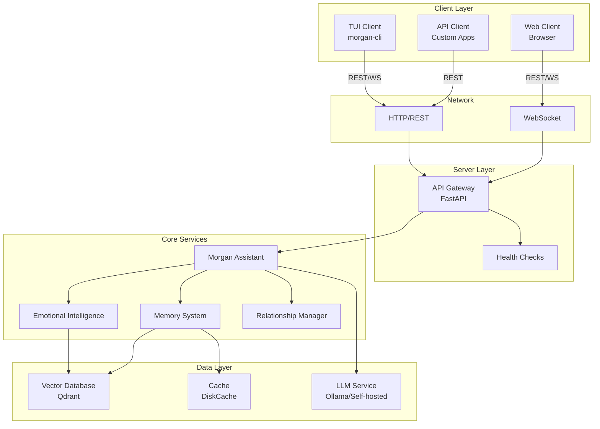

# Design Document: Client-Server Separation

## Overview

This design document outlines the architectural approach for separating Morgan into a clean client-server model for single-user self-hosted deployment. The current implementation has a monolithic structure where the CLI (`cli.py`) and the internal CLI (`morgan/cli/click_cli.py`) both have tight coupling to Morgan's core components. The server components exist but are not properly organized for production deployment.

**Key Design Principles:**
- Single-user self-hosted deployment (no multi-tenancy)
- Self-hosted LLM providers only (Ollama, OpenAI-compatible endpoints)
- No authentication required (local deployment)
- Simple configuration and deployment
- Complete recreation of all components (server, CLI, etc.) - no legacy code
- Focus on personal assistant with empathic engine and knowledge engine
- Human-like communication with roleplay configuration and personalization layers

The separation will create (all components built from scratch):
1. **Morgan Server**: A standalone FastAPI application that hosts all core functionality:
   - **Empathic Engine**: Emotional intelligence, personality, and relationship management
   - **Knowledge Engine**: RAG system with vector database and semantic search
   - **Personalization Layer**: User preferences, communication style, and context awareness
   - **Roleplay System**: Base roleplay configuration with additional logic for natural interaction
2. **Morgan TUI Client**: A lightweight terminal client that communicates exclusively via HTTP/WebSocket APIs
3. **Clear API boundaries**: Well-defined REST and WebSocket APIs for client-server communication
4. **Independent packaging**: Separate Python packages for server and client with minimal dependency overlap

This design enables:
- Clean separation of concerns between client and server
- Multiple client types (TUI, web) connecting to the same server
- Containerized deployment with Docker
- Independent development and testing of client and server components
- Easy self-hosted deployment with Ollama or other OpenAI-compatible LLM providers

## Architecture

### High-Level Architecture



### Component Separation

#### Server Components (`morgan-server` package) - All New
- **FastAPI Application**: API Gateway and routing
- **Empathic Engine**: 
  - Emotional intelligence and tone analysis
  - Personality system with roleplay configuration
  - Relationship tracking and milestone celebration
  - Communication style adaptation
- **Knowledge Engine**:
  - RAG system with semantic search
  - Vector database client (Qdrant)
  - Document ingestion and chunking
  - Context retrieval and ranking
- **Personalization Layer**:
  - User profile management
  - Preference learning and adaptation
  - Conversation history and memory
  - Context-aware response generation
- **LLM Client**: Self-hosted model integration (Ollama, OpenAI-compatible)
- **Configuration Management**: Environment-based configuration
- **Health Checks and Monitoring**: System status and metrics

#### Client Components (`morgan-cli` package) - All New
- **Terminal UI**: Rich-based interactive interface
- **HTTP/WebSocket Client**: Server communication
- **Command-line Interface**: Click-based CLI with intuitive commands
- **Local Configuration**: Server URL and preferences
- **Response Rendering**: Markdown formatting and streaming support
- **No Core Logic**: Pure client, all intelligence on server

### Directory Structure

```
morgan-rag/
├── morgan-server/            # NEW: Server package (complete rewrite)
│   ├── morgan_server/
│   │   ├── __init__.py
│   │   ├── app.py           # FastAPI app factory
│   │   ├── config.py        # Server configuration
│   │   ├── empathic/        # NEW: Empathic Engine
│   │   │   ├── __init__.py
│   │   │   ├── emotional.py # Emotional intelligence
│   │   │   ├── personality.py # Personality system
│   │   │   ├── relationships.py # Relationship tracking
│   │   │   └── roleplay.py  # Roleplay configuration
│   │   ├── knowledge/       # NEW: Knowledge Engine
│   │   │   ├── __init__.py
│   │   │   ├── rag.py       # RAG system
│   │   │   ├── vectordb.py  # Vector database client
│   │   │   ├── ingestion.py # Document processing
│   │   │   └── search.py    # Semantic search
│   │   ├── personalization/ # NEW: Personalization Layer
│   │   │   ├── __init__.py
│   │   │   ├── profile.py   # User profile
│   │   │   ├── preferences.py # Preference learning
│   │   │   └── memory.py    # Conversation memory
│   │   ├── llm/             # NEW: LLM Client
│   │   │   ├── __init__.py
│   │   │   ├── ollama.py    # Ollama client
│   │   │   └── openai_compatible.py # OpenAI-compatible client
│   │   ├── api/             # NEW: API layer
│   │   │   ├── __init__.py
│   │   │   ├── routes/
│   │   │   │   ├── chat.py      # Chat endpoints
│   │   │   │   ├── memory.py    # Memory endpoints
│   │   │   │   ├── knowledge.py # Knowledge endpoints
│   │   │   │   └── profile.py   # User profile endpoints
│   │   │   └── models.py    # Pydantic models for API
│   │   ├── middleware.py    # CORS, logging, validation
│   │   └── health.py        # Health check endpoints
│   ├── pyproject.toml       # Server dependencies
│   └── README.md
│
├── morgan-cli/               # NEW: Client package (complete rewrite)
│   ├── morgan_cli/
│   │   ├── __init__.py
│   │   ├── client.py        # HTTP/WS client
│   │   ├── cli.py           # Click CLI
│   │   ├── ui.py            # Rich TUI components
│   │   └── config.py        # Client configuration
│   ├── pyproject.toml       # Client dependencies only
│   └── README.md
│
├── docker/
│   ├── Dockerfile.server    # Server container
│   └── docker-compose.yml   # Full stack (server + qdrant)
│
├── morgan/                   # OLD: Will be deprecated/removed
├── cli.py                    # OLD: Will be deprecated/removed
└── MIGRATION.md              # Migration guide from old to new
```

## Core Engine Design

### Empathic Engine

The Empathic Engine is responsible for making Morgan feel human and emotionally aware. It consists of multiple layers:

**1. Emotional Intelligence Layer**
- Detect emotional tone in user messages
- Adjust response tone to match or complement user emotion
- Track emotional patterns over time
- Celebrate positive moments and provide support during difficult times

**2. Personality System**
- Base roleplay configuration defining Morgan's personality traits
- Consistent personality across conversations
- Adaptive behavior based on relationship depth
- Natural conversational style (not robotic)

**3. Relationship Management**
- Track interaction history and patterns
- Build trust level over time
- Recognize and celebrate milestones
- Personalize responses based on relationship depth

**4. Communication Style Adaptation**
- Learn user's preferred communication style
- Adapt response length and detail level
- Match user's formality level
- Remember topics of interest

### Knowledge Engine

The Knowledge Engine provides intelligent information retrieval and context awareness:

**1. RAG System**
- Semantic search using vector embeddings
- Context-aware document retrieval
- Multi-stage ranking (vector similarity + reranking)
- Source attribution and confidence scoring

**2. Document Processing**
- Support multiple formats (PDF, markdown, text, web pages)
- Intelligent chunking with overlap
- Metadata extraction and tagging
- Incremental updates

**3. Context Management**
- Conversation history integration
- Long-term memory across sessions
- Relevant context retrieval
- Context window optimization

### Personalization Layer

The Personalization Layer adds individual customization:

**1. User Profile**
- Preferred name and communication preferences
- Topics of interest
- Interaction patterns
- Trust and engagement metrics

**2. Adaptive Learning**
- Learn from user feedback
- Adjust based on interaction patterns
- Improve relevance over time
- Personalized suggestions

**3. Roleplay Enhancement**
- Base roleplay configuration (personality, tone, style)
- Additional logic layers for natural interaction:
  - Context-aware responses
  - Emotional intelligence integration
  - Relationship-aware behavior
  - Personalized communication style

## Components and Interfaces

### 1. API Gateway (FastAPI Application)

**Responsibilities:**
- Route HTTP requests to appropriate handlers
- Manage WebSocket connections
- Apply middleware (CORS, logging, request validation)
- Serve OpenAPI documentation
- Handle errors and return structured responses

**Key Endpoints:**

```python
# Chat endpoints
POST   /api/chat              # Send message, get response
WS     /ws/{user_id}          # WebSocket for real-time chat

# Memory endpoints
GET    /api/memory/stats      # Get memory statistics
GET    /api/memory/search     # Search conversation history
DELETE /api/memory/cleanup    # Clean old conversations

# Knowledge endpoints
POST   /api/knowledge/learn   # Add documents to knowledge base
GET    /api/knowledge/search  # Search knowledge base
GET    /api/knowledge/stats   # Get knowledge statistics

# Profile endpoints
GET    /api/profile/{user_id} # Get user profile
PUT    /api/profile/{user_id} # Update user preferences
GET    /api/timeline/{user_id}# Get relationship timeline

# System endpoints
GET    /health                # Health check
GET    /api/status            # Detailed status
GET    /metrics               # Prometheus metrics
GET    /docs                  # OpenAPI documentation
```

### 2. Server Configuration System

**Responsibilities:**
- Load configuration from multiple sources (env vars, files)
- Apply precedence rules (env > file > defaults)
- Validate required settings
- Provide typed configuration objects

**Configuration Sources:**
1. Environment variables (highest precedence)
2. Configuration file (`.env`, `config.yaml`, `config.json`)
3. Default values (lowest precedence)

**Key Configuration Parameters:**

```python
class ServerConfig:
    # Server settings
    host: str = "0.0.0.0"
    port: int = 8080
    workers: int = 4
    
    # LLM settings
    llm_provider: str = "ollama"  # or "openai-compatible"
    llm_api_key: Optional[str] = None  # Optional for self-hosted
    llm_model: str = "gemma3"
    llm_endpoint: str = "http://localhost:11434"  # Self-hosted endpoint
    
    # Vector database settings
    vector_db_url: str = "http://localhost:6333"
    vector_db_api_key: Optional[str] = None
    
    # Embedding settings
    embedding_provider: str = "local"  # Options: "local", "ollama", "openai-compatible"
    embedding_model: str = "sentence-transformers/all-MiniLM-L6-v2"
    embedding_device: str = "cpu"  # For local only
    embedding_endpoint: Optional[str] = None  # Required for remote providers
    embedding_api_key: Optional[str] = None  # Optional for remote providers
    
    # Cache settings
    cache_dir: str = "./data/cache"
    cache_size_mb: int = 1000
    
    # Note: Authentication not needed for single-user self-hosted deployment
    
    # Logging settings
    log_level: str = "INFO"
    log_format: str = "json"  # or "text"
    
    # Performance settings
    max_concurrent_requests: int = 100
    request_timeout_seconds: int = 60
    session_timeout_minutes: int = 60
```

### 3. Session Management

**Responsibilities:**
- Track active client sessions
- Maintain conversation context per session
- Isolate user data between sessions
- Clean up expired sessions
- Manage connection pooling

**Session Model:**

```python
class Session:
    session_id: str
    user_id: str
    conversation_id: Optional[str]
    created_at: datetime
    last_activity: datetime
    metadata: Dict[str, Any]
```

### 4. Health Check System

**Responsibilities:**
- Monitor component health
- Provide quick health status for load balancers
- Provide detailed status for debugging
- Expose metrics for monitoring systems

**Health Check Response:**

```python
class HealthStatus:
    status: str  # "healthy", "degraded", "unhealthy"
    timestamp: datetime
    components: Dict[str, ComponentHealth]
    
class ComponentHealth:
    name: str
    status: str  # "up", "down", "degraded"
    latency_ms: Optional[float]
    error: Optional[str]
    metadata: Dict[str, Any]
```

### 5. TUI Client

**Responsibilities:**
- Provide interactive terminal interface
- Connect to Morgan server via HTTP/WebSocket
- Render responses with markdown formatting
- Handle user input and commands
- Display errors and connection status
- Manage local configuration (server URL, preferences)

**Client Configuration:**

```python
class ClientConfig:
    server_url: str = "http://localhost:8080"
    api_key: Optional[str] = None
    user_id: Optional[str] = None
    timeout_seconds: int = 60
    retry_attempts: int = 3
    retry_delay_seconds: int = 2
```

### 6. Request Middleware

**Responsibilities:**
- Request logging and timing
- CORS handling for web clients
- Request size limits
- Error handling and formatting

**Middleware Stack:**
1. Logging middleware (request/response logging)
2. CORS middleware (for web client access)
3. Error handling middleware (catch and format errors)
4. Request validation middleware (validate request format)


## Data Models

### API Request/Response Models

```python
# Chat API
class ChatRequest(BaseModel):
    message: str
    user_id: Optional[str] = None
    conversation_id: Optional[str] = None
    metadata: Dict[str, Any] = {}

class ChatResponse(BaseModel):
    answer: str
    conversation_id: str
    emotional_tone: Optional[str] = None
    empathy_level: Optional[float] = None
    personalization_elements: List[str] = []
    milestone_celebration: Optional[MilestoneCelebration] = None
    confidence: float
    sources: List[Source] = []
    metadata: Dict[str, Any] = {}

# Memory API
class MemoryStats(BaseModel):
    total_conversations: int
    active_conversations: int
    total_messages: int
    oldest_conversation: Optional[datetime]
    newest_conversation: Optional[datetime]

class MemorySearchRequest(BaseModel):
    query: str
    user_id: Optional[str] = None
    limit: int = 10

class MemorySearchResult(BaseModel):
    conversation_id: str
    timestamp: datetime
    message: str
    response: str
    relevance_score: float

# Knowledge API
class LearnRequest(BaseModel):
    source: Optional[str] = None  # File path
    url: Optional[str] = None
    content: Optional[str] = None
    doc_type: str = "auto"
    metadata: Dict[str, Any] = {}

class LearnResponse(BaseModel):
    status: str
    documents_processed: int
    chunks_created: int
    processing_time_seconds: float

class KnowledgeStats(BaseModel):
    total_documents: int
    total_chunks: int
    total_size_bytes: int
    collections: List[str]

# Profile API
class ProfileResponse(BaseModel):
    user_id: str
    preferred_name: Optional[str]
    relationship_age_days: int
    interaction_count: int
    trust_level: float
    engagement_score: float
    communication_style: str
    response_length: str
    topics_of_interest: List[str]

class PreferenceUpdate(BaseModel):
    communication_style: Optional[str] = None
    response_length: Optional[str] = None
    topics_of_interest: Optional[List[str]] = None
    preferred_name: Optional[str] = None

# Health API
class HealthResponse(BaseModel):
    status: str  # "healthy", "degraded", "unhealthy"
    timestamp: datetime
    version: str
    uptime_seconds: float

class StatusResponse(BaseModel):
    status: str
    timestamp: datetime
    components: Dict[str, ComponentStatus]
    metrics: SystemMetrics

class ComponentStatus(BaseModel):
    name: str
    status: str  # "up", "down", "degraded"
    latency_ms: Optional[float]
    error: Optional[str]
    details: Dict[str, Any] = {}

class SystemMetrics(BaseModel):
    requests_total: int
    requests_per_second: float
    average_response_time_ms: float
    error_rate: float
    active_sessions: int
```

### Configuration Models

```python
class ServerConfig(BaseModel):
    """Server configuration with validation"""
    
    # Server
    host: str = Field(default="0.0.0.0", env="MORGAN_HOST")
    port: int = Field(default=8080, env="MORGAN_PORT")
    workers: int = Field(default=4, env="MORGAN_WORKERS")
    
    # LLM (self-hosted only)
    llm_provider: str = Field(default="ollama", env="MORGAN_LLM_PROVIDER")
    llm_api_key: Optional[str] = Field(default=None, env="MORGAN_LLM_API_KEY")  # Optional for self-hosted
    llm_model: str = Field(default="gemma3", env="MORGAN_LLM_MODEL")
    llm_endpoint: str = Field(default="http://localhost:11434", env="MORGAN_LLM_ENDPOINT")
    
    # Vector DB
    vector_db_url: str = Field(default="http://localhost:6333", env="MORGAN_VECTOR_DB_URL")
    vector_db_api_key: Optional[str] = Field(default=None, env="MORGAN_VECTOR_DB_API_KEY")
    
    # Embedding
    embedding_provider: str = Field(
        default="local",
        env="MORGAN_EMBEDDING_PROVIDER"
    )  # Options: "local", "ollama", "openai-compatible"
    embedding_model: str = Field(
        default="sentence-transformers/all-MiniLM-L6-v2",
        env="MORGAN_EMBEDDING_MODEL"
    )
    embedding_device: str = Field(default="cpu", env="MORGAN_EMBEDDING_DEVICE")
    embedding_endpoint: Optional[str] = Field(
        default=None,
        env="MORGAN_EMBEDDING_ENDPOINT"
    )  # Required for remote providers
    embedding_api_key: Optional[str] = Field(
        default=None,
        env="MORGAN_EMBEDDING_API_KEY"
    )  # Optional for remote providers
    
    # Cache
    cache_dir: str = Field(default="./data/cache", env="MORGAN_CACHE_DIR")
    cache_size_mb: int = Field(default=1000, env="MORGAN_CACHE_SIZE_MB")
    
    # Note: Authentication not needed for single-user self-hosted deployment
    
    # Logging
    log_level: str = Field(default="INFO", env="MORGAN_LOG_LEVEL")
    log_format: str = Field(default="json", env="MORGAN_LOG_FORMAT")
    
    # Performance
    max_concurrent_requests: int = Field(default=100, env="MORGAN_MAX_CONCURRENT")
    request_timeout_seconds: int = Field(default=60, env="MORGAN_REQUEST_TIMEOUT")
    session_timeout_minutes: int = Field(default=60, env="MORGAN_SESSION_TIMEOUT")
    
    @validator("llm_provider")
    def validate_llm_provider(cls, v):
        if v not in ["ollama", "openai-compatible"]:
            raise ValueError("llm_provider must be 'ollama' or 'openai-compatible'")
        return v
    
    @validator("log_level")
    def validate_log_level(cls, v):
        if v not in ["DEBUG", "INFO", "WARNING", "ERROR", "CRITICAL"]:
            raise ValueError("Invalid log level")
        return v

class ClientConfig(BaseModel):
    """Client configuration"""
    
    server_url: str = Field(default="http://localhost:8080", env="MORGAN_SERVER_URL")
    api_key: Optional[str] = Field(default=None, env="MORGAN_API_KEY")
    user_id: Optional[str] = Field(default=None, env="MORGAN_USER_ID")
    timeout_seconds: int = Field(default=60, env="MORGAN_TIMEOUT")
    retry_attempts: int = Field(default=3, env="MORGAN_RETRY_ATTEMPTS")
    retry_delay_seconds: int = Field(default=2, env="MORGAN_RETRY_DELAY")
```


## Correctness Properties

*A property is a characteristic or behavior that should hold true across all valid executions of a system-essentially, a formal statement about what the system should do. Properties serve as the bridge between human-readable specifications and machine-verifiable correctness guarantees.*

### Property 1: Server initialization independence
*For any* server configuration, when the server is started, all core components (vector database, embedding service, LLM connection, memory system) should be initialized without requiring any client connection.
**Validates: Requirements 1.1**

### Property 2: Configuration precedence consistency
*For any* configuration parameter that exists in multiple sources (environment variable, config file, default), the value from the highest precedence source (environment > file > default) should be used by the server.
**Validates: Requirements 3.3**

### Property 3: Invalid configuration rejection
*For any* invalid server configuration (missing required values, invalid formats, out-of-range values), the server should fail to start and provide a clear error message indicating which configuration is invalid.
**Validates: Requirements 1.4, 3.4, 3.5**

### Property 4: Graceful shutdown preservation
*For any* server state with active connections and pending data, when the server receives a shutdown signal, all connections should be closed and all pending data should be persisted before the server exits.
**Validates: Requirements 1.5**

### Property 5: Client API-only communication
*For any* request sent by the TUI client, the communication should occur exclusively through HTTP or WebSocket APIs, with no direct access to core components (vector database, embeddings, LLM).
**Validates: Requirements 2.1, 2.3**

### Property 6: Client configuration flexibility
*For any* valid server URL provided via command-line argument or environment variable, the TUI client should accept it and use it for all server communication.
**Validates: Requirements 2.2**

### Property 7: Client error handling
*For any* scenario where the server is unavailable, the TUI client should display a clear error message and either exit gracefully or retry based on configuration, without crashing.
**Validates: Requirements 2.4**

### Property 8: Client cleanup isolation
*For any* TUI client session, when the client exits, all network connections should be closed and the server state should remain unchanged (no data loss, no orphaned sessions).
**Validates: Requirements 2.5**

### Property 9: Configuration format support
*For any* valid configuration file in YAML, JSON, or .env format containing the same configuration values, the server should parse it correctly and produce equivalent runtime configuration.
**Validates: Requirements 3.2**

### Property 10: Health check responsiveness
*For any* health check request, the server should respond within 2 seconds with a status indicating whether all components are operational ("healthy") or if any component has failed ("unhealthy" with details).
**Validates: Requirements 4.1, 4.2, 4.3**

### Property 11: Metrics accuracy
*For any* sequence of API requests, the metrics endpoint should return counts and statistics that accurately reflect the actual requests processed (request count, error count, response times).
**Validates: Requirements 4.5**

### Property 12: Concurrent request handling
*For any* set of concurrent client connections, the server should handle all requests without blocking, maintaining session isolation such that data from one session never appears in another session's responses.
**Validates: Requirements 6.1, 6.2**

### Property 13: Performance under load
*For any* concurrent load up to the configured maximum, the server should maintain 95th percentile response times under 5 seconds.
**Validates: Requirements 6.4**

### Property 14: Session cleanup isolation
*For any* client that disconnects, the server should clean up that client's session resources without affecting other active sessions or their data.
**Validates: Requirements 6.5**

### Property 15: API consistency
*For any* API endpoint, responses should follow consistent formats (JSON structure, HTTP status codes, error format) as defined in the OpenAPI specification.
**Validates: Requirements 7.2**

### Property 16: Error response structure
*For any* API request that fails (validation error, server error, not found), the response should be a structured JSON object containing an error code, message, and optional details.
**Validates: Requirements 7.3**


### Property 18: Container configuration
*For any* server running in a container, configuration values provided via environment variables should be read and applied correctly, producing the same behavior as running outside a container.
**Validates: Requirements 8.2**

### Property 19: Container signal handling
*For any* containerized server, when a SIGTERM signal is received, the server should perform graceful shutdown (close connections, persist data) before the container exits.
**Validates: Requirements 8.4**

### Property 20: Markdown rendering
*For any* message containing markdown syntax (bold, italic, code blocks, lists), the TUI client should render it with appropriate formatting visible to the user.
**Validates: Requirements 9.1**

### Property 21: Command history
*For any* sequence of commands entered by the user, the TUI client should maintain a history that allows navigating to previous commands using arrow keys or similar navigation.
**Validates: Requirements 9.3**

### Property 22: Error message clarity
*For any* error that occurs in the TUI client (network error, server error, validation error), the displayed error message should be user-friendly (no stack traces) and include suggested actions when applicable.
**Validates: Requirements 9.5**

### Property 23: Request logging completeness
*For any* API request processed by the server, a log entry should be created containing the timestamp, user ID (if available), endpoint, and response time.
**Validates: Requirements 10.1**

### Property 24: Error logging detail
*For any* error that occurs during request processing, a log entry should be created at the ERROR level containing the stack trace and relevant context (request details, user ID, conversation ID).
**Validates: Requirements 10.2**

### Property 25: Log level filtering
*For any* configured log level (DEBUG, INFO, WARNING, ERROR), only log messages at that level or higher should be written to the log output.
**Validates: Requirements 10.4**

### Property 26: Structured logging format
*For any* log entry when JSON logging is enabled, the log output should be valid JSON containing standard fields (timestamp, level, message, logger name) and any additional context fields.
**Validates: Requirements 10.5**


## Error Handling

### Server-Side Error Handling

**Error Categories:**

1. **Configuration Errors** (Startup)
   - Missing required configuration (LLM API key, vector DB URL)
   - Invalid configuration values (invalid port, malformed URLs)
   - Action: Fail fast with clear error message, exit with non-zero code

2. **Component Initialization Errors** (Startup)
   - Vector database connection failure
   - LLM service unavailable
   - Embedding model loading failure
   - Action: Fail fast with component-specific error, suggest remediation

3. **Request Processing Errors** (Runtime)
   - Invalid request format (validation errors)
   - Missing required fields
   - Action: Return HTTP 400 with structured error response

4. **Service Errors** (Runtime)
   - LLM API errors (rate limits, timeouts)
   - Vector database errors
   - Memory system errors
   - Action: Return HTTP 503 with retry-after header, log error details

5. **Authentication Errors** (Runtime)
   - Not applicable for single-user self-hosted deployment

6. **Resource Errors** (Runtime)
   - Session not found
   - User profile not found
   - Conversation not found
   - Action: Return HTTP 404 with helpful error message

**Error Response Format:**

```python
class ErrorResponse(BaseModel):
    error: str  # Error code (e.g., "INVALID_REQUEST", "SERVICE_UNAVAILABLE")
    message: str  # Human-readable error message
    details: Optional[Dict[str, Any]] = None  # Additional context
    timestamp: datetime
    request_id: Optional[str] = None  # For tracking
```

**Error Handling Strategy:**

1. **Validation Errors**: Catch at API boundary, return 400 with field-level details
2. **Service Errors**: Implement retry logic with exponential backoff, circuit breaker pattern
3. **Timeout Errors**: Set reasonable timeouts, return 504 Gateway Timeout
4. **Unexpected Errors**: Log full stack trace, return 500 with generic message (don't leak internals)

### Client-Side Error Handling

**Error Categories:**

1. **Connection Errors**
   - Server unreachable
   - Network timeout
   - Action: Display error, offer retry or exit options

2. **Authentication Errors**
   - Not applicable for single-user self-hosted deployment

3. **Server Errors**
   - 4xx client errors
   - 5xx server errors
   - Action: Display user-friendly message, suggest actions

4. **Rendering Errors**
   - Invalid markdown
   - Malformed response
   - Action: Display raw content with warning

**Error Display Strategy:**

1. **Network Errors**: Show connection status, suggest checking server URL
2. **Server Errors**: Show error message from server, suggest retry
3. **Validation Errors**: Show field-level errors, suggest corrections
4. **Unexpected Errors**: Show generic error, offer to report issue

### Logging Strategy

**Log Levels:**

- **DEBUG**: Detailed diagnostic information (request/response bodies, internal state)
- **INFO**: General informational messages (request received, response sent)
- **WARNING**: Potentially harmful situations (deprecated API usage, slow queries)
- **ERROR**: Error events that might still allow the application to continue
- **CRITICAL**: Severe errors that cause the application to abort

**Structured Logging Fields:**

```python
{
    "timestamp": "2024-12-08T10:30:00Z",
    "level": "INFO",
    "logger": "morgan.api.chat",
    "message": "Chat request processed",
    "request_id": "req_123",
    "user_id": "user_456",
    "conversation_id": "conv_789",
    "response_time_ms": 1234,
    "status_code": 200
}
```

**Log Rotation:**

- Rotate logs daily or when size exceeds 100MB
- Keep last 30 days of logs
- Compress old logs

## Testing Strategy

### Unit Testing

**Server Components:**

1. **Configuration System**
   - Test loading from environment variables
   - Test loading from config files
   - Test precedence rules
   - Test validation of required fields
   - Test default value application

2. **API Endpoints**
   - Test request validation
   - Test response formatting
   - Test error handling
   - Test authentication (when enabled)

3. **Session Management**
   - Test session creation
   - Test session isolation
   - Test session cleanup
   - Test timeout handling

4. **Health Checks**
   - Test healthy state response
   - Test degraded state response
   - Test component failure detection

**Client Components:**

1. **HTTP Client**
   - Test request formatting
   - Test response parsing
   - Test error handling
   - Test retry logic

2. **UI Components**
   - Test markdown rendering
   - Test command history
   - Test error display
   - Test scrolling/pagination

3. **Configuration**
   - Test loading from environment
   - Test loading from command-line args
   - Test default values

### Property-Based Testing

Property-based tests will be implemented using **Hypothesis** (Python) to verify universal properties across many randomly generated inputs.

**Configuration Properties:**

- Property 2: Configuration precedence consistency
- Property 3: Invalid configuration rejection
- Property 9: Configuration format support

**API Properties:**

- Property 5: Client API-only communication
- Property 15: API consistency
- Property 16: Error response structure
- Property 20: Markdown rendering
- Property 22: Error message clarity

**Concurrency Properties:**

- Property 12: Concurrent request handling
- Property 13: Performance under load
- Property 14: Session cleanup isolation

**Logging Properties:**

- Property 23: Request logging completeness
- Property 24: Error logging detail
- Property 25: Log level filtering
- Property 26: Structured logging format

**Test Configuration:**

- Each property-based test will run a minimum of 100 iterations
- Tests will use Hypothesis strategies to generate valid and invalid inputs
- Tests will be tagged with comments referencing the design document property

**Example Property Test:**

```python
from hypothesis import given, strategies as st

# Feature: client-server-separation, Property 2: Configuration precedence consistency
@given(
    env_value=st.text(min_size=1),
    file_value=st.text(min_size=1),
    default_value=st.text(min_size=1)
)
def test_config_precedence(env_value, file_value, default_value):
    """Test that environment variables override file config and defaults."""
    # Set up config sources
    os.environ["MORGAN_TEST_VALUE"] = env_value
    config_file = {"test_value": file_value}
    
    # Load configuration
    config = load_config(config_file, defaults={"test_value": default_value})
    
    # Verify precedence: env > file > default
    assert config.test_value == env_value
```

### Integration Testing

**Server Integration Tests:**

1. **Full Stack Tests**
   - Start server with all components
   - Make API requests
   - Verify responses
   - Check database state
   - Verify logs

2. **Component Integration**
   - Test API → Morgan Core → Vector DB flow
   - Test session management with concurrent requests
   - Test health checks with component failures

**Client-Server Integration Tests:**

1. **End-to-End Tests**
   - Start server
   - Start client
   - Send messages
   - Verify responses
   - Test error scenarios

2. **WebSocket Tests**
   - Test connection establishment
   - Test message streaming
   - Test connection cleanup

### Container Testing

1. **Docker Build Tests**
   - Verify image builds successfully
   - Verify only required dependencies are included
   - Verify image size is reasonable

2. **Docker Run Tests**
   - Start container with environment variables
   - Verify server starts correctly
   - Make health check requests
   - Test graceful shutdown (SIGTERM)

3. **Docker Compose Tests**
   - Start full stack (server + vector DB)
   - Verify all services are healthy
   - Test inter-service communication
   - Test data persistence

### Performance Testing

1. **Load Testing**
   - Test with increasing concurrent connections
   - Measure response times at different load levels
   - Verify 95th percentile stays under 5 seconds

2. **Stress Testing**
   - Test beyond normal capacity
   - Verify graceful degradation
   - Verify error handling under stress

3. **Endurance Testing**
   - Run for extended periods (24+ hours)
   - Monitor for memory leaks
   - Monitor for connection leaks
   - Verify log rotation works

## Deployment Considerations

### Docker Deployment

**Server Dockerfile:**

```dockerfile
FROM python:3.11-slim

WORKDIR /app

# Install system dependencies
RUN apt-get update && apt-get install -y \
    build-essential \
    && rm -rf /var/lib/apt/lists/*

# Copy and install Python dependencies
COPY requirements-server.txt .
RUN pip install --no-cache-dir -r requirements-server.txt

# Copy application code
COPY morgan/ ./morgan/

# Create non-root user
RUN useradd -m -u 1000 morgan && chown -R morgan:morgan /app
USER morgan

# Expose port
EXPOSE 8080

# Health check
HEALTHCHECK --interval=30s --timeout=10s --start-period=40s --retries=3 \
    CMD curl -f http://localhost:8080/health || exit 1

# Run server
CMD ["python", "-m", "uvicorn", "morgan.server.app:create_app", \
     "--host", "0.0.0.0", "--port", "8080", "--factory"]
```

**Docker Compose:**

```yaml
version: '3.8'

services:
  morgan-server:
    build:
      context: .
      dockerfile: docker/Dockerfile.server
    ports:
      - "8080:8080"
    environment:
      - MORGAN_LLM_PROVIDER=ollama
      - MORGAN_LLM_ENDPOINT=http://ollama:11434
      - MORGAN_LLM_MODEL=gemma3
      - MORGAN_VECTOR_DB_URL=http://qdrant:6333
      - MORGAN_LOG_LEVEL=INFO
      - MORGAN_LOG_FORMAT=json
    depends_on:
      - qdrant
    volumes:
      - morgan-cache:/app/data/cache
    restart: unless-stopped
    healthcheck:
      test: ["CMD", "curl", "-f", "http://localhost:8080/health"]
      interval: 30s
      timeout: 10s
      retries: 3

  ollama:
    image: ollama/ollama:latest
    ports:
      - "11434:11434"
    volumes:
      - ollama-models:/root/.ollama
    restart: unless-stopped

  qdrant:
    image: qdrant/qdrant:latest
    ports:
      - "6333:6333"
    volumes:
      - qdrant-data:/qdrant/storage
    restart: unless-stopped

  prometheus:
    image: prom/prometheus:latest
    ports:
      - "9090:9090"
    volumes:
      - ./monitoring/prometheus.yml:/etc/prometheus/prometheus.yml
      - prometheus-data:/prometheus
    command:
      - '--config.file=/etc/prometheus/prometheus.yml'
    restart: unless-stopped

volumes:
  morgan-cache:
  ollama-models:
  qdrant-data:
  prometheus-data:
```

### Kubernetes Deployment

**Key Considerations:**

1. **Deployment**: Use Deployment resource for server pods
2. **Service**: Expose server via LoadBalancer or Ingress
3. **ConfigMap**: Store non-sensitive configuration
4. **Secret**: Store API keys and sensitive data
5. **PersistentVolume**: For cache and data persistence
6. **HorizontalPodAutoscaler**: Auto-scale based on CPU/memory
7. **Liveness/Readiness Probes**: Use /health endpoint

### Environment Variables

**Required:**
- `MORGAN_LLM_ENDPOINT`: Self-hosted LLM endpoint URL (e.g., http://localhost:11434 for Ollama)

**Optional (with defaults):**
- `MORGAN_LLM_API_KEY`: API key for LLM service (optional for self-hosted)
- `MORGAN_HOST`: Server host (default: 0.0.0.0)
- `MORGAN_PORT`: Server port (default: 8080)
- `MORGAN_VECTOR_DB_URL`: Vector database URL (default: http://localhost:6333)
- `MORGAN_VECTOR_DB_API_KEY`: Vector database API key (optional)
- `MORGAN_EMBEDDING_PROVIDER`: Embedding provider type (default: local)
- `MORGAN_EMBEDDING_MODEL`: Embedding model name (default: sentence-transformers/all-MiniLM-L6-v2)
- `MORGAN_EMBEDDING_DEVICE`: Device for local embeddings (default: cpu)
- `MORGAN_EMBEDDING_ENDPOINT`: Remote embedding service endpoint (required for ollama/openai-compatible)
- `MORGAN_EMBEDDING_API_KEY`: API key for remote embedding service (optional)
- `MORGAN_LOG_LEVEL`: Log level (default: INFO)
- `MORGAN_LOG_FORMAT`: Log format (default: json)
- `MORGAN_LLM_PROVIDER`: LLM provider type (default: ollama)
- `MORGAN_LLM_MODEL`: LLM model name (default: gemma3)

### Security Considerations

For single-user self-hosted deployment:

1. **Network Security**: Bind server to localhost (127.0.0.1) by default to prevent external access
2. **Input Validation**: Validate all inputs at API boundary to prevent injection attacks
3. **XSS Prevention**: Sanitize user input before rendering in web clients
4. **File System Access**: Restrict file operations to designated directories
5. **Resource Limits**: Implement request size limits and timeouts to prevent DoS
6. **Secrets Management**: Store LLM API keys (if needed) in environment variables, never in code
7. **HTTPS**: Optional for local deployment, recommended if exposing to network
8. **CORS**: Configure allowed origins if web client is on different port/domain

### Monitoring and Observability

**Metrics to Track:**

1. **Request Metrics**
   - Request rate (requests/second)
   - Response time (p50, p95, p99)
   - Error rate (errors/second, error percentage)

2. **System Metrics**
   - CPU usage
   - Memory usage
   - Disk usage
   - Network I/O

3. **Component Metrics**
   - Vector DB query latency
   - LLM API latency
   - Cache hit rate
   - Active sessions

4. **Business Metrics**
   - Active users
   - Conversations per day
   - Messages per conversation
   - User satisfaction (from feedback)

**Alerting:**

1. **Critical Alerts**
   - Service down (health check failing)
   - Error rate > 5%
   - Response time p95 > 10 seconds
   - Disk usage > 90%

2. **Warning Alerts**
   - Error rate > 1%
   - Response time p95 > 5 seconds
   - Memory usage > 80%
   - Cache hit rate < 50%

### Migration Strategy

**Important: Complete Rewrite Approach**

This is a complete recreation of all components, not a refactoring. The old codebase will be deprecated.

**Phase 1: New Server Creation**
1. Create new `morgan-server` package from scratch
2. Implement Empathic Engine (emotional intelligence, personality, relationships, roleplay)
3. Implement Knowledge Engine (RAG, vector DB, document processing, search)
4. Implement Personalization Layer (profiles, preferences, memory)
5. Implement LLM Client (Ollama, OpenAI-compatible)
6. Implement API layer (FastAPI routes, models, middleware)
7. Add configuration system, health checks, and monitoring

**Phase 2: New Client Creation**
1. Create new `morgan-cli` package from scratch
2. Implement HTTP/WebSocket client
3. Implement Rich-based TUI
4. Implement Click-based CLI
5. Add configuration and error handling

**Phase 3: Integration and Testing**
1. Test server independently
2. Test client against server
3. Test end-to-end flows
4. Create Docker images
5. Test containerized deployment

**Phase 4: Documentation and Deployment**
1. Write comprehensive documentation
2. Create migration guide from old system
3. Provide example configurations
4. Create deployment guides (Docker, bare metal)

**Phase 5: Deprecation of Old System**
1. Mark old `morgan/` and `cli.py` as deprecated
2. Provide clear migration path
3. Keep old system for reference only
4. Eventually remove old code

