# Morgan Multi-Host MVP - Implementation Tasks

> **Version**: 3.0.0
> **Status**: Updated for CLI-Only, PostgreSQL (Code-Only Logic), MinIO, Flexible Hosts
> **Last Updated**: 2025-11-02
> **Feature**: Multi-Host Self-Hosted AI Assistant with RAG, Empathy, and Learning (CLI-Only MVP)

---

## Implementation Plan

This document provides a comprehensive, step-by-step implementation plan for transforming Morgan into a flexible multi-host distributed system with CLI interface, PostgreSQL database (code-only logic), and MinIO file storage. Each task is designed to be incremental, testable, and builds upon previous tasks.

### Key Changes from V1.0.0

- **CLI-Only Interface**: Removed all WebUI, WebSocket, streaming UI tasks
- **Flexible Host Count**: Dynamic allocation (1-7+ hosts) instead of fixed 6 hosts
- **PostgreSQL Code-Only**: All business logic in Python/SQLAlchemy (no stored procedures, functions, triggers)
- **MinIO S3 Storage**: Added file storage for documents, audio, artifacts
- **CUDA 12.4+**: Updated from CUDA 13.0.1
- **Kong Gateway Optional**: MVP uses direct Consul DNS access

---

## Task Estimation Summary

| Phase | Task Count | Estimated Hours | Priority |
|-------|-----------|-----------------|----------|
| Phase 1: Foundation | 13 | 80h | Critical |
| Phase 2: Data Layer | 22 | 120h | Critical |
| Phase 3: Service Deployment | 15 | 90h | Critical |
| Phase 4: Advanced Features | 18 | 100h | High |
| Phase 5: Testing & Validation | 12 | 60h | High |
| **Total** | **80** | **450h** | **~11 weeks** |

---

## Phase 1: Foundation - Service Discovery & CLI (Critical Path)

**Objective**: Establish core infrastructure and CLI interface for system interaction

**Estimated Duration**: 2 weeks (80 hours)

---

### Task Group 1.1: Consul Service Discovery

#### CLI-001: Deploy Consul Server on Primary CPU Host

**Effort**: 6 hours

**Description**: Deploy HashiCorp Consul as the service discovery backbone

**Acceptance Criteria**:
- Consul server deployed via Docker on primary CPU_Host
- Consul UI accessible at http://primary-host:8500
- Persistent volume mounted for Consul data
- Health check endpoint responding
- Consul agent runs in server mode (minimum 1 server for MVP, 3 for production)

**Implementation Steps**:
1. Create `docker-compose-consul.yml` for Consul server
2. Configure Consul with server mode, datacenter name "morgan"
3. Expose ports: 8500 (HTTP API/UI), 8600 (DNS), 8300-8302 (cluster/gossip)
4. Mount volume `./data/consul:/consul/data`
5. Verify Consul UI accessible and health check passes

**Requirements**: 3.1, 3.2

**Dependencies**: None

---

#### CLI-002: Create Host Capability Detection Script

**Effort**: 8 hours

**Description**: Implement cross-platform script to detect host hardware capabilities and register with Consul

**Acceptance Criteria**:
- Scripts created for Linux (`.sh`), Windows (`.ps1`), macOS (`.sh`)
- Detects: CPU model, core count, RAM, GPU presence, GPU VRAM, architecture (x86_64/arm64)
- Stores metadata in Consul KV under `morgan/hosts/{hostname}/capabilities`
- Script can be run manually or during setup

**Implementation Steps**:
1. Create `scripts/detect-host-capabilities.sh` for Linux/macOS
2. Create `scripts/detect-host-capabilities.ps1` for Windows
3. Implement GPU detection (nvidia-smi for NVIDIA GPUs)
4. Implement CPU/RAM detection (lscpu, free, sysctl, WMI)
5. Write capabilities JSON to Consul KV via HTTP API
6. Add script to setup automation

**Requirements**: 3.2, 10.1, 10.2, 10.3

**Dependencies**: CLI-001

---

#### CLI-003: Implement Service Registration Utility

**Effort**: 6 hours

**Description**: Create shared Python utility for automatic Consul service registration

**Acceptance Criteria**:
- `shared/utils/service_discovery.py` created with `ConsulRegistry` class
- Supports `register_service(name, port, health_check_url)` method
- Supports automatic deregistration on service shutdown
- Includes service metadata (version, capabilities, tags)
- Unit tests pass

**Implementation Steps**:
1. Create `ConsulRegistry` class in `shared/utils/service_discovery.py`
2. Use `python-consul` library for Consul HTTP API integration
3. Implement `register_service()` with health check configuration
4. Implement `deregister_service()` in shutdown handler
5. Add service metadata support (version, tags, capabilities)
6. Write unit tests with mocked Consul responses

**Requirements**: 3.1, 3.2, 3.3

**Dependencies**: CLI-001

---

#### CLI-004: Update Core Service for Consul Registration

**Effort**: 4 hours

**Description**: Integrate ConsulRegistry into Core service

**Acceptance Criteria**:
- Core service registers with Consul on startup
- Health check endpoint `/health` configured in Consul
- Service visible in Consul UI
- Graceful deregistration on shutdown
- Service metadata includes version and capabilities

**Implementation Steps**:
1. Import `ConsulRegistry` in `core/app.py`
2. Register Core service on startup with service name "morgan-core"
3. Configure health check: HTTP GET http://service-ip:8000/health every 10s
4. Add shutdown handler to deregister service
5. Test service appears in Consul catalog

**Requirements**: 3.1, 3.2

**Dependencies**: CLI-003

---

#### CLI-005: Create Service Discovery Client Utility

**Effort**: 6 hours

**Description**: Implement dynamic service discovery client with caching

**Acceptance Criteria**:
- `ConsulServiceDiscovery` class created in `shared/utils/service_discovery.py`
- Method `discover_service(service_name)` returns list of healthy endpoints
- Caching layer with 30-second TTL to reduce Consul load
- Fallback to cached endpoints if Consul unavailable
- Unit tests with mocked Consul responses

**Implementation Steps**:
1. Add `ConsulServiceDiscovery` class to `shared/utils/service_discovery.py`
2. Implement `discover_service(name)` using Consul Health API
3. Add in-memory cache with 30s TTL using `cachetools`
4. Filter only passing health checks
5. Return list of (host, port) tuples
6. Write unit tests for discovery and caching

**Requirements**: 3.2, 3.3

**Dependencies**: CLI-001

---

### Task Group 1.2: CLI Framework Setup

#### CLI-010: Install CLI Framework and Dependencies

**Effort**: 3 hours

**Description**: Set up Python Click framework with Rich console output and Prompt Toolkit

**Acceptance Criteria**:
- Click, Rich, Prompt Toolkit, HTTPx added to `requirements-core.txt`
- Dependencies installed in virtual environment
- CLI entry point defined in `pyproject.toml`
- Test CLI can be invoked with `morgan --help`

**Implementation Steps**:
1. Add dependencies to `requirements-core.txt`: `click`, `rich`, `prompt-toolkit`, `httpx`
2. Update `pyproject.toml` with CLI entry point: `morgan = morgan.cli.main:cli`
3. Run `uv pip install -e .` to install in dev mode
4. Create empty `morgan/cli/__init__.py` and `morgan/cli/main.py`
5. Test `morgan --help` shows usage

**Requirements**: 1.1

**Dependencies**: None

---

#### CLI-011: Create CLI Base Structure with Click Groups

**Effort**: 5 hours

**Description**: Implement base CLI command structure with Click command groups

**Acceptance Criteria**:
- `morgan/cli/main.py` created with Click app
- Command groups defined: `morgan chat`, `morgan ingest`, `morgan query`, `morgan status`, `morgan hosts`, `morgan config`
- Each command has basic placeholder implementation
- `morgan --version` shows Morgan version
- Help text available for all commands

**Implementation Steps**:
1. Create `morgan/cli/main.py` with `@click.group()` decorator
2. Add `--version` flag with Morgan version from `__version__.py`
3. Create command groups: `chat`, `ingest`, `query`, `status`, `hosts`, `config`
4. Add placeholder functions for each command
5. Add docstrings for help text
6. Test `morgan <command> --help` for all commands

**Requirements**: 1.1

**Dependencies**: CLI-010

---

#### CLI-012: Implement Rich Console for Output

**Effort**: 4 hours

**Description**: Add Rich console for colored output, progress bars, and formatted tables

**Acceptance Criteria**:
- `morgan/cli/console.py` created with Rich Console instance
- Global console instance exported for reuse
- Support for colored output (red=error, yellow=warning, green=success, blue=info)
- Support for progress bars (for document ingestion)
- Support for tables (for host/service status)

**Implementation Steps**:
1. Create `morgan/cli/console.py` with Rich Console
2. Export global console instance: `console = Console()`
3. Add helper functions: `print_error()`, `print_warning()`, `print_success()`, `print_info()`
4. Add table formatter function for status display
5. Add progress bar context manager for long-running tasks
6. Test colored output in terminal

**Requirements**: 1.2, 1.4

**Dependencies**: CLI-010

---

### Task Group 1.3: CLI Service Integration

#### CLI-020: Implement Consul DNS Resolution for Services

**Effort**: 6 hours

**Description**: Add Consul DNS resolver for service discovery in CLI

**Acceptance Criteria**:
- `morgan/cli/service_client.py` created with Consul DNS resolution
- Method `resolve_service(service_name)` uses Consul DNS (SRV records)
- Falls back to HTTP API if DNS unavailable
- Resolves `core.service.consul` to Core service endpoints
- Unit tests pass

**Implementation Steps**:
1. Create `morgan/cli/service_client.py` module
2. Implement `resolve_service()` using `dnspython` for SRV record lookup
3. Query Consul DNS at `service-name.service.consul` (port 8600)
4. Parse SRV records to extract host:port
5. Add fallback to Consul HTTP API `/v1/catalog/service/{name}`
6. Write unit tests with mocked DNS responses

**Requirements**: 3.2, 3.3

**Dependencies**: CLI-001, CLI-005

---

#### CLI-021: Implement HTTPx Async Client for Core Service

**Effort**: 5 hours

**Description**: Create async HTTP client for CLI-to-Core communication

**Acceptance Criteria**:
- `morgan/cli/service_client.py` includes `MorganCLIClient` class
- Uses HTTPx async client for API calls
- Implements retry logic (max 3 retries with exponential backoff)
- Supports timeout configuration (default 30s)
- Error handling with user-friendly messages

**Implementation Steps**:
1. Add `MorganCLIClient` class to `morgan/cli/service_client.py`
2. Use `httpx.AsyncClient` with connection pooling
3. Implement methods: `chat()`, `query()`, `ingest()`, `status()`, `health()`
4. Add retry decorator using `tenacity` library
5. Add timeout handling and connection error handling
6. Write unit tests with mocked HTTPx responses

**Requirements**: 1.1, 1.2, 1.3, 1.4

**Dependencies**: CLI-020

---

#### CLI-022: Add Error Handling and Network Failure Recovery

**Effort**: 4 hours

**Description**: Implement robust error handling for network failures and service unavailability

**Acceptance Criteria**:
- Connection failures show user-friendly error messages
- Automatic retry on transient failures (connection refused, timeout)
- Graceful degradation if Core service unavailable
- Errors logged to `~/.morgan/cli.log`
- Exit codes: 0=success, 1=error, 2=service unavailable

**Implementation Steps**:
1. Add exception handling in `MorganCLIClient` methods
2. Catch `httpx.ConnectError`, `httpx.TimeoutException`, `httpx.HTTPStatusError`
3. Map exceptions to user-friendly messages using Rich console
4. Implement logging to `~/.morgan/cli.log`
5. Return appropriate exit codes for each error type
6. Test error scenarios (service down, network timeout, invalid response)

**Requirements**: 1.5

**Dependencies**: CLI-021

---

### Task Group 1.4: CLI Commands Implementation

#### CLI-030: Implement `morgan chat` Command

**Effort**: 8 hours

**Description**: Implement interactive chat session with conversation history

**Acceptance Criteria**:
- `morgan chat` starts interactive chat session
- Supports multi-line input (Ctrl+D or Enter to send)
- Displays conversation history in terminal
- Shows emotional tone via colored output (optional)
- Exit commands: `/exit`, `/quit`, Ctrl+C, Ctrl+D
- Conversation history persisted locally in `~/.morgan/conversations/{session_id}.json`

**Implementation Steps**:
1. Create `morgan/cli/commands/chat.py` module
2. Implement `chat()` command using Prompt Toolkit for input
3. Display conversation history with Rich panels
4. Send messages to Core service `/api/text` endpoint
5. Handle streaming responses (if supported by Core)
6. Add colored output for emotional states (red=anger, blue=sadness, green=joy)
7. Save conversation to local JSON file
8. Add unit tests and integration tests

**Requirements**: 1.1, 1.2

**Dependencies**: CLI-021

---

#### CLI-031: Implement `morgan query` Command

**Effort**: 4 hours

**Description**: Implement one-shot query command for quick questions

**Acceptance Criteria**:
- `morgan query "<question>"` sends question and prints response
- No conversation history maintained (stateless)
- Supports `--json` flag for JSON output
- Supports `--emotion` flag to show detected emotion
- Exit code 0 on success, 1 on error

**Implementation Steps**:
1. Create `morgan/cli/commands/query.py` module
2. Implement `query(question)` command
3. Send request to Core service `/api/text` endpoint with `user_id=cli`
4. Print response text to console
5. Add `--json` flag to output raw JSON response
6. Add `--emotion` flag to display detected emotional state
7. Write unit tests with mocked responses

**Requirements**: 1.1

**Dependencies**: CLI-021

---

#### CLI-032: Implement `morgan ingest` Command

**Effort**: 10 hours

**Description**: Implement document ingestion with progress bar and MinIO upload

**Acceptance Criteria**:
- `morgan ingest <path>` accepts file or directory path
- Supports PDF, MD, TXT, DOCX, HTML files
- Shows progress bar during upload
- Displays summary: X documents processed, Y chunks created, Z embeddings generated
- Reports errors with file names
- Uploads files to MinIO S3 bucket `morgan-documents`

**Implementation Steps**:
1. Create `morgan/cli/commands/ingest.py` module
2. Implement file/directory path validation and expansion
3. Filter supported file types: `.pdf`, `.md`, `.txt`, `.docx`, `.html`
4. Use Rich progress bar for upload tracking
5. Send files to Core service `/api/ingest` endpoint (multipart form data)
6. Parse response for processing summary
7. Display errors with file names using Rich console
8. Write integration tests with sample documents

**Requirements**: 1.3

**Dependencies**: CLI-021

---

#### CLI-033: Implement `morgan status` Command

**Effort**: 8 hours

**Description**: Implement system status display with host metrics and service health

**Acceptance Criteria**:
- `morgan status` displays all hosts with CPU%, RAM%, GPU%, VRAM%
- Shows all services with health status (healthy/unhealthy)
- Shows Consul cluster status
- Shows PostgreSQL replication status (primary/standby)
- Shows Redis cluster status (nodes up/down)
- Supports `--watch` flag for auto-refresh every 5 seconds

**Implementation Steps**:
1. Create `morgan/cli/commands/status.py` module
2. Query Core service `/api/status` endpoint
3. Query Consul `/v1/catalog/nodes` for all hosts
4. Query Consul `/v1/health/state/any` for service health
5. Display host table with Rich Table (columns: Host, CPU%, RAM%, GPU%, VRAM%, Status)
6. Display service table (columns: Service, Host, Port, Health, Uptime)
7. Add `--watch` flag using Rich Live display for auto-refresh
8. Write unit tests with mocked API responses

**Requirements**: 1.4

**Dependencies**: CLI-021

---

#### CLI-034: Implement `morgan hosts list` Command

**Effort**: 5 hours

**Description**: Implement host listing with detected capabilities

**Acceptance Criteria**:
- `morgan hosts list` shows all detected hosts
- Displays host metadata: OS, architecture, CPU model, RAM, GPU type, VRAM
- Shows assigned services for each host
- Supports `--json` flag for JSON output

**Implementation Steps**:
1. Create `morgan/cli/commands/hosts.py` module
2. Query Consul KV `/v1/kv/morgan/hosts/?recurse` for all host capabilities
3. Query Consul catalog for service assignments
4. Display host table with Rich Table
5. Add `--json` flag for JSON output
6. Write unit tests with mocked Consul responses

**Requirements**: 1.4

**Dependencies**: CLI-020

---

#### CLI-035: Implement `morgan config` Command

**Effort**: 6 hours

**Description**: Implement configuration management commands

**Acceptance Criteria**:
- `morgan config get <key>` retrieves config value
- `morgan config set <key> <value>` sets config value in Consul KV
- `morgan config list` shows all configuration keys
- Config stored in Consul KV under `morgan/config/`
- Supports dot notation for nested keys (e.g., `llm.temperature`)

**Implementation Steps**:
1. Create `morgan/cli/commands/config.py` module
2. Implement `config get <key>` to query Consul KV
3. Implement `config set <key> <value>` to write to Consul KV
4. Implement `config list` to show all keys under `morgan/config/`
5. Support dot notation for nested keys
6. Validate config values before setting (e.g., temperature 0-2)
7. Write unit tests with mocked Consul KV

**Requirements**: 4.1, 4.2

**Dependencies**: CLI-020

---

#### CLI-036: Implement `morgan feedback` Command

**Effort**: 5 hours

**Description**: Implement feedback submission for learning system

**Acceptance Criteria**:
- `morgan feedback --rating <1-5> --comment "<text>"` submits feedback
- Links feedback to last conversation session
- Stores feedback in PostgreSQL via Core service
- Displays confirmation message

**Implementation Steps**:
1. Create `morgan/cli/commands/feedback.py` module
2. Implement `feedback --rating <1-5> --comment <text>` command
3. Send POST request to Core service `/api/feedback` endpoint
4. Include last conversation ID from local session file
5. Validate rating range (1-5)
6. Display confirmation with Rich console
7. Write unit tests with mocked API

**Requirements**: Learning system feedback (design.md section 5.6.6)

**Dependencies**: CLI-021

---

## Phase 2: Data Layer - PostgreSQL, MinIO, Redis (Critical Path)

**Objective**: Implement data persistence with PostgreSQL (code-only), MinIO file storage, and Redis caching

**Estimated Duration**: 3 weeks (120 hours)

---

### Task Group 2.1: PostgreSQL Schema and ORM Models

#### DB-001: Create SQLAlchemy Base Models

**Effort**: 6 hours

**Description**: Implement base SQLAlchemy models with common fields and methods

**Acceptance Criteria**:
- `shared/models/db/base.py` created with `BaseModel` class
- Common fields: `id`, `created_at`, `updated_at`, `deleted_at` (soft delete)
- Soft delete logic in application code (NOT database triggers)
- Timestamp update logic in application code (NOT database defaults)
- All models inherit from `BaseModel`

**Implementation Steps**:
1. Create `shared/models/db/base.py` with SQLAlchemy `declarative_base()`
2. Define `BaseModel` class with common columns
3. Add `id` as UUID primary key
4. Add `created_at`, `updated_at` as DateTime with timezone
5. Add `deleted_at` for soft delete (nullable)
6. Implement `soft_delete()` method to set `deleted_at`
7. Add query filter helper `is_not_deleted()` to exclude soft-deleted records

**Requirements**: 8.1, 8.2

**Dependencies**: None

---

#### DB-002: Create Conversations Model

**Effort**: 4 hours

**Description**: Implement Conversations table for conversation history

**Acceptance Criteria**:
- `shared/models/db/conversations.py` created
- Fields: `id`, `user_id`, `session_id`, `context_summary`, `metadata` (JSONB), `created_at`, `updated_at`, `deleted_at`
- Index on `user_id`, `session_id`
- Cascade delete logic in application code (NOT database)
- Unit tests pass

**Implementation Steps**:
1. Create `Conversation` model in `shared/models/db/conversations.py`
2. Define columns: `user_id` (String), `session_id` (String), `context_summary` (Text)
3. Add `metadata` column as JSONB for flexible data
4. Create index on `user_id` and `session_id`
5. Implement cascade delete method to delete related messages
6. Write unit tests for model creation and soft delete

**Requirements**: 8.1

**Dependencies**: DB-001

---

#### DB-003: Create Messages Model

**Effort**: 5 hours

**Description**: Implement Messages table for conversation messages

**Acceptance Criteria**:
- `shared/models/db/messages.py` created
- Fields: `id`, `conversation_id` (FK), `role`, `content`, `timestamp`, `tokens_used`, `metadata` (JSONB), `created_at`, `updated_at`, `deleted_at`
- Foreign key to `conversations.id` with ON DELETE CASCADE in application logic
- Index on `conversation_id`, `timestamp`
- Unit tests pass

**Implementation Steps**:
1. Create `Message` model in `shared/models/db/messages.py`
2. Define columns: `conversation_id` (UUID FK), `role` (String), `content` (Text)
3. Add `timestamp` (DateTime), `tokens_used` (Integer)
4. Add `metadata` (JSONB) for embeddings, emotions, etc.
5. Create ForeignKey to `conversations.id` (no ON DELETE CASCADE in DB)
6. Create index on `conversation_id` and `timestamp`
7. Implement application-level cascade delete in `Conversation.soft_delete()`
8. Write unit tests for message creation and FK constraints

**Requirements**: 8.1

**Dependencies**: DB-002

---

#### DB-004: Create EmotionalStates Model

**Effort**: 5 hours

**Description**: Implement EmotionalStates table for detected emotions

**Acceptance Criteria**:
- `shared/models/db/emotional_states.py` created
- Fields: `id`, `message_id` (FK), `emotion_type`, `confidence`, `intensity`, `valence`, `arousal`, `dominance`, `metadata` (JSONB), `created_at`, `updated_at`, `deleted_at`
- Foreign key to `messages.id`
- Index on `message_id`, `emotion_type`
- Unit tests pass

**Implementation Steps**:
1. Create `EmotionalState` model in `shared/models/db/emotional_states.py`
2. Define columns: `message_id` (UUID FK), `emotion_type` (String)
3. Add `confidence` (Float), `intensity` (Float), `valence` (Float), `arousal` (Float), `dominance` (Float)
4. Add `metadata` (JSONB) for additional emotion data
5. Create ForeignKey to `messages.id`
6. Create index on `message_id` and `emotion_type`
7. Write unit tests for emotion creation

**Requirements**: Emotion Engine (design.md section 5.4)

**Dependencies**: DB-003

---

#### DB-005: Create EmotionPatterns Model

**Effort**: 4 hours

**Description**: Implement EmotionPatterns table for user emotion patterns over time

**Acceptance Criteria**:
- `shared/models/db/emotion_patterns.py` created
- Fields: `id`, `user_id`, `pattern_type`, `frequency`, `intensity_avg`, `context_metadata` (JSONB), `created_at`, `updated_at`, `deleted_at`
- Index on `user_id`, `pattern_type`
- Unit tests pass

**Implementation Steps**:
1. Create `EmotionPattern` model in `shared/models/db/emotion_patterns.py`
2. Define columns: `user_id` (String), `pattern_type` (String), `frequency` (Integer)
3. Add `intensity_avg` (Float), `context_metadata` (JSONB)
4. Create index on `user_id` and `pattern_type`
5. Write unit tests for pattern tracking

**Requirements**: Emotion Engine (design.md section 5.4.5)

**Dependencies**: DB-001

---

#### DB-006: Create EmotionTriggers Model

**Effort**: 4 hours

**Description**: Implement EmotionTriggers table for emotion triggers detection

**Acceptance Criteria**:
- `shared/models/db/emotion_triggers.py` created
- Fields: `id`, `user_id`, `trigger_keyword`, `emotion_type`, `frequency`, `last_triggered`, `metadata` (JSONB), `created_at`, `updated_at`, `deleted_at`
- Index on `user_id`, `trigger_keyword`
- Unit tests pass

**Implementation Steps**:
1. Create `EmotionTrigger` model in `shared/models/db/emotion_triggers.py`
2. Define columns: `user_id` (String), `trigger_keyword` (String), `emotion_type` (String)
3. Add `frequency` (Integer), `last_triggered` (DateTime)
4. Add `metadata` (JSONB) for context
5. Create index on `user_id` and `trigger_keyword`
6. Write unit tests for trigger creation

**Requirements**: Emotion Engine (design.md section 5.4.6)

**Dependencies**: DB-001

---

#### DB-007: Create Documents Model

**Effort**: 5 hours

**Description**: Implement Documents table for RAG document metadata

**Acceptance Criteria**:
- `shared/models/db/documents.py` created
- Fields: `id`, `filename`, `file_type`, `file_size`, `object_key` (MinIO key), `ingestion_status`, `chunk_count`, `metadata` (JSONB), `created_at`, `updated_at`, `deleted_at`
- Index on `filename`, `file_type`, `ingestion_status`
- Foreign key reference to MinIO via `object_key`
- Unit tests pass

**Implementation Steps**:
1. Create `Document` model in `shared/models/db/documents.py`
2. Define columns: `filename` (String), `file_type` (String), `file_size` (BigInteger)
3. Add `object_key` (String) for MinIO S3 object reference
4. Add `ingestion_status` (Enum: pending, processing, completed, failed)
5. Add `chunk_count` (Integer), `metadata` (JSONB)
6. Create index on `filename`, `file_type`, `ingestion_status`
7. Write unit tests for document creation

**Requirements**: RAG System (design.md section 5.2)

**Dependencies**: DB-001

---

#### DB-008: Create DocumentChunks Model

**Effort**: 5 hours

**Description**: Implement DocumentChunks table for RAG document chunks

**Acceptance Criteria**:
- `shared/models/db/document_chunks.py` created
- Fields: `id`, `document_id` (FK), `chunk_index`, `chunk_text`, `embedding_id` (Qdrant ID), `token_count`, `metadata` (JSONB), `created_at`, `updated_at`, `deleted_at`
- Foreign key to `documents.id`
- Index on `document_id`, `chunk_index`, `embedding_id`
- Unit tests pass

**Implementation Steps**:
1. Create `DocumentChunk` model in `shared/models/db/document_chunks.py`
2. Define columns: `document_id` (UUID FK), `chunk_index` (Integer), `chunk_text` (Text)
3. Add `embedding_id` (String) for Qdrant vector ID
4. Add `token_count` (Integer), `metadata` (JSONB)
5. Create ForeignKey to `documents.id`
6. Create index on `document_id`, `chunk_index`, `embedding_id`
7. Write unit tests for chunk creation

**Requirements**: RAG System (design.md section 5.2.2)

**Dependencies**: DB-007

---

#### DB-009: Create UserPreferences Model

**Effort**: 4 hours

**Description**: Implement UserPreferences table for learning system

**Acceptance Criteria**:
- `shared/models/db/user_preferences.py` created
- Fields: `id`, `user_id`, `preference_type`, `preference_value` (JSONB), `confidence`, `metadata` (JSONB), `created_at`, `updated_at`, `deleted_at`
- Index on `user_id`, `preference_type`
- Unit tests pass

**Implementation Steps**:
1. Create `UserPreference` model in `shared/models/db/user_preferences.py`
2. Define columns: `user_id` (String), `preference_type` (String), `preference_value` (JSONB)
3. Add `confidence` (Float), `metadata` (JSONB)
4. Create index on `user_id` and `preference_type`
5. Write unit tests for preference tracking

**Requirements**: Learning System (design.md section 5.6.2)

**Dependencies**: DB-001

---

#### DB-010: Create BehavioralPatterns Model

**Effort**: 4 hours

**Description**: Implement BehavioralPatterns table for learning system

**Acceptance Criteria**:
- `shared/models/db/behavioral_patterns.py` created
- Fields: `id`, `user_id`, `pattern_type`, `pattern_data` (JSONB), `frequency`, `confidence`, `metadata` (JSONB), `created_at`, `updated_at`, `deleted_at`
- Index on `user_id`, `pattern_type`
- Unit tests pass

**Implementation Steps**:
1. Create `BehavioralPattern` model in `shared/models/db/behavioral_patterns.py`
2. Define columns: `user_id` (String), `pattern_type` (String), `pattern_data` (JSONB)
3. Add `frequency` (Integer), `confidence` (Float), `metadata` (JSONB)
4. Create index on `user_id` and `pattern_type`
5. Write unit tests for pattern tracking

**Requirements**: Learning System (design.md section 5.6.3)

**Dependencies**: DB-001

---

#### DB-011: Create Feedback Model

**Effort**: 5 hours

**Description**: Implement Feedback table for user feedback and ratings

**Acceptance Criteria**:
- `shared/models/db/feedback.py` created
- Fields: `id`, `conversation_id` (FK), `message_id` (FK), `user_id`, `rating`, `comment`, `feedback_type`, `metadata` (JSONB), `created_at`, `updated_at`, `deleted_at`
- Foreign keys to `conversations.id` and `messages.id` (optional)
- Index on `conversation_id`, `message_id`, `user_id`
- Unit tests pass

**Implementation Steps**:
1. Create `Feedback` model in `shared/models/db/feedback.py`
2. Define columns: `conversation_id` (UUID FK, nullable), `message_id` (UUID FK, nullable)
3. Add `user_id` (String), `rating` (Integer 1-5), `comment` (Text)
4. Add `feedback_type` (Enum: rating, correction, preference)
5. Add `metadata` (JSONB)
6. Create ForeignKeys to `conversations.id` and `messages.id` (nullable)
7. Create index on `conversation_id`, `message_id`, `user_id`
8. Write unit tests for feedback submission

**Requirements**: Learning System (design.md section 5.6.6)

**Dependencies**: DB-002, DB-003

---

#### DB-012: Create Alembic Migration Scripts

**Effort**: 8 hours

**Description**: Generate Alembic migrations for all database models

**Acceptance Criteria**:
- Alembic initialized in `shared/db/migrations/`
- Initial migration created for all tables
- Migration script includes indexes, constraints, foreign keys
- Migration tested on PostgreSQL 17
- Upgrade and downgrade work correctly

**Implementation Steps**:
1. Initialize Alembic: `alembic init shared/db/migrations`
2. Configure `alembic.ini` with PostgreSQL connection string
3. Import all models in `shared/db/migrations/env.py`
4. Generate migration: `alembic revision --autogenerate -m "Initial schema"`
5. Review migration script for correctness
6. Test upgrade: `alembic upgrade head`
7. Test downgrade: `alembic downgrade -1`
8. Add migration to CI/CD pipeline

**Requirements**: 8.1, 8.2

**Dependencies**: DB-001 through DB-011

---

### Task Group 2.2: PostgreSQL Database Client

#### DB-020: Implement Async Database Client

**Effort**: 8 hours

**Description**: Create async PostgreSQL client using asyncpg with connection pooling

**Acceptance Criteria**:
- `shared/db/client.py` created with `DatabaseClient` class
- Uses `asyncpg` for async PostgreSQL connections
- Connection pool: min=10, max=100
- Health check method: `health_check()`
- Retry logic with exponential backoff (max 5 retries)
- Unit tests with test database

**Implementation Steps**:
1. Create `DatabaseClient` class in `shared/db/client.py`
2. Use `asyncpg.create_pool()` for connection pooling
3. Configure pool: min_size=10, max_size=100, timeout=30s
4. Implement `health_check()` to test connectivity
5. Add retry logic using `tenacity` library
6. Add connection failure handling (log error, retry)
7. Write unit tests with PostgreSQL test database

**Requirements**: 8.1, 8.4

**Dependencies**: DB-001

---

#### DB-021: Implement SQLAlchemy Session Management

**Effort**: 6 hours

**Description**: Create SQLAlchemy async session factory with proper lifecycle management

**Acceptance Criteria**:
- `shared/db/session.py` created with `get_session()` factory
- Uses SQLAlchemy async engine
- Session lifecycle managed with context manager
- Automatic commit/rollback on error
- Unit tests pass

**Implementation Steps**:
1. Create `shared/db/session.py` with SQLAlchemy async engine
2. Configure engine with asyncpg driver: `postgresql+asyncpg://`
3. Create `async_sessionmaker` factory
4. Implement `get_session()` context manager for session lifecycle
5. Add automatic commit on success, rollback on exception
6. Write unit tests for session management

**Requirements**: 8.1

**Dependencies**: DB-020

---

#### DB-022: Add Database Health Check Endpoint

**Effort**: 3 hours

**Description**: Expose database health check for monitoring

**Acceptance Criteria**:
- Core service `/health/db` endpoint created
- Returns 200 if database reachable, 503 if unavailable
- Response includes: status, latency, pool stats (active/idle connections)
- Prometheus metrics exposed

**Implementation Steps**:
1. Add `/health/db` endpoint in `core/api/server.py`
2. Call `DatabaseClient.health_check()` method
3. Measure query latency
4. Get connection pool stats from asyncpg
5. Return JSON response with health data
6. Add Prometheus metrics for DB health

**Requirements**: 6.2

**Dependencies**: DB-020

---

#### DB-023: Implement Soft Delete Logic in Application Code

**Effort**: 5 hours

**Description**: Implement soft delete functionality in application code (NOT database triggers)

**Acceptance Criteria**:
- All models inherit `soft_delete()` method from `BaseModel`
- Soft delete sets `deleted_at` timestamp
- Query filter `is_not_deleted()` excludes soft-deleted records
- No database triggers used (all logic in Python)
- Unit tests pass

**Implementation Steps**:
1. Add `soft_delete()` method to `BaseModel` in `shared/models/db/base.py`
2. Method sets `deleted_at = datetime.now(UTC)`
3. Add query filter `is_not_deleted()` to exclude `deleted_at IS NOT NULL`
4. Apply filter to all queries by default
5. Add `include_deleted=True` parameter to bypass filter
6. Write unit tests for soft delete and query filtering

**Requirements**: 8.1 (code-only logic)

**Dependencies**: DB-001

---

#### DB-024: Implement Timestamp Update Logic in Application Code

**Effort**: 3 hours

**Description**: Update `updated_at` timestamp in application code on every save (NOT database defaults)

**Acceptance Criteria**:
- All model updates set `updated_at = datetime.now(UTC)` in Python code
- No database triggers or defaults used
- SQLAlchemy ORM event listener updates timestamp on flush
- Unit tests pass

**Implementation Steps**:
1. Add SQLAlchemy event listener in `shared/models/db/base.py`
2. Listen for `before_update` event
3. Set `updated_at = datetime.now(UTC)` for all models
4. Test timestamp update on model save
5. Write unit tests for timestamp updates

**Requirements**: 8.1 (code-only logic)

**Dependencies**: DB-001

---

#### DB-025: Implement Cascade Delete Logic in Application Code

**Effort**: 6 hours

**Description**: Implement cascade delete in Python code (NOT database CASCADE constraints)

**Acceptance Criteria**:
- `Conversation.soft_delete()` soft-deletes all related Messages
- `Message.soft_delete()` soft-deletes all related EmotionalStates
- `Document.soft_delete()` soft-deletes all related DocumentChunks
- No database CASCADE constraints used
- Unit tests pass

**Implementation Steps**:
1. Override `soft_delete()` in `Conversation` model
2. Query all related `Message` records and call `soft_delete()` on each
3. Override `soft_delete()` in `Message` model
4. Query all related `EmotionalState` records and call `soft_delete()` on each
5. Override `soft_delete()` in `Document` model
6. Query all related `DocumentChunk` records and call `soft_delete()` on each
7. Write unit tests for cascade delete

**Requirements**: 8.1 (code-only logic)

**Dependencies**: DB-002, DB-003, DB-004, DB-007, DB-008

---

#### DB-026: Add PostgreSQL Failover Handling

**Effort**: 6 hours

**Description**: Implement automatic reconnection on PostgreSQL primary failure

**Acceptance Criteria**:
- DatabaseClient detects connection failures
- Retries with exponential backoff (max 5 retries, 30s max wait)
- Falls back to local SQLite cache if PostgreSQL unavailable
- Logs failover events with structured logging
- Unit tests with simulated failures

**Implementation Steps**:
1. Add connection failure detection in `DatabaseClient`
2. Implement retry logic with exponential backoff using `tenacity`
3. Add fallback to local SQLite database in `~/.morgan/cache.db`
4. Log failover events with logger
5. Add Prometheus metric for DB failover events
6. Write unit tests simulating connection failures

**Requirements**: 11.2

**Dependencies**: DB-020

---

### Task Group 2.3: PostgreSQL Replication Setup

#### DB-030: Configure PostgreSQL Streaming Replication

**Effort**: 10 hours

**Description**: Set up PostgreSQL primary-standby replication for high availability

**Acceptance Criteria**:
- PostgreSQL primary deployed on primary CPU_Host
- PostgreSQL standby deployed on secondary CPU_Host
- Streaming replication configured (asynchronous, WAL streaming)
- Replication lag monitored (target <1s)
- Standby can be promoted to primary manually

**Implementation Steps**:
1. Deploy PostgreSQL primary via `docker-compose-postgres-primary.yml`
2. Configure `postgresql.conf`: `wal_level=replica`, `max_wal_senders=5`
3. Create replication user with REPLICATION privilege
4. Deploy PostgreSQL standby via `docker-compose-postgres-standby.yml`
5. Configure standby with primary connection info
6. Start standby in recovery mode
7. Verify replication with `SELECT * FROM pg_stat_replication;`
8. Test replication with sample data inserts

**Requirements**: 11.2

**Dependencies**: DB-020

---

#### DB-031: Configure Consul Health Checks for PostgreSQL

**Effort**: 4 hours

**Description**: Register PostgreSQL primary and standby with Consul health checks

**Acceptance Criteria**:
- PostgreSQL primary registered as `postgres-primary` in Consul
- PostgreSQL standby registered as `postgres-standby` in Consul
- Health check queries replication status
- Consul marks standby unhealthy if replication lag >10s
- Consul UI shows PostgreSQL health

**Implementation Steps**:
1. Register PostgreSQL primary with Consul via `ConsulRegistry`
2. Register PostgreSQL standby with Consul
3. Create health check script: `scripts/postgres-health-check.sh`
4. Script queries replication lag: `SELECT pg_last_wal_receive_lsn() - pg_last_wal_replay_lsn();`
5. Mark unhealthy if lag >10s
6. Test health check in Consul UI

**Requirements**: 3.3, 11.2

**Dependencies**: DB-030, CLI-003

---

#### DB-032: Test PostgreSQL Failover Scenarios

**Effort**: 6 hours

**Description**: Test manual PostgreSQL failover and standby promotion

**Acceptance Criteria**:
- Test 1: Stop primary PostgreSQL, promote standby to primary
- Test 2: Verify Core service reconnects to new primary
- Test 3: Verify no data loss during failover
- Test 4: Old primary can rejoin as standby
- Failover documented in runbook

**Implementation Steps**:
1. Write failover test script: `tests/test_postgres_failover.py`
2. Test 1: Stop primary container, promote standby via `pg_ctl promote`
3. Test 2: Verify Core service reconnects (check logs)
4. Test 3: Insert data before failover, verify after failover
5. Test 4: Bring up old primary as new standby
6. Document failover steps in `docs/operations/postgres-failover.md`

**Requirements**: 11.2

**Dependencies**: DB-030

---

### Task Group 2.4: MinIO S3 Storage Implementation

#### MINIO-001: Deploy MinIO Service (Local)

**Effort**: 5 hours

**Description**: Deploy MinIO S3-compatible storage as Docker service

**Acceptance Criteria**:
- MinIO deployed via `docker-compose-minio.yml`
- MinIO console accessible at http://localhost:9001
- Access key and secret key securely generated
- Persistent volume mounted for data storage
- Health check endpoint responding

**Implementation Steps**:
1. Create `docker-compose-minio.yml` for MinIO service
2. Configure MinIO environment variables: `MINIO_ROOT_USER`, `MINIO_ROOT_PASSWORD`
3. Expose ports: 9000 (API), 9001 (console)
4. Mount volume `./data/minio:/data`
5. Verify MinIO console accessible
6. Create access key and secret key via console

**Requirements**: File storage (design.md section 5.2.1)

**Dependencies**: None

---

#### MINIO-002: Configure MinIO Buckets

**Effort**: 3 hours

**Description**: Create MinIO buckets for documents, audio, and artifacts

**Acceptance Criteria**:
- Buckets created: `morgan-documents`, `morgan-artifacts`, `morgan-audio`
- Bucket policies configured (private by default)
- Versioning enabled for `morgan-documents`
- Lifecycle policies configured (delete after 90 days for `morgan-audio`)

**Implementation Steps**:
1. Create buckets using MinIO client (`mc`)
2. Set bucket policies to private (no public access)
3. Enable versioning: `mc version enable morgan/morgan-documents`
4. Configure lifecycle policy for `morgan-audio`: delete after 90 days
5. Verify buckets via MinIO console

**Requirements**: File storage (design.md section 5.2.1)

**Dependencies**: MINIO-001

---

#### MINIO-003: Implement MinIO Python Client

**Effort**: 8 hours

**Description**: Create async MinIO client for file upload/download

**Acceptance Criteria**:
- `shared/storage/minio_client.py` created with `MinIOClient` class
- Methods: `upload_file()`, `download_file()`, `delete_file()`, `list_files()`, `presigned_url()`
- Supports multipart upload for large files (>100MB)
- Supports streaming download
- Retry logic with exponential backoff
- Unit tests pass

**Implementation Steps**:
1. Create `MinIOClient` class in `shared/storage/minio_client.py`
2. Use `minio` Python library
3. Implement `upload_file(bucket, object_key, file_path)` with multipart support
4. Implement `download_file(bucket, object_key, dest_path)` with streaming
5. Implement `delete_file(bucket, object_key)`
6. Implement `list_files(bucket, prefix)` with pagination
7. Implement `presigned_url(bucket, object_key, expires=3600)` for temporary access
8. Add retry logic using `tenacity`
9. Write unit tests with MinIO test server

**Requirements**: File storage (design.md section 5.2.1)

**Dependencies**: MINIO-001

---

#### MINIO-004: Integrate MinIO with Core Service

**Effort**: 6 hours

**Description**: Integrate MinIO client into Core service for document ingestion

**Acceptance Criteria**:
- Core service initializes MinIO client on startup
- `/api/ingest` endpoint uploads files to MinIO
- File metadata stored in PostgreSQL `documents` table
- `documents.object_key` links to MinIO object
- Integration tests pass

**Implementation Steps**:
1. Import `MinIOClient` in `core/app.py`
2. Initialize MinIO client with credentials from config
3. Update `/api/ingest` endpoint to upload files to MinIO
4. Generate unique `object_key` for each file (UUID + extension)
5. Store metadata in PostgreSQL `documents` table
6. Link document to MinIO via `object_key`
7. Write integration test for document ingestion

**Requirements**: RAG System (design.md section 5.2.1)

**Dependencies**: MINIO-003, DB-007

---

#### MINIO-005: Integrate MinIO with RAG Service

**Effort**: 6 hours

**Description**: Integrate MinIO with RAG service for document retrieval

**Acceptance Criteria**:
- RAG service retrieves documents from MinIO
- Uses presigned URLs for temporary access (1 hour expiry)
- Caches frequently accessed files in Redis (max 100MB per file)
- Integration tests pass

**Implementation Steps**:
1. Import `MinIOClient` in RAG service
2. Implement `get_document(object_key)` method
3. Check Redis cache first for file
4. If not cached, download from MinIO
5. Cache in Redis with 1-hour TTL (if <100MB)
6. Return file content for processing
7. Write integration test for document retrieval

**Requirements**: RAG System (design.md section 5.2.1)

**Dependencies**: MINIO-003, REDIS-001 (see below)

---

#### MINIO-006: Add MinIO Health Check Endpoint

**Effort**: 3 hours

**Description**: Expose MinIO health check for monitoring

**Acceptance Criteria**:
- Core service `/health/minio` endpoint created
- Returns 200 if MinIO reachable, 503 if unavailable
- Response includes: status, latency, bucket count
- Prometheus metrics exposed

**Implementation Steps**:
1. Add `/health/minio` endpoint in `core/api/server.py`
2. Call `MinIOClient.health_check()` method (ping MinIO)
3. Measure latency
4. Get bucket count via `list_buckets()`
5. Return JSON response with health data
6. Add Prometheus metrics for MinIO health

**Requirements**: 6.2

**Dependencies**: MINIO-003

---

#### MINIO-007: Configure Remote MinIO Support

**Effort**: 4 hours

**Description**: Add configuration for remote MinIO deployment

**Acceptance Criteria**:
- MinIO client supports local and remote endpoints
- Configuration via environment variables: `MINIO_ENDPOINT`, `MINIO_ACCESS_KEY`, `MINIO_SECRET_KEY`
- TLS support for remote connections
- Config validation on startup
- Documentation updated

**Implementation Steps**:
1. Add MinIO config to `config/core.yaml`
2. Add environment variables: `MORGAN_MINIO_ENDPOINT`, `MORGAN_MINIO_ACCESS_KEY`, `MORGAN_MINIO_SECRET_KEY`
3. Update `MinIOClient` to use config values
4. Add TLS support via `secure=True` parameter
5. Validate config on startup (ping MinIO)
6. Document remote MinIO setup in `docs/deployment/minio.md`

**Requirements**: File storage (design.md section 5.2.1)

**Dependencies**: MINIO-003

---

#### MINIO-008: Test MinIO Failover (Local to Remote)

**Effort**: 5 hours

**Description**: Test MinIO failover from local to remote deployment

**Acceptance Criteria**:
- Test 1: Stop local MinIO, verify fallback to remote
- Test 2: Verify file uploads go to remote MinIO
- Test 3: Verify file downloads work from remote MinIO
- Test 4: Verify queue for retrying failed uploads
- Failover documented in runbook

**Implementation Steps**:
1. Write failover test script: `tests/test_minio_failover.py`
2. Test 1: Stop local MinIO container, verify Core switches to remote
3. Test 2: Upload file, verify it appears in remote MinIO
4. Test 3: Download file, verify content matches
5. Test 4: Simulate network failure, verify upload queued for retry
6. Document failover steps in `docs/operations/minio-failover.md`

**Requirements**: 11.3

**Dependencies**: MINIO-003, MINIO-007

---

### Task Group 2.5: Redis Cluster Setup

#### REDIS-001: Deploy Redis Cluster (3 Nodes)

**Effort**: 8 hours

**Description**: Deploy Redis cluster for distributed caching

**Acceptance Criteria**:
- Redis cluster with 3 nodes deployed via `docker-compose-redis-cluster.yml`
- Nodes distributed across primary CPU_Host, secondary CPU_Host, and third host
- Cluster initialized with `redis-cli --cluster create`
- Cluster status verified with `redis-cli cluster info`
- Persistent storage enabled

**Implementation Steps**:
1. Create `docker-compose-redis-cluster.yml` with 3 Redis nodes
2. Configure each node with cluster mode enabled
3. Expose ports: 6379 (node 1), 6380 (node 2), 6381 (node 3)
4. Mount volumes for persistence: `./data/redis/node{1,2,3}:/data`
5. Initialize cluster: `redis-cli --cluster create node1:6379 node2:6380 node3:6381`
6. Verify cluster: `redis-cli cluster info`
7. Test key distribution across nodes

**Requirements**: 8.3

**Dependencies**: None

---

#### REDIS-002: Implement Redis Cluster Client

**Effort**: 6 hours

**Description**: Create async Redis cluster client for caching

**Acceptance Criteria**:
- `shared/cache/redis_client.py` created with `RedisClusterClient` class
- Methods: `get()`, `set()`, `delete()`, `exists()`, `expire()`
- Supports TTL for cache entries
- Connection pooling enabled
- Retry logic with exponential backoff
- Unit tests pass

**Implementation Steps**:
1. Create `RedisClusterClient` class in `shared/cache/redis_client.py`
2. Use `redis-py-cluster` library for cluster support
3. Implement `get(key)`, `set(key, value, ttl)`, `delete(key)`
4. Implement `exists(key)`, `expire(key, ttl)`
5. Configure connection pool: max_connections=50
6. Add retry logic using `tenacity`
7. Write unit tests with Redis test cluster

**Requirements**: 8.3

**Dependencies**: REDIS-001

---

#### REDIS-003: Integrate Redis with Core Service

**Effort**: 5 hours

**Description**: Integrate Redis caching into Core service for conversation context

**Acceptance Criteria**:
- Core service initializes Redis client on startup
- Conversation context cached with 1-hour TTL
- Cache-aside pattern implemented
- Cache miss falls back to PostgreSQL
- Integration tests pass

**Implementation Steps**:
1. Import `RedisClusterClient` in `core/app.py`
2. Initialize Redis client with cluster nodes from config
3. Update `ConversationManager` to use cache-aside pattern
4. On `get_conversation()`: check Redis first, fall back to PostgreSQL
5. On `save_conversation()`: write to PostgreSQL and update Redis cache
6. Set TTL=3600s (1 hour)
7. Write integration test for caching

**Requirements**: 8.3

**Dependencies**: REDIS-002

---

#### REDIS-004: Add Redis Health Check Endpoint

**Effort**: 3 hours

**Description**: Expose Redis health check for monitoring

**Acceptance Criteria**:
- Core service `/health/redis` endpoint created
- Returns 200 if Redis reachable, 503 if unavailable
- Response includes: status, latency, cluster size, node health
- Prometheus metrics exposed

**Implementation Steps**:
1. Add `/health/redis` endpoint in `core/api/server.py`
2. Call `RedisClusterClient.health_check()` method (ping all nodes)
3. Measure latency
4. Get cluster info via `CLUSTER INFO`
5. Return JSON response with health data
6. Add Prometheus metrics for Redis health

**Requirements**: 6.2

**Dependencies**: REDIS-002

---

## Phase 3: Service Deployment - Dynamic Allocation (Critical Path)

**Objective**: Deploy all services across detected hosts with dynamic resource allocation

**Estimated Duration**: 2 weeks (90 hours)

---

### Task Group 3.1: Consul-Based Service Allocation

#### SVC-001: Implement Host Capabilities Query

**Effort**: 5 hours

**Description**: Query Consul for all host capabilities and build allocation map

**Acceptance Criteria**:
- `shared/orchestration/host_manager.py` created with `HostManager` class
- Queries Consul KV `/v1/kv/morgan/hosts/?recurse` for all hosts
- Parses host metadata: OS, arch, CPU, RAM, GPU type, VRAM
- Returns list of available hosts with capabilities
- Unit tests pass

**Implementation Steps**:
1. Create `HostManager` class in `shared/orchestration/host_manager.py`
2. Implement `get_all_hosts()` method to query Consul KV
3. Parse JSON metadata for each host
4. Build `Host` dataclass with fields: hostname, os, arch, cpu_model, ram_gb, gpu_type, vram_gb
5. Return list of `Host` objects
6. Write unit tests with mocked Consul responses

**Requirements**: 3.2, 10.1, 10.2, 10.3

**Dependencies**: CLI-002, CLI-005

---

#### SVC-002: Implement Service Allocation Algorithm

**Effort**: 10 hours

**Description**: Implement algorithm to allocate services to hosts based on capabilities

**Acceptance Criteria**:
- `shared/orchestration/allocator.py` created with `ServiceAllocator` class
- Allocates LLM to highest VRAM GPU_Host (12GB+ preferred)
- Allocates Embedding to moderate VRAM GPU_Host (8GB+)
- Allocates Reranking to minimal VRAM GPU_Host (6GB+) or CPU_Host
- Allocates Qdrant to highest RAM CPU_Host
- Allocates PostgreSQL primary to highest RAM CPU_Host
- Allocates Redis cluster nodes to multiple CPU_Hosts (3+ nodes)
- Returns allocation map: {service_name: hostname}
- Unit tests pass

**Implementation Steps**:
1. Create `ServiceAllocator` class in `shared/orchestration/allocator.py`
2. Implement `allocate_services(hosts)` method
3. Sort GPU hosts by VRAM descending
4. Sort CPU hosts by RAM descending
5. Allocate services based on priority rules (see design.md section 4.2)
6. Handle insufficient resources gracefully (log warning)
7. Return allocation map
8. Write unit tests with various host configurations

**Requirements**: Service allocation (design.md section 4.2)

**Dependencies**: SVC-001

---

#### SVC-003: Generate Per-Host Docker Compose Files

**Effort**: 8 hours

**Description**: Generate docker-compose files for each host based on allocation

**Acceptance Criteria**:
- `scripts/generate-compose-files.py` created
- Reads allocation map from `ServiceAllocator`
- Generates `docker-compose-{hostname}.yml` for each host
- Includes only services allocated to that host
- Configures Consul agent, service registration, and health checks
- Output files validated with `docker-compose config`

**Implementation Steps**:
1. Create `scripts/generate-compose-files.py` script
2. Query `ServiceAllocator.allocate_services()` for allocation map
3. For each host, create docker-compose YAML with allocated services
4. Add Consul agent service to all compose files
5. Add service registration config (via environment variables)
6. Write compose files to `./deployment/{hostname}/docker-compose.yml`
7. Validate with `docker-compose -f <file> config`
8. Test with sample allocation map

**Requirements**: 1.1, 1.2

**Dependencies**: SVC-002

---

#### SVC-004: Create Multi-Host Deployment Script

**Effort**: 8 hours

**Description**: Implement script to deploy services across all hosts

**Acceptance Criteria**:
- `scripts/deploy-multi-host.sh` created for Linux/macOS
- `scripts/deploy-multi-host.ps1` created for Windows
- SSH to each host and run `docker-compose up -d`
- Verify all services registered in Consul
- Display deployment summary (services per host)
- Support `--dry-run` flag for simulation

**Implementation Steps**:
1. Create `scripts/deploy-multi-host.sh` bash script
2. Read host list from Consul KV
3. For each host, SSH and run: `docker-compose -f deployment/{hostname}/docker-compose.yml up -d`
4. Query Consul catalog to verify service registration
5. Display summary table with Rich console
6. Add `--dry-run` flag to show actions without executing
7. Create PowerShell version `scripts/deploy-multi-host.ps1`
8. Test deployment on multi-host setup

**Requirements**: 9.4

**Dependencies**: SVC-003

---

### Task Group 3.2: Service-Specific Deployment

#### SVC-010: Deploy Core RAG Orchestrator Service

**Effort**: 6 hours

**Description**: Deploy Core RAG Orchestrator service on primary CPU_Host

**Acceptance Criteria**:
- Core service deployed with 2 replicas for HA
- Service registers with Consul as `morgan-core`
- Health check endpoint configured
- Environment variables configured (PostgreSQL, Redis, MinIO, Consul)
- Logs forwarded to centralized logging
- Integration tests pass

**Implementation Steps**:
1. Create `services/core/docker-compose.yml` for Core service
2. Configure 2 replicas for high availability
3. Add Consul registration on startup
4. Configure environment variables from Consul KV
5. Add health check: HTTP GET /health every 10s
6. Configure log driver for centralized logging
7. Deploy via generated compose file
8. Test service registration in Consul UI

**Requirements**: Core service (design.md section 5.1)

**Dependencies**: SVC-003, DB-020, REDIS-002, MINIO-003

---

#### SVC-011: Deploy LLM Service

**Effort**: 6 hours

**Description**: Deploy LLM service on highest VRAM GPU_Host

**Acceptance Criteria**:
- LLM service deployed on allocated GPU_Host
- Connects to external Ollama (192.168.101.3:11434)
- Service registers with Consul as `morgan-llm`
- GPU utilization verified with `nvidia-smi`
- Health check endpoint configured
- Integration tests pass

**Implementation Steps**:
1. Create `services/llm/docker-compose.yml` for LLM service
2. Configure GPU access via `deploy.resources.reservations.devices`
3. Set `OLLAMA_BASE_URL` environment variable
4. Add Consul registration on startup
5. Add health check: HTTP GET /health every 10s
6. Deploy via generated compose file
7. Verify GPU utilization: `nvidia-smi`
8. Test LLM inference via `/api/generate` endpoint

**Requirements**: LLM service (design.md section 5.1.1)

**Dependencies**: SVC-003

---

#### SVC-012: Deploy Embedding Service

**Effort**: 6 hours

**Description**: Deploy Embedding service on moderate VRAM GPU_Host

**Acceptance Criteria**:
- Embedding service deployed on allocated GPU_Host (8GB+ VRAM)
- Uses `nomic-embed-text` or similar embedding model
- Service registers with Consul as `morgan-embedding`
- GPU utilization verified
- Health check endpoint configured
- Integration tests pass

**Implementation Steps**:
1. Create `services/embedding/` directory with service implementation
2. Implement embedding generation using `sentence-transformers`
3. Create `services/embedding/docker-compose.yml`
4. Configure GPU access
5. Add Consul registration
6. Add health check endpoint
7. Deploy via generated compose file
8. Test embedding generation via `/api/embed` endpoint

**Requirements**: Embedding service (design.md section 5.2.3)

**Dependencies**: SVC-003

---

#### SVC-013: Deploy Reranking Service

**Effort**: 6 hours

**Description**: Deploy Reranking service on minimal VRAM GPU_Host or CPU_Host

**Acceptance Criteria**:
- Reranking service deployed on allocated host (6GB+ VRAM or CPU)
- Uses CrossEncoder model for reranking
- Service registers with Consul as `morgan-reranking`
- Health check endpoint configured
- Integration tests pass

**Implementation Steps**:
1. Create `services/reranking/` directory with service implementation
2. Implement reranking using `sentence-transformers` CrossEncoder
3. Create `services/reranking/docker-compose.yml`
4. Configure GPU access (if GPU host) or CPU-only mode
5. Add Consul registration
6. Add health check endpoint
7. Deploy via generated compose file
8. Test reranking via `/api/rerank` endpoint

**Requirements**: Reranking service (design.md section 5.2.4)

**Dependencies**: SVC-003

---

#### SVC-014: Deploy Qdrant Vector Database

**Effort**: 5 hours

**Description**: Deploy Qdrant on highest RAM CPU_Host

**Acceptance Criteria**:
- Qdrant deployed on allocated CPU_Host (64GB+ RAM)
- Persistent volume mounted for vector storage
- Service registers with Consul as `qdrant`
- Collection created: `morgan-embeddings` with 768 dimensions
- Health check endpoint configured
- Integration tests pass

**Implementation Steps**:
1. Create `docker-compose-qdrant.yml` for Qdrant service
2. Configure persistent volume: `./data/qdrant:/qdrant/storage`
3. Add Consul registration
4. Create collection via Qdrant HTTP API: `POST /collections/morgan-embeddings`
5. Configure collection: vector size=768, distance=cosine
6. Add health check: HTTP GET /health
7. Deploy via generated compose file
8. Test vector insertion and search

**Requirements**: Qdrant (design.md section 5.2.5)

**Dependencies**: SVC-003

---

#### SVC-015: Deploy Emotion Engine Service

**Effort**: 8 hours

**Description**: Deploy Emotion Engine with 11 modules on primary CPU_Host

**Acceptance Criteria**:
- Emotion Engine service deployed on primary CPU_Host
- 11 emotion detection modules implemented (see design.md section 5.4)
- Service registers with Consul as `morgan-emotion`
- Integrates with PostgreSQL for emotion storage
- Health check endpoint configured
- Integration tests pass

**Implementation Steps**:
1. Create `services/emotion/` directory with service implementation
2. Implement 11 emotion modules (emotion classifier, intensity analyzer, etc.)
3. Create `services/emotion/docker-compose.yml`
4. Configure PostgreSQL connection for emotion storage
5. Add Consul registration
6. Add health check endpoint
7. Deploy via generated compose file
8. Test emotion detection via `/api/detect_emotion` endpoint

**Requirements**: Emotion Engine (design.md section 5.4)

**Dependencies**: SVC-003, DB-004

---

#### SVC-016: Deploy Empathy Engine Service

**Effort**: 8 hours

**Description**: Deploy Empathy Engine with 5 modules on primary CPU_Host

**Acceptance Criteria**:
- Empathy Engine service deployed on primary CPU_Host
- 5 empathy modules implemented (see design.md section 5.5)
- Service registers with Consul as `morgan-empathy`
- Integrates with Emotion Engine for emotional context
- Health check endpoint configured
- Integration tests pass

**Implementation Steps**:
1. Create `services/empathy/` directory with service implementation
2. Implement 5 empathy modules (empathy response generator, tone adjuster, etc.)
3. Create `services/empathy/docker-compose.yml`
4. Configure integration with Emotion Engine
5. Add Consul registration
6. Add health check endpoint
7. Deploy via generated compose file
8. Test empathy response generation via `/api/empathy_response` endpoint

**Requirements**: Empathy Engine (design.md section 5.5)

**Dependencies**: SVC-003, SVC-015

---

#### SVC-017: Deploy Learning System Service

**Effort**: 8 hours

**Description**: Deploy Learning System with 6 modules on secondary CPU_Host

**Acceptance Criteria**:
- Learning System service deployed on secondary CPU_Host
- 6 learning modules implemented (see design.md section 5.6)
- Service registers with Consul as `morgan-learning`
- Integrates with PostgreSQL for preference/pattern storage
- Health check endpoint configured
- Integration tests pass

**Implementation Steps**:
1. Create `services/learning/` directory with service implementation
2. Implement 6 learning modules (preference tracker, pattern detector, etc.)
3. Create `services/learning/docker-compose.yml`
4. Configure PostgreSQL connection for learning data
5. Add Consul registration
6. Add health check endpoint
7. Deploy via generated compose file
8. Test learning adaptation via `/api/update_preferences` endpoint

**Requirements**: Learning System (design.md section 5.6)

**Dependencies**: SVC-003, DB-009, DB-010

---

### Task Group 3.3: CUDA Version Update

#### SVC-020: Update Dockerfiles for CUDA 12.4+

**Effort**: 6 hours

**Description**: Update all GPU service Dockerfiles to use CUDA 12.4+ base images

**Acceptance Criteria**:
- LLM service Dockerfile uses `nvidia/cuda:12.4.1-cudnn-runtime-ubuntu22.04`
- Embedding service Dockerfile uses CUDA 12.4+ base image
- Reranking service Dockerfile uses CUDA 12.4+ base image (if GPU)
- PyTorch version compatible with CUDA 12.4 (`torch>=2.5.0`)
- All services build successfully
- GPU services run on CUDA 12.4 hosts

**Implementation Steps**:
1. Update `services/llm/Dockerfile` to use CUDA 12.4.1 base image
2. Update `services/embedding/Dockerfile` to use CUDA 12.4.1 base image
3. Update `services/reranking/Dockerfile` to use CUDA 12.4.1 base image
4. Update `requirements.txt` for all services: `torch>=2.5.0`
5. Rebuild all Docker images
6. Test on GPU host with CUDA 12.4
7. Verify GPU utilization with `nvidia-smi`

**Requirements**: CUDA 12.4+ (requirements.md)

**Dependencies**: None

---

#### SVC-021: Update NVIDIA Runtime Configuration

**Effort**: 3 hours

**Description**: Update Docker daemon and docker-compose for NVIDIA runtime compatibility

**Acceptance Criteria**:
- Docker daemon configured with `nvidia` runtime
- docker-compose files use `deploy.resources.reservations.devices` for GPU access
- GPU services start successfully on CUDA 12.4 hosts
- Documentation updated

**Implementation Steps**:
1. Update `/etc/docker/daemon.json` with NVIDIA runtime config
2. Update all GPU service docker-compose files with GPU resource reservation
3. Test GPU service deployment on CUDA 12.4 host
4. Document NVIDIA runtime setup in `docs/deployment/gpu-setup.md`

**Requirements**: CUDA 12.4+ (requirements.md)

**Dependencies**: SVC-020

---

## Phase 4: Advanced Features & Optional Components

**Objective**: Implement Kong gateway, monitoring, and platform-specific deployment

**Estimated Duration**: 2.5 weeks (100 hours)

---

### Task Group 4.1: Kong API Gateway (Optional for MVP)

#### KONG-001: Deploy Kong Gateway

**Effort**: 8 hours

**Description**: Deploy Kong API Gateway on primary CPU_Host (optional for production)

**Acceptance Criteria**:
- Kong deployed via `docker-compose-kong.yml`
- Kong Admin API accessible at http://primary-host:8001
- Kong Proxy accessible at http://primary-host:8000
- PostgreSQL database for Kong configuration
- Health check endpoint configured
- Consul integration for service discovery

**Implementation Steps**:
1. Create `docker-compose-kong.yml` for Kong Gateway
2. Deploy Kong with PostgreSQL backend
3. Initialize Kong database: `kong migrations bootstrap`
4. Configure Consul DNS resolver plugin
5. Expose ports: 8000 (proxy), 8001 (admin API)
6. Add health check: HTTP GET /status
7. Test Kong proxy routing

**Requirements**: Kong Gateway (design.md section 3.3)

**Dependencies**: DB-030

---

#### KONG-002: Configure Kong Upstreams and Routes

**Effort**: 6 hours

**Description**: Configure Kong to route requests to Core service via Consul DNS

**Acceptance Criteria**:
- Kong upstream created for `morgan-core` service
- Kong routes created for `/api/*` endpoints
- Load balancing enabled (round-robin)
- Health checks configured for upstream targets
- Integration tests pass

**Implementation Steps**:
1. Create Kong upstream: `POST /upstreams` with name `morgan-core`
2. Add targets from Consul DNS: `morgan-core.service.consul:8000`
3. Create Kong routes for `/api/text`, `/api/ingest`, `/api/status`
4. Configure load balancing algorithm: round-robin
5. Add health checks for upstream targets (HTTP GET /health every 10s)
6. Test routing: `curl http://kong:8000/api/status`

**Requirements**: Kong Gateway (design.md section 3.3)

**Dependencies**: KONG-001

---

#### KONG-003: Configure Kong Rate Limiting Plugin

**Effort**: 4 hours

**Description**: Add rate limiting to Kong routes

**Acceptance Criteria**:
- Rate limiting plugin enabled for `/api/*` routes
- Limit: 100 requests/minute per IP for `/api/text`
- Limit: 10 requests/minute per IP for `/api/ingest`
- Rate limit headers returned in response
- Integration tests pass

**Implementation Steps**:
1. Enable rate limiting plugin on `/api/text` route: 100 req/min per IP
2. Enable rate limiting plugin on `/api/ingest` route: 10 req/min per IP
3. Configure response headers: `X-RateLimit-Limit`, `X-RateLimit-Remaining`
4. Test rate limiting: send >100 requests, verify 429 response
5. Document rate limits in API documentation

**Requirements**: 7.5

**Dependencies**: KONG-002

---

### Task Group 4.2: Monitoring Stack (Prometheus, Grafana, Loki)

#### MON-001: Deploy Prometheus Server

**Effort**: 6 hours

**Description**: Deploy Prometheus for metrics collection

**Acceptance Criteria**:
- Prometheus deployed via `docker-compose-monitoring.yml`
- Prometheus UI accessible at http://secondary-host:9090
- Service discovery via Consul for dynamic targets
- Scrape configs for all Morgan services
- Retention period: 15 days
- Persistent volume for metrics storage

**Implementation Steps**:
1. Create `docker-compose-monitoring.yml` with Prometheus service
2. Configure `prometheus.yml` with Consul service discovery
3. Add scrape configs for all `/metrics` endpoints
4. Set retention period: `--storage.tsdb.retention.time=15d`
5. Mount volume: `./data/prometheus:/prometheus`
6. Add health check: HTTP GET /-/healthy
7. Test Prometheus UI and scrape targets

**Requirements**: 6.5

**Dependencies**: None

---

#### MON-002: Add Prometheus Instrumentation to Services

**Effort**: 8 hours

**Description**: Add Prometheus metrics to all services

**Acceptance Criteria**:
- All services expose `/metrics` endpoint
- Metrics tracked: request count, latency (histogram), error rate, active connections
- Custom metrics: GPU utilization, conversation count, embedding generation time
- Prometheus scrapes all services successfully
- Grafana can query metrics

**Implementation Steps**:
1. Add `prometheus-client` to `requirements-core.txt`
2. Create `shared/utils/metrics.py` with Prometheus middleware
3. Add middleware to FastAPI in all services
4. Track metrics: `http_requests_total`, `http_request_duration_seconds`, `http_errors_total`
5. Add custom metrics for GPU utilization (via `nvidia-smi`)
6. Add `/metrics` endpoint to all services
7. Verify Prometheus scrapes metrics

**Requirements**: 6.5

**Dependencies**: MON-001

---

#### MON-003: Deploy Grafana

**Effort**: 5 hours

**Description**: Deploy Grafana for visualization

**Acceptance Criteria**:
- Grafana deployed via `docker-compose-monitoring.yml`
- Grafana UI accessible at http://secondary-host:3000
- Prometheus configured as data source
- Persistent volume for dashboards
- Admin credentials configured

**Implementation Steps**:
1. Add Grafana to `docker-compose-monitoring.yml`
2. Configure Prometheus data source in `grafana/provisioning/datasources.yml`
3. Mount volumes: `./data/grafana:/var/lib/grafana`, `./monitoring/dashboards:/etc/grafana/provisioning/dashboards`
4. Set admin credentials via environment variables
5. Add health check: HTTP GET /api/health
6. Test Grafana UI and Prometheus queries

**Requirements**: 6.3

**Dependencies**: MON-001

---

#### MON-004: Create System Overview Dashboard

**Effort**: 8 hours

**Description**: Create Grafana dashboard showing system-wide metrics

**Acceptance Criteria**:
- Dashboard displays all hosts with CPU%, RAM%, GPU%, VRAM%
- Dashboard displays all services with health status
- Dashboard displays request throughput (req/s) and latency (p50, p95, p99)
- Dashboard displays error rate (errors/min)
- Dashboard JSON exported to `monitoring/dashboards/system-overview.json`

**Implementation Steps**:
1. Create Grafana dashboard with panels for host metrics
2. Add panels for service health (up/down)
3. Add panels for request metrics (throughput, latency)
4. Add panels for error rate
5. Add time range selector and auto-refresh
6. Export dashboard JSON
7. Add dashboard to provisioning directory

**Requirements**: 6.3

**Dependencies**: MON-003

---

#### MON-005: Deploy Loki for Centralized Logging

**Effort**: 6 hours

**Description**: Deploy Loki and Promtail for log aggregation

**Acceptance Criteria**:
- Loki deployed via `docker-compose-monitoring.yml`
- Promtail deployed on all hosts to collect container logs
- Logs aggregated in Loki
- Loki configured as Grafana data source
- Retention period: 7 days
- Integration tests pass

**Implementation Steps**:
1. Add Loki to `docker-compose-monitoring.yml`
2. Configure `loki-config.yml` with retention period 7d
3. Deploy Promtail on all hosts via docker-compose
4. Configure Promtail to scrape Docker container logs
5. Add Loki as Grafana data source
6. Test log queries in Grafana Explore
7. Verify logs from all services appear in Loki

**Requirements**: 6.4

**Dependencies**: MON-003

---

#### MON-006: Update Services for Structured JSON Logs

**Effort**: 6 hours

**Description**: Update all services to output structured JSON logs

**Acceptance Criteria**:
- All services log in JSON format
- Log fields: timestamp, level, service_name, host, request_id, user_id, message
- Logs parsable by Promtail and Loki
- Log level configurable via environment variable
- Integration tests pass

**Implementation Steps**:
1. Update `shared/utils/logging.py` to use `python-json-logger`
2. Configure JSON formatter with fields: timestamp, level, service, host, request_id, message
3. Add request_id middleware to FastAPI (generate UUID per request)
4. Update all services to use structured logger
5. Test JSON log output in Docker logs
6. Verify Loki can parse and query logs

**Requirements**: 6.4

**Dependencies**: MON-005

---

### Task Group 4.3: Platform-Specific Setup Scripts

#### PLAT-001: Create Windows 11 Setup Script

**Effort**: 8 hours

**Description**: Create automated setup script for Windows 11 hosts

**Acceptance Criteria**:
- `scripts/setup-windows.ps1` created (PowerShell)
- Checks for WSL2 and prompts installation if missing
- Installs Docker Desktop with WSL2 backend
- Installs NVIDIA drivers and Container Toolkit in WSL2 (if GPU present)
- Runs host capability detection script
- Registers host with Consul
- Documentation updated

**Implementation Steps**:
1. Create `scripts/setup-windows.ps1` PowerShell script
2. Check for WSL2: `wsl --status`
3. If missing, prompt user to install: `wsl --install`
4. Download and install Docker Desktop
5. Detect GPU: check for `nvidia-smi.exe`
6. If GPU present, install NVIDIA Container Toolkit in WSL2
7. Run `detect-host-capabilities.ps1` script
8. Register host with Consul
9. Test script on clean Windows 11 VM

**Requirements**: 2.1, 9.1

**Dependencies**: CLI-002

---

#### PLAT-002: Create Windows-Specific Docker Compose File

**Effort**: 5 hours

**Description**: Create docker-compose template for Windows hosts

**Acceptance Criteria**:
- `templates/docker-compose-windows.yml` created
- GPU services configured with NVIDIA runtime
- Windows path syntax for volume mounts (e.g., `C:\Morgan\data`)
- Environment variables for CUDA
- Tested on Windows 11 with GPU

**Implementation Steps**:
1. Create `templates/docker-compose-windows.yml`
2. Configure GPU services with `deploy.resources.reservations.devices`
3. Use Windows path syntax: `C:\Morgan\data\service:/app/data`
4. Set environment variables: `CUDA_VISIBLE_DEVICES=0`
5. Add Consul agent service
6. Test deployment on Windows 11 VM with GPU
7. Verify GPU utilization with `nvidia-smi`

**Requirements**: 2.1, 10.1

**Dependencies**: PLAT-001

---

#### PLAT-003: Create macOS M1 Setup Script

**Effort**: 8 hours

**Description**: Create automated setup script for macOS M1 hosts

**Acceptance Criteria**:
- `scripts/setup-macos.sh` created (bash)
- Installs Homebrew if not present
- Installs Docker (Colima or Docker Desktop)
- Pulls ARM64-compatible images from registry
- Runs host capability detection script
- Registers host with Consul
- Documentation updated

**Implementation Steps**:
1. Create `scripts/setup-macos.sh` bash script
2. Check for Homebrew: `which brew`
3. If missing, install Homebrew
4. Install Docker: `brew install docker colima`
5. Start Colima: `colima start --arch aarch64`
6. Pull ARM64 images from Harbor registry
7. Run `detect-host-capabilities.sh` script
8. Register host with Consul
9. Test script on macOS M1 device

**Requirements**: 2.3, 9.3

**Dependencies**: CLI-002

---

#### PLAT-004: Build ARM64-Compatible Docker Images

**Effort**: 6 hours

**Description**: Build multi-arch Docker images for ARM64 support

**Acceptance Criteria**:
- All service Dockerfiles support multi-arch builds
- ARM64 images built using `docker buildx`
- Images pushed to Harbor with `-arm64` tag
- macOS M1 hosts can pull and run ARM64 images
- Integration tests pass on ARM64

**Implementation Steps**:
1. Update Dockerfiles to support multi-arch builds
2. Use `docker buildx create --use` to create buildx builder
3. Build ARM64 images: `docker buildx build --platform linux/arm64 -t harbor.in.lazarev.cloud/morgan/core:latest-arm64 --push .`
4. Repeat for all services
5. Test pulling and running images on macOS M1
6. Update deployment scripts to use `-arm64` tag for ARM64 hosts

**Requirements**: 2.3, 10.3

**Dependencies**: None

---

#### PLAT-005: Create macOS-Specific Docker Compose File

**Effort**: 5 hours

**Description**: Create docker-compose template for macOS M1 hosts

**Acceptance Criteria**:
- `templates/docker-compose-macos.yml` created
- CPU-only services configured (no GPU)
- ARM64 image tags used
- Network configured to connect to remote Consul
- Tested on macOS M1 device

**Implementation Steps**:
1. Create `templates/docker-compose-macos.yml`
2. Configure Core and LLM services (CPU-only mode)
3. Use ARM64 image tags: `image: harbor.in.lazarev.cloud/morgan/core:latest-arm64`
4. Configure network to connect to remote Consul server
5. Test deployment on macOS M1 device
6. Verify services register with remote Consul

**Requirements**: 2.3, 10.3

**Dependencies**: PLAT-003, PLAT-004

---

#### PLAT-006: Create Debian/Ubuntu Linux Setup Script

**Effort**: 8 hours

**Description**: Create automated setup script for Debian/Ubuntu Linux hosts

**Acceptance Criteria**:
- `scripts/setup-linux.sh` created (bash)
- Installs Docker Engine using official repository
- Detects GPU and installs NVIDIA Container Toolkit if present
- Configures Docker daemon for GPU support
- Runs host capability detection script
- Registers host with Consul
- Documentation updated

**Implementation Steps**:
1. Create `scripts/setup-linux.sh` bash script
2. Add Docker GPG key and repository
3. Install Docker Engine: `apt-get install docker-ce docker-ce-cli containerd.io`
4. Detect GPU: `lspci | grep -i nvidia`
5. If GPU present, install NVIDIA Container Toolkit
6. Configure `/etc/docker/daemon.json` with NVIDIA runtime
7. Run `detect-host-capabilities.sh` script
8. Register host with Consul
9. Test script on Ubuntu 22.04 VM

**Requirements**: 2.2, 9.2

**Dependencies**: CLI-002

---

#### PLAT-007: Create GPU-Enabled Linux Docker Compose File

**Effort**: 5 hours

**Description**: Create docker-compose template for Linux GPU hosts

**Acceptance Criteria**:
- `templates/docker-compose-linux-gpu.yml` created
- GPU services configured with NVIDIA runtime
- CUDA environment variables set
- Tested on Ubuntu 22.04 with NVIDIA GPU

**Implementation Steps**:
1. Create `templates/docker-compose-linux-gpu.yml`
2. Configure GPU services with `deploy.resources.reservations.devices`
3. Set environment variables: `CUDA_VISIBLE_DEVICES=0`
4. Add Consul agent service
5. Test deployment on Ubuntu 22.04 with GPU
6. Verify GPU utilization with `nvidia-smi`

**Requirements**: 2.2, 10.1, 10.2

**Dependencies**: PLAT-006

---

#### PLAT-008: Create CPU-Only Linux Docker Compose File

**Effort**: 4 hours

**Description**: Create docker-compose template for Linux CPU-only hosts

**Acceptance Criteria**:
- `templates/docker-compose-linux-cpu.yml` created
- CPU-only services configured (Core, LLM proxy, VAD)
- CPU optimizations (thread counts, affinity)
- Tested on Debian without GPU

**Implementation Steps**:
1. Create `templates/docker-compose-linux-cpu.yml`
2. Configure Core, LLM proxy, VAD services (CPU-only)
3. Set CPU optimization environment variables: `OMP_NUM_THREADS=8`
4. Add Consul agent service
5. Test deployment on Debian VM without GPU
6. Verify services register with Consul

**Requirements**: 2.2, 10.3

**Dependencies**: PLAT-006

---

## Phase 5: Testing & Validation

**Objective**: Comprehensive testing of all components and workflows

**Estimated Duration**: 1.5 weeks (60 hours)

---

### Task Group 5.1: CLI Testing

#### TEST-001: Unit Tests for CLI Commands

**Effort**: 8 hours

**Description**: Write unit tests for all CLI commands

**Acceptance Criteria**:
- Unit tests for `morgan chat`, `morgan query`, `morgan ingest`, `morgan status`, `morgan hosts`, `morgan config`, `morgan feedback`
- Tests use mocked HTTPx responses
- Test coverage >80%
- All tests pass in CI/CD pipeline

**Implementation Steps**:
1. Create `tests/cli/test_chat.py` with unit tests for chat command
2. Create `tests/cli/test_query.py` with unit tests for query command
3. Create `tests/cli/test_ingest.py` with unit tests for ingest command
4. Create `tests/cli/test_status.py` with unit tests for status command
5. Create `tests/cli/test_hosts.py` with unit tests for hosts command
6. Create `tests/cli/test_config.py` with unit tests for config command
7. Create `tests/cli/test_feedback.py` with unit tests for feedback command
8. Use `pytest` with `pytest-mock` for mocking
9. Run tests: `pytest tests/cli/ --cov=morgan.cli --cov-report=html`

**Requirements**: All CLI requirements (1.1-1.5)

**Dependencies**: All CLI-* tasks

---

#### TEST-002: Integration Tests for `morgan chat`

**Effort**: 6 hours

**Description**: End-to-end integration test for chat command

**Acceptance Criteria**:
- Test full chat flow: start session, send message, receive response, exit
- Test conversation history persistence
- Test emotional tone detection
- Test error handling (service unavailable)
- Integration tests pass

**Implementation Steps**:
1. Create `tests/integration/test_cli_chat.py`
2. Start Core service in test mode
3. Run `morgan chat` command in subprocess
4. Send test messages via stdin
5. Verify responses in stdout
6. Check conversation history file created
7. Test exit commands (`/exit`, Ctrl+C)
8. Test error scenario (Core service down)

**Requirements**: 1.1, 1.2

**Dependencies**: CLI-030, SVC-010

---

#### TEST-003: Integration Tests for `morgan ingest`

**Effort**: 6 hours

**Description**: End-to-end integration test for document ingestion

**Acceptance Criteria**:
- Test file ingestion (PDF, MD, TXT)
- Test directory ingestion (multiple files)
- Test MinIO upload
- Test PostgreSQL metadata storage
- Test Qdrant embedding storage
- Integration tests pass

**Implementation Steps**:
1. Create `tests/integration/test_cli_ingest.py`
2. Prepare test documents: sample PDF, MD, TXT files
3. Start Core, MinIO, PostgreSQL, Qdrant in test mode
4. Run `morgan ingest tests/fixtures/documents/` command
5. Verify files uploaded to MinIO
6. Verify metadata in PostgreSQL `documents` table
7. Verify embeddings in Qdrant collection
8. Test progress bar output
9. Test error handling (unsupported file type)

**Requirements**: 1.3

**Dependencies**: CLI-032, SVC-010, MINIO-004, DB-007

---

#### TEST-004: Integration Tests for `morgan status`

**Effort**: 4 hours

**Description**: Integration test for status command

**Acceptance Criteria**:
- Test status display with multiple hosts
- Test service health status
- Test `--watch` flag for auto-refresh
- Integration tests pass

**Implementation Steps**:
1. Create `tests/integration/test_cli_status.py`
2. Start multiple services (Core, LLM, Embedding)
3. Register hosts and services with Consul
4. Run `morgan status` command
5. Verify output contains host table and service table
6. Test `--watch` flag (auto-refresh every 5s)
7. Stop a service and verify status changes to unhealthy

**Requirements**: 1.4

**Dependencies**: CLI-033, SVC-010

---

### Task Group 5.2: Database Testing

#### TEST-010: Unit Tests for SQLAlchemy ORM Models

**Effort**: 6 hours

**Description**: Write unit tests for all database models

**Acceptance Criteria**:
- Unit tests for all models: Conversation, Message, EmotionalState, Document, etc.
- Test CRUD operations (create, read, update, delete)
- Test soft delete logic
- Test cascade delete logic
- Test coverage >80%
- All tests pass

**Implementation Steps**:
1. Create `tests/db/test_models.py` with tests for all models
2. Use PostgreSQL test database (or SQLite in-memory)
3. Test model creation and field validation
4. Test soft delete: `model.soft_delete()`, verify `deleted_at` set
5. Test cascade delete: delete Conversation, verify Messages deleted
6. Test query filters: `is_not_deleted()`
7. Run tests: `pytest tests/db/ --cov=shared.models.db`

**Requirements**: 8.1

**Dependencies**: All DB-* tasks

---

#### TEST-011: Integration Tests for PostgreSQL Client

**Effort**: 5 hours

**Description**: Integration tests for database client with real PostgreSQL

**Acceptance Criteria**:
- Test connection pooling
- Test CRUD operations with asyncpg
- Test transaction rollback on error
- Test connection retry logic
- Integration tests pass

**Implementation Steps**:
1. Create `tests/integration/test_db_client.py`
2. Start PostgreSQL test database
3. Test `DatabaseClient.health_check()`
4. Test connection pool creation
5. Test CRUD operations via asyncpg
6. Test transaction: insert, rollback, verify no data
7. Test connection retry: stop database, restart, verify reconnection
8. Run tests: `pytest tests/integration/test_db_client.py`

**Requirements**: 8.1, 8.4

**Dependencies**: DB-020

---

#### TEST-012: Integration Tests for PostgreSQL Replication

**Effort**: 6 hours

**Description**: Test PostgreSQL primary-standby replication and failover

**Acceptance Criteria**:
- Test replication lag monitoring
- Test manual failover (promote standby to primary)
- Test data consistency after failover
- Test old primary rejoining as standby
- Integration tests pass

**Implementation Steps**:
1. Create `tests/integration/test_postgres_replication.py`
2. Start PostgreSQL primary and standby
3. Insert data on primary, verify replication to standby
4. Measure replication lag (should be <1s)
5. Stop primary, promote standby to primary
6. Verify Core service reconnects to new primary
7. Insert data on new primary, verify no data loss
8. Bring up old primary as new standby
9. Run tests: `pytest tests/integration/test_postgres_replication.py`

**Requirements**: 11.2

**Dependencies**: DB-030, DB-032

---

#### TEST-013: Load Tests for PostgreSQL

**Effort**: 6 hours

**Description**: Load test PostgreSQL with concurrent writes and reads

**Acceptance Criteria**:
- Test 100 concurrent writes (conversations, messages)
- Test 500 concurrent reads (conversation history)
- Measure p95 latency (<50ms for reads, <100ms for writes)
- No errors or deadlocks
- Load tests pass

**Implementation Steps**:
1. Create `tests/load/test_postgres_load.py`
2. Use `locust` or `pytest-asyncio` for concurrent load
3. Test 1: 100 concurrent conversation inserts
4. Test 2: 500 concurrent conversation reads
5. Measure latency with Prometheus metrics
6. Verify p95 latency targets
7. Check PostgreSQL logs for errors
8. Run tests: `pytest tests/load/test_postgres_load.py`

**Requirements**: Performance requirements

**Dependencies**: DB-020

---

### Task Group 5.3: Storage Testing

#### TEST-020: Unit Tests for MinIO Client

**Effort**: 5 hours

**Description**: Write unit tests for MinIO client

**Acceptance Criteria**:
- Test `upload_file()`, `download_file()`, `delete_file()`, `list_files()`, `presigned_url()`
- Test multipart upload for large files
- Test streaming download
- Test retry logic on failure
- Test coverage >80%
- All tests pass

**Implementation Steps**:
1. Create `tests/storage/test_minio_client.py`
2. Use MinIO test server or mock MinIO responses
3. Test file upload: upload sample file, verify in MinIO
4. Test file download: download file, verify content matches
5. Test file deletion: delete file, verify not in MinIO
6. Test list files: upload multiple files, list, verify count
7. Test presigned URL: generate URL, verify accessible
8. Test multipart upload: upload 200MB file, verify successful
9. Run tests: `pytest tests/storage/ --cov=shared.storage`

**Requirements**: File storage

**Dependencies**: MINIO-003

---

#### TEST-021: Integration Tests for Document Ingestion

**Effort**: 6 hours

**Description**: End-to-end test for document ingestion (MinIO + PostgreSQL + Qdrant)

**Acceptance Criteria**:
- Test document upload to MinIO
- Test metadata storage in PostgreSQL
- Test chunk storage in PostgreSQL
- Test embedding generation and storage in Qdrant
- Integration tests pass

**Implementation Steps**:
1. Create `tests/integration/test_document_ingestion.py`
2. Start Core, MinIO, PostgreSQL, Qdrant, Embedding services
3. Upload test PDF document via `/api/ingest`
4. Verify file uploaded to MinIO bucket `morgan-documents`
5. Verify document metadata in PostgreSQL `documents` table
6. Verify document chunks in PostgreSQL `document_chunks` table
7. Verify embeddings in Qdrant collection `morgan-embeddings`
8. Query Qdrant for similar documents, verify results
9. Run tests: `pytest tests/integration/test_document_ingestion.py`

**Requirements**: RAG system

**Dependencies**: MINIO-004, DB-007, DB-008, SVC-012, SVC-014

---

#### TEST-022: Integration Tests for File Retrieval

**Effort**: 4 hours

**Description**: Test file retrieval with Redis caching

**Acceptance Criteria**:
- Test file download from MinIO
- Test Redis caching (file cached after first download)
- Test cache hit (second download from Redis)
- Test cache expiration (TTL 1 hour)
- Integration tests pass

**Implementation Steps**:
1. Create `tests/integration/test_file_retrieval.py`
2. Start Core, MinIO, Redis services
3. Upload test file to MinIO
4. Download file via Core service (cache miss, download from MinIO)
5. Verify file cached in Redis
6. Download same file again (cache hit, download from Redis)
7. Verify faster retrieval on cache hit
8. Wait 1 hour, verify cache expired
9. Run tests: `pytest tests/integration/test_file_retrieval.py`

**Requirements**: File storage with caching

**Dependencies**: MINIO-005, REDIS-003

---

#### TEST-023: Load Tests for MinIO

**Effort**: 5 hours

**Description**: Load test MinIO with concurrent uploads and downloads

**Acceptance Criteria**:
- Test 50 concurrent file uploads
- Test 100 concurrent file downloads
- Measure p95 latency (<200ms for uploads, <100ms for downloads)
- No errors or timeouts
- Load tests pass

**Implementation Steps**:
1. Create `tests/load/test_minio_load.py`
2. Use `locust` for concurrent load
3. Test 1: 50 concurrent file uploads (10MB each)
4. Test 2: 100 concurrent file downloads
5. Measure latency with Prometheus metrics
6. Verify p95 latency targets
7. Check MinIO logs for errors
8. Run tests: `pytest tests/load/test_minio_load.py`

**Requirements**: Performance requirements

**Dependencies**: MINIO-003

---

### Task Group 5.4: End-to-End Testing

#### TEST-030: E2E Test for Full Conversation Flow

**Effort**: 8 hours

**Description**: End-to-end test for complete conversation workflow

**Acceptance Criteria**:
- Test user sends message via `morgan chat`
- Test LLM generates response
- Test emotion detection runs
- Test empathy response generation
- Test conversation saved to PostgreSQL
- Test feedback submission
- E2E test passes

**Implementation Steps**:
1. Create `tests/e2e/test_conversation_flow.py`
2. Start all services: Core, LLM, Emotion, Empathy, PostgreSQL
3. Send test message via CLI: "I'm feeling frustrated"
4. Verify LLM response received
5. Verify emotion detected: "frustration"
6. Verify empathy response generated
7. Verify conversation saved to PostgreSQL
8. Submit feedback: `morgan feedback --rating 5 --comment "Great response!"`
9. Verify feedback stored in PostgreSQL
10. Run test: `pytest tests/e2e/test_conversation_flow.py`

**Requirements**: All functional requirements

**Dependencies**: All service deployment tasks

---

#### TEST-031: E2E Test for RAG Query

**Effort**: 6 hours

**Description**: End-to-end test for RAG-enhanced query

**Acceptance Criteria**:
- Test document ingestion
- Test RAG query with semantic search
- Test retrieved documents used in LLM context
- Test response includes document references
- E2E test passes

**Implementation Steps**:
1. Create `tests/e2e/test_rag_query.py`
2. Start all services: Core, RAG, LLM, Embedding, Reranking, Qdrant, PostgreSQL, MinIO
3. Ingest test document via `morgan ingest tests/fixtures/test_doc.pdf`
4. Send RAG query via `morgan query "What is the main topic of the document?"`
5. Verify semantic search runs on Qdrant
6. Verify retrieved documents reranked
7. Verify LLM response includes document references
8. Run test: `pytest tests/e2e/test_rag_query.py`

**Requirements**: RAG system requirements

**Dependencies**: All RAG-related tasks

---

#### TEST-032: Chaos Test for Service Failures

**Effort**: 8 hours

**Description**: Test system resilience to service failures

**Acceptance Criteria**:
- Test 1: Kill LLM service, verify Core retries and recovers
- Test 2: Kill PostgreSQL primary, verify failover to standby
- Test 3: Kill Redis node, verify cluster continues
- Test 4: Kill MinIO, verify fallback to remote MinIO
- System recovers automatically in all scenarios
- Chaos tests pass

**Implementation Steps**:
1. Create `tests/chaos/test_service_failures.py`
2. Test 1: Stop LLM service container, send query, verify Core retries, restart LLM, verify success
3. Test 2: Stop PostgreSQL primary, verify standby promoted, verify Core reconnects
4. Test 3: Stop Redis node, verify cluster still responds
5. Test 4: Stop local MinIO, verify Core switches to remote MinIO
6. Run tests: `pytest tests/chaos/test_service_failures.py`

**Requirements**: 11.1, 11.2, 11.3, 11.4

**Dependencies**: All service deployment tasks

---

#### TEST-033: Multi-Platform Deployment Test

**Effort**: 8 hours

**Description**: Test automated deployment on all platforms (Windows, Linux, macOS)

**Acceptance Criteria**:
- Test deployment on Windows 11 VM (with GPU)
- Test deployment on Ubuntu 22.04 VM (with GPU)
- Test deployment on macOS M1 VM (CPU-only)
- All hosts join Consul cluster
- All services register successfully
- Multi-platform tests pass

**Implementation Steps**:
1. Create `tests/deployment/test_multi_platform.py`
2. Provision VMs: Windows 11 (GPU), Ubuntu 22.04 (GPU), macOS M1
3. Run setup script on each VM
4. Run deployment script: `scripts/deploy-multi-host.sh`
5. Verify all hosts appear in Consul catalog
6. Verify all services registered in Consul
7. Send test query, verify response from distributed services
8. Run test: `pytest tests/deployment/test_multi_platform.py`

**Requirements**: 2.1, 2.2, 2.3

**Dependencies**: All PLAT-* tasks

---

## Post-MVP Enhancements (Out of Scope)

The following enhancements are **not required** for MVP but can be implemented in future iterations:

- Kubernetes migration for advanced orchestration
- Automatic scaling based on load metrics
- Advanced GPU scheduling with multi-GPU support
- Geographic distribution across multiple data centers
- Mobile client applications (iOS, Android)
- Advanced NLP features (sentiment analysis, entity recognition beyond emotions)
- Integration with additional smart home platforms (Google Home, Alexa)
- Advanced security (WAF, IDS/IPS, DDoS mitigation)
- Multi-tenancy support with user isolation

---

## Task Dependencies Diagram

```mermaid
flowchart TD
    %% Phase 1: Foundation - CLI and Service Discovery
    CLI_001[CLI-001: Deploy Consul]
    CLI_002[CLI-002: Host Detection Script]
    CLI_003[CLI-003: Service Registration Utility]
    CLI_004[CLI-004: Core Consul Registration]
    CLI_005[CLI-005: Service Discovery Client]

    CLI_010[CLI-010: Install CLI Framework]
    CLI_011[CLI-011: CLI Base Structure]
    CLI_012[CLI-012: Rich Console]
    CLI_020[CLI-020: Consul DNS Resolution]
    CLI_021[CLI-021: HTTPx Client]
    CLI_022[CLI-022: Error Handling]
    CLI_030[CLI-030: morgan chat]
    CLI_031[CLI-031: morgan query]
    CLI_032[CLI-032: morgan ingest]
    CLI_033[CLI-033: morgan status]
    CLI_034[CLI-034: morgan hosts]
    CLI_035[CLI-035: morgan config]
    CLI_036[CLI-036: morgan feedback]

    CLI_001 --> CLI_002
    CLI_001 --> CLI_003
    CLI_003 --> CLI_004
    CLI_001 --> CLI_005

    CLI_010 --> CLI_011
    CLI_010 --> CLI_012
    CLI_001 --> CLI_020
    CLI_005 --> CLI_020
    CLI_020 --> CLI_021
    CLI_021 --> CLI_022
    CLI_021 --> CLI_030
    CLI_021 --> CLI_031
    CLI_021 --> CLI_032
    CLI_021 --> CLI_033
    CLI_020 --> CLI_034
    CLI_020 --> CLI_035
    CLI_021 --> CLI_036

    %% Phase 2: Data Layer - PostgreSQL
    DB_001[DB-001: Base Models]
    DB_002[DB-002: Conversations]
    DB_003[DB-003: Messages]
    DB_004[DB-004: EmotionalStates]
    DB_005[DB-005: EmotionPatterns]
    DB_006[DB-006: EmotionTriggers]
    DB_007[DB-007: Documents]
    DB_008[DB-008: DocumentChunks]
    DB_009[DB-009: UserPreferences]
    DB_010[DB-010: BehavioralPatterns]
    DB_011[DB-011: Feedback]
    DB_012[DB-012: Alembic Migrations]

    DB_020[DB-020: DB Client]
    DB_021[DB-021: Session Management]
    DB_022[DB-022: Health Check]
    DB_023[DB-023: Soft Delete Logic]
    DB_024[DB-024: Timestamp Logic]
    DB_025[DB-025: Cascade Delete]
    DB_026[DB-026: Failover Handling]

    DB_030[DB-030: Replication Setup]
    DB_031[DB-031: Consul Health Checks]
    DB_032[DB-032: Failover Tests]

    DB_001 --> DB_002
    DB_002 --> DB_003
    DB_003 --> DB_004
    DB_001 --> DB_005
    DB_001 --> DB_006
    DB_001 --> DB_007
    DB_007 --> DB_008
    DB_001 --> DB_009
    DB_001 --> DB_010
    DB_002 --> DB_011
    DB_003 --> DB_011
    DB_011 --> DB_012

    DB_001 --> DB_020
    DB_020 --> DB_021
    DB_020 --> DB_022
    DB_001 --> DB_023
    DB_001 --> DB_024
    DB_002 --> DB_025
    DB_003 --> DB_025
    DB_007 --> DB_025
    DB_020 --> DB_026

    DB_020 --> DB_030
    DB_030 --> DB_031
    DB_031 --> DB_032

    %% Phase 2: MinIO
    MINIO_001[MINIO-001: Deploy MinIO]
    MINIO_002[MINIO-002: Configure Buckets]
    MINIO_003[MINIO-003: MinIO Client]
    MINIO_004[MINIO-004: Core Integration]
    MINIO_005[MINIO-005: RAG Integration]
    MINIO_006[MINIO-006: Health Check]
    MINIO_007[MINIO-007: Remote Support]
    MINIO_008[MINIO-008: Failover Test]

    MINIO_001 --> MINIO_002
    MINIO_001 --> MINIO_003
    MINIO_003 --> MINIO_004
    MINIO_003 --> MINIO_005
    MINIO_003 --> MINIO_006
    MINIO_003 --> MINIO_007
    MINIO_007 --> MINIO_008

    %% Phase 2: Redis
    REDIS_001[REDIS-001: Deploy Cluster]
    REDIS_002[REDIS-002: Redis Client]
    REDIS_003[REDIS-003: Core Integration]
    REDIS_004[REDIS-004: Health Check]

    REDIS_001 --> REDIS_002
    REDIS_002 --> REDIS_003
    REDIS_002 --> REDIS_004

    %% Phase 3: Service Deployment
    SVC_001[SVC-001: Host Query]
    SVC_002[SVC-002: Allocation Algorithm]
    SVC_003[SVC-003: Generate Compose]
    SVC_004[SVC-004: Deploy Script]

    SVC_010[SVC-010: Core Service]
    SVC_011[SVC-011: LLM Service]
    SVC_012[SVC-012: Embedding Service]
    SVC_013[SVC-013: Reranking Service]
    SVC_014[SVC-014: Qdrant]
    SVC_015[SVC-015: Emotion Engine]
    SVC_016[SVC-016: Empathy Engine]
    SVC_017[SVC-017: Learning System]

    SVC_020[SVC-020: CUDA 12.4 Dockerfiles]
    SVC_021[SVC-021: NVIDIA Runtime]

    CLI_002 --> SVC_001
    CLI_005 --> SVC_001
    SVC_001 --> SVC_002
    SVC_002 --> SVC_003
    SVC_003 --> SVC_004

    SVC_003 --> SVC_010
    DB_020 --> SVC_010
    REDIS_002 --> SVC_010
    MINIO_003 --> SVC_010

    SVC_003 --> SVC_011
    SVC_003 --> SVC_012
    SVC_003 --> SVC_013
    SVC_003 --> SVC_014
    SVC_003 --> SVC_015
    DB_004 --> SVC_015
    SVC_003 --> SVC_016
    SVC_015 --> SVC_016
    SVC_003 --> SVC_017
    DB_009 --> SVC_017
    DB_010 --> SVC_017

    SVC_020 --> SVC_021

    %% Phase 4: Optional Components
    KONG_001[KONG-001: Deploy Kong]
    KONG_002[KONG-002: Routes]
    KONG_003[KONG-003: Rate Limiting]

    MON_001[MON-001: Prometheus]
    MON_002[MON-002: Metrics]
    MON_003[MON-003: Grafana]
    MON_004[MON-004: Dashboard]
    MON_005[MON-005: Loki]
    MON_006[MON-006: JSON Logs]

    PLAT_001[PLAT-001: Windows Setup]
    PLAT_002[PLAT-002: Windows Compose]
    PLAT_003[PLAT-003: macOS Setup]
    PLAT_004[PLAT-004: ARM64 Images]
    PLAT_005[PLAT-005: macOS Compose]
    PLAT_006[PLAT-006: Linux Setup]
    PLAT_007[PLAT-007: Linux GPU Compose]
    PLAT_008[PLAT-008: Linux CPU Compose]

    DB_030 --> KONG_001
    KONG_001 --> KONG_002
    KONG_002 --> KONG_003

    MON_001 --> MON_002
    MON_001 --> MON_003
    MON_003 --> MON_004
    MON_003 --> MON_005
    MON_005 --> MON_006

    CLI_002 --> PLAT_001
    PLAT_001 --> PLAT_002
    CLI_002 --> PLAT_003
    PLAT_003 --> PLAT_004
    PLAT_004 --> PLAT_005
    CLI_002 --> PLAT_006
    PLAT_006 --> PLAT_007
    PLAT_006 --> PLAT_008

    %% Phase 5: Testing
    TEST_001[TEST-001: CLI Unit Tests]
    TEST_002[TEST-002: Chat Integration]
    TEST_003[TEST-003: Ingest Integration]
    TEST_004[TEST-004: Status Integration]

    TEST_010[TEST-010: ORM Unit Tests]
    TEST_011[TEST-011: DB Integration]
    TEST_012[TEST-012: Replication Tests]
    TEST_013[TEST-013: DB Load Tests]

    TEST_020[TEST-020: MinIO Unit Tests]
    TEST_021[TEST-021: Ingestion Integration]
    TEST_022[TEST-022: Retrieval Integration]
    TEST_023[TEST-023: MinIO Load Tests]

    TEST_030[TEST-030: E2E Conversation]
    TEST_031[TEST-031: E2E RAG]
    TEST_032[TEST-032: Chaos Tests]
    TEST_033[TEST-033: Multi-Platform]

    CLI_030 --> TEST_001
    CLI_030 --> TEST_002
    CLI_032 --> TEST_003
    CLI_033 --> TEST_004

    DB_012 --> TEST_010
    DB_020 --> TEST_011
    DB_032 --> TEST_012
    DB_020 --> TEST_013

    MINIO_003 --> TEST_020
    MINIO_004 --> TEST_021
    MINIO_005 --> TEST_022
    MINIO_003 --> TEST_023

    SVC_010 --> TEST_030
    SVC_011 --> TEST_030
    SVC_015 --> TEST_030
    SVC_016 --> TEST_030

    SVC_012 --> TEST_031
    SVC_013 --> TEST_031
    SVC_014 --> TEST_031
    MINIO_004 --> TEST_031

    SVC_010 --> TEST_032
    DB_032 --> TEST_032
    MINIO_008 --> TEST_032

    PLAT_002 --> TEST_033
    PLAT_005 --> TEST_033
    PLAT_007 --> TEST_033

    %% Styling by Phase
    style CLI_001 fill:#e1f5fe
    style CLI_010 fill:#e1f5fe
    style CLI_020 fill:#e1f5fe
    style CLI_030 fill:#e1f5fe

    style DB_001 fill:#fff3e0
    style DB_020 fill:#fff3e0
    style DB_030 fill:#fff3e0

    style MINIO_001 fill:#f3e5f5
    style REDIS_001 fill:#f3e5f5

    style SVC_001 fill:#e8f5e9
    style SVC_010 fill:#e8f5e9
    style SVC_020 fill:#e8f5e9

    style KONG_001 fill:#fff9c4
    style MON_001 fill:#fff9c4
    style PLAT_001 fill:#fff9c4

    style TEST_001 fill:#e0f2f1
    style TEST_010 fill:#e0f2f1
    style TEST_020 fill:#e0f2f1
    style TEST_030 fill:#ffebee
```

---

## MVP Acceptance Criteria

The multi-host MVP is considered complete when all of the following are verified:

- [ ] Morgan CLI is functional with all commands (`chat`, `query`, `ingest`, `status`, `hosts`, `config`, `feedback`)
- [ ] Interactive chat sessions work with conversation history persistence
- [ ] Document ingestion uploads to MinIO and stores metadata in PostgreSQL
- [ ] RAG queries retrieve relevant documents and generate context-aware responses
- [ ] Emotion detection identifies emotional states in user messages
- [ ] Empathy engine generates emotionally appropriate responses
- [ ] Learning system adapts to user preferences based on feedback
- [ ] All services automatically register with Consul on startup
- [ ] Services discover each other dynamically via Consul DNS
- [ ] PostgreSQL primary-standby replication is working with automatic failover capability
- [ ] Redis cluster is operational with 3+ nodes for distributed caching
- [ ] MinIO stores all documents with support for local and remote deployments
- [ ] System operates across multiple hosts (minimum 1, tested with 3-7)
- [ ] Host capabilities detected automatically and services allocated dynamically
- [ ] Prometheus/Grafana dashboards show all hosts, services, and metrics
- [ ] Centralized logging with Loki aggregates logs from all services
- [ ] Automated deployment scripts work for Windows 11, Debian/Ubuntu, and macOS M1
- [ ] GPU services utilize NVIDIA GPUs on CUDA 12.4+ hosts
- [ ] macOS M1 hosts run ARM64-optimized services successfully
- [ ] End-to-end integration tests pass (conversation, RAG, ingestion)
- [ ] Chaos tests demonstrate automatic recovery from service failures
- [ ] System achieves <2 second p95 latency for text requests under load
- [ ] All database business logic implemented in Python (no stored procedures/triggers)

---

## Summary of Changes from V1.0.0

### Major Additions

1. **CLI Framework (13 tasks)**: Complete CLI implementation with Click, Rich, and Prompt Toolkit
2. **PostgreSQL Code-Only Logic (15 tasks)**: All business logic in Python/SQLAlchemy, no database functions/triggers
3. **MinIO S3 Storage (8 tasks)**: File storage for documents, audio, artifacts with local/remote support
4. **Flexible Host Allocation (4 tasks)**: Dynamic service allocation based on detected host capabilities
5. **Advanced AI Features (3 tasks)**: Emotion Engine (11 modules), Empathy Engine (5 modules), Learning System (6 modules)

### Major Removals

1. **WebUI Tasks**: Removed all WebSocket, real-time streaming, React frontend tasks
2. **Fixed Host Configuration**: Removed hardcoded 6-host setup
3. **Traefik Gateway**: Replaced with Kong (optional) and Consul DNS for MVP

### Technical Updates

1. **CUDA Version**: Updated to 12.4+ (from 13.0.1)
2. **Database Logic**: All in application code (PostgreSQL tables/indexes only)
3. **Gateway**: Kong optional for MVP, direct Consul DNS access for CLI
4. **File Storage**: MinIO instead of filesystem-only storage

---

## Estimated Effort Summary

| Phase | Hours | Weeks (40h/week) |
|-------|-------|------------------|
| Phase 1: Foundation | 80h | 2 weeks |
| Phase 2: Data Layer | 120h | 3 weeks |
| Phase 3: Service Deployment | 90h | 2.25 weeks |
| Phase 4: Advanced Features | 100h | 2.5 weeks |
| Phase 5: Testing | 60h | 1.5 weeks |
| **Total** | **450h** | **~11 weeks** |

**Notes**:
- Assumes 1 full-time developer
- Estimates include implementation, testing, and documentation
- Parallel tasks can reduce calendar time with multiple developers
- Production deployment and tuning may require additional time

---

**Document Status**: Ready for implementation
**Dependencies**: Requires approval of requirements.md (V3.2.0) and design.md (V3.0.0)
**Next Steps**: Begin Phase 1 implementation (Consul setup and CLI framework)

---

## Implementation Workflow

1. **Start with Phase 1**: Establish Consul and CLI foundation (critical path)
2. **Parallel Phase 2**: Data layer can be developed in parallel with Phase 3 service deployment
3. **Incremental Testing**: Write tests for each task before marking complete
4. **Documentation**: Update docs as features are implemented
5. **Version Control**: Commit after completing each task or logical group
6. **Validation**: Verify acceptance criteria before moving to next task
7. **CI/CD**: Run all tests in CI/CD pipeline before merging to main branch

**Critical Path**: Phase 1 → Phase 2 (PostgreSQL, MinIO) → Phase 3 (Service Deployment) → Phase 5 (E2E Testing)

**Parallel Tracks**:
- CLI development can proceed independently after CLI-021
- Database models can be developed while CLI is being implemented
- Platform-specific scripts can be developed in Phase 4 while Phase 3 is ongoing
