# Morgan Documentation Index

Complete documentation for the Morgan AI Assistant.

**Last Updated**: December 26, 2025

---

## 📚 Quick Navigation

| Document | Description |
|----------|-------------|
| [claude.md](./claude.md) | **Project context** - Complete architecture, diagrams, and status |
| [README.md](./README.md) | Project overview and quick start |
| [MIGRATION.md](./MIGRATION.md) | Migration guide from old system |

---

## 🏗️ System Architecture

### High-Level Overview

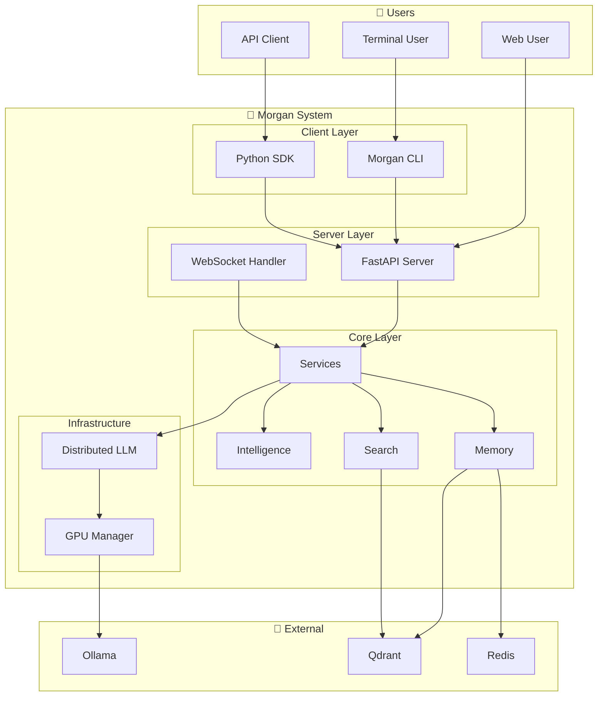

### Request Processing Flow

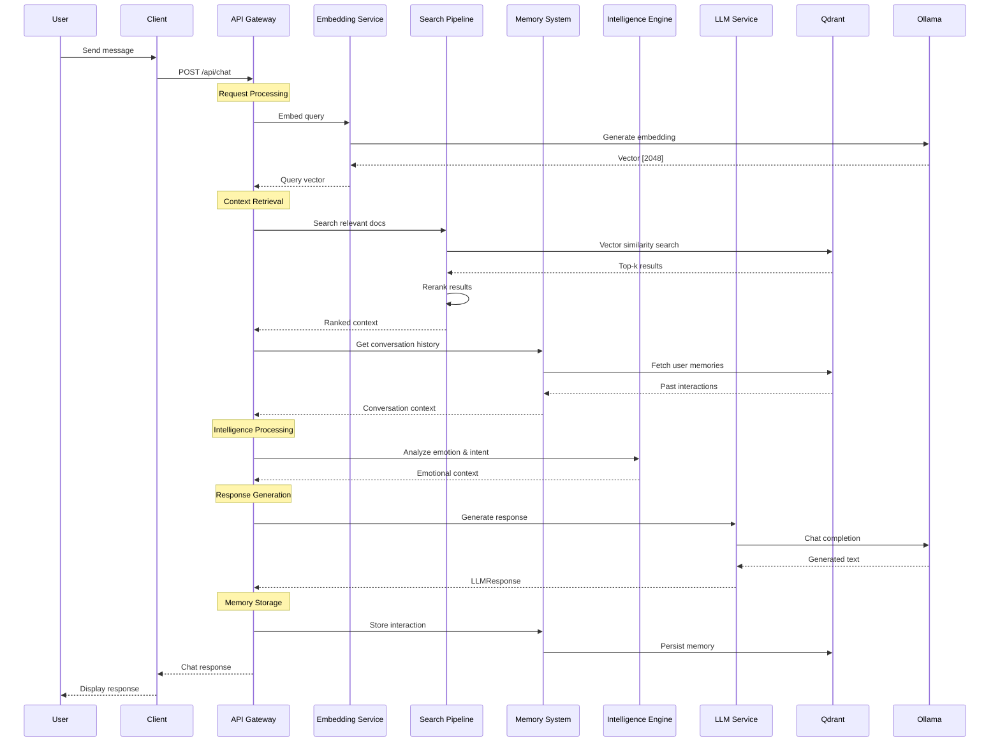

---

## 📁 Project Structure

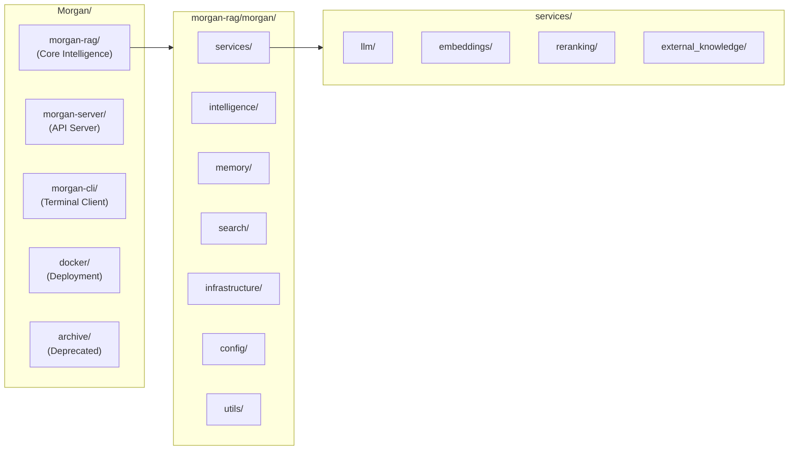

### Directory Structure

```
Morgan/
├── morgan-rag/              # Core RAG intelligence (ACTIVE)
│   └── morgan/
│       ├── services/        # Unified service layer
│       │   ├── llm/         # LLM service
│       │   ├── embeddings/  # Embedding service
│       │   ├── reranking/   # Reranking service
│       │   └── external_knowledge/
│       ├── intelligence/    # Emotional intelligence
│       ├── memory/          # Conversation memory
│       ├── search/          # Multi-stage search
│       ├── infrastructure/  # Distributed infrastructure
│       ├── config/          # Configuration
│       └── utils/           # Utilities
├── morgan-server/           # FastAPI server (ACTIVE)
├── morgan-cli/              # Terminal client (ACTIVE)
├── docker/                  # Docker configs (ACTIVE)
├── shared/                  # Shared utilities
└── archive/                 # Archived deprecated code
```

---

## 🔧 Services Layer

### Service Architecture

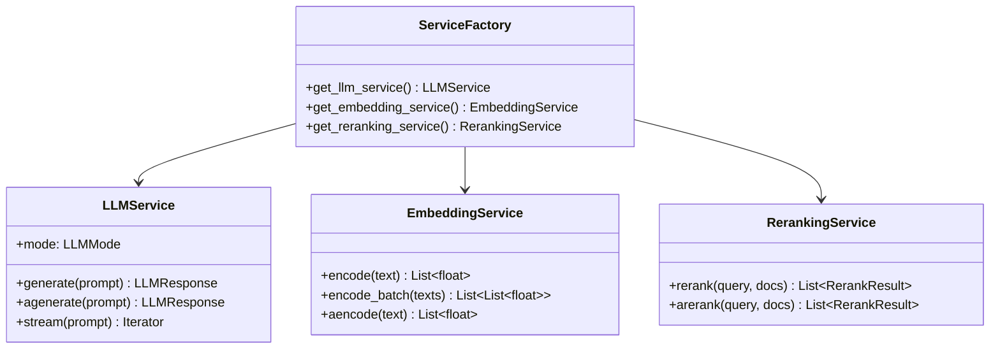

### Service Fallback Hierarchy

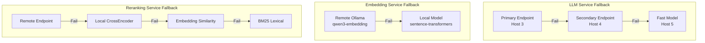

### Usage

```python
from morgan.services import (
    get_llm_service,
    get_embedding_service,
    get_reranking_service,
)

llm = get_llm_service()
embeddings = get_embedding_service()
reranking = get_reranking_service()
```

---

## 🧠 Intelligence Layer

### Emotional Intelligence Flow

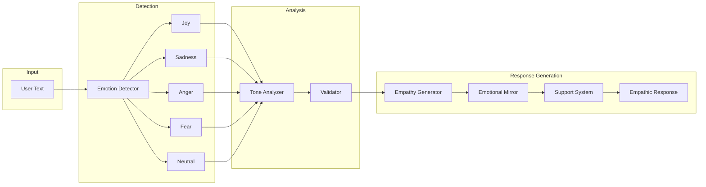

### Memory System Flow

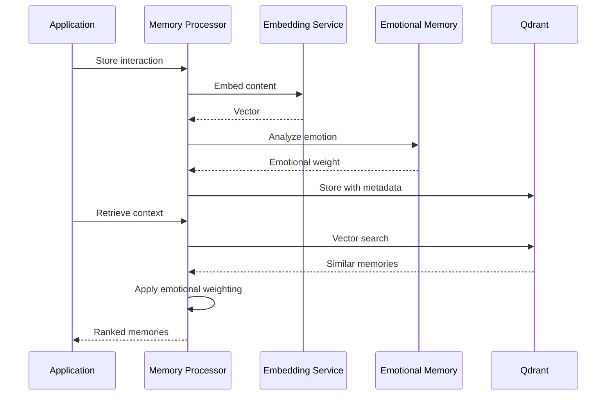

---

## 🔍 Search Pipeline

### Multi-Stage Search

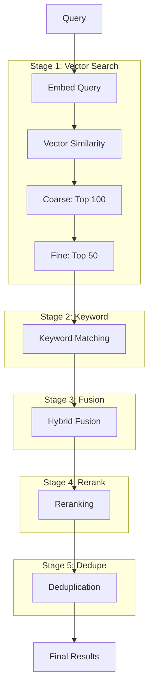

---

## 🖥️ Hardware Architecture

### 6-Host Distributed Setup

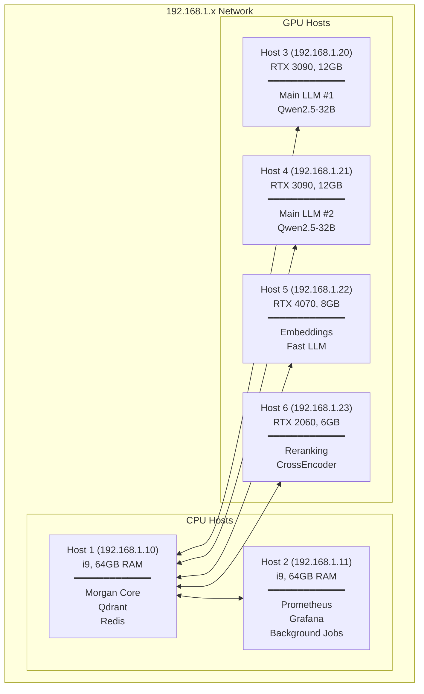

---

## 📋 Configuration

### Configuration Hierarchy

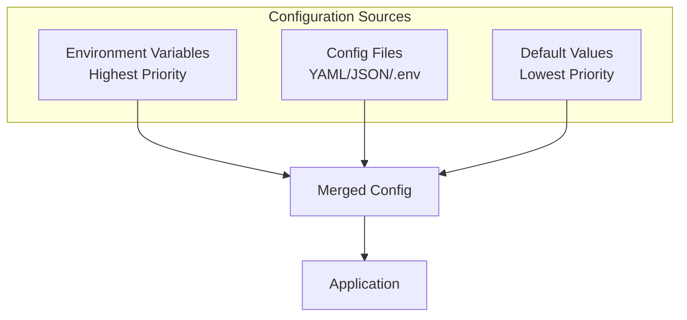

### Key Environment Variables

```bash
# LLM
MORGAN_LLM_ENDPOINT=http://localhost:11434/v1
MORGAN_LLM_MODEL=qwen2.5:7b

# Embeddings
MORGAN_EMBEDDING_ENDPOINT=http://localhost:11434/v1
MORGAN_EMBEDDING_MODEL=qwen3-embedding:4b

# Vector Database
MORGAN_QDRANT_URL=http://localhost:6333

# Cache
MORGAN_REDIS_URL=redis://localhost:6379
```

---

## 📊 Status & Progress

### Development Progress

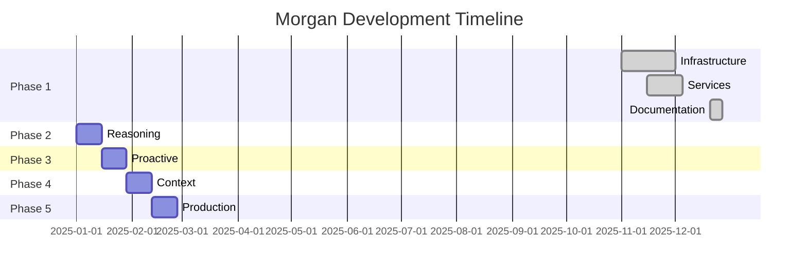

### Component Status

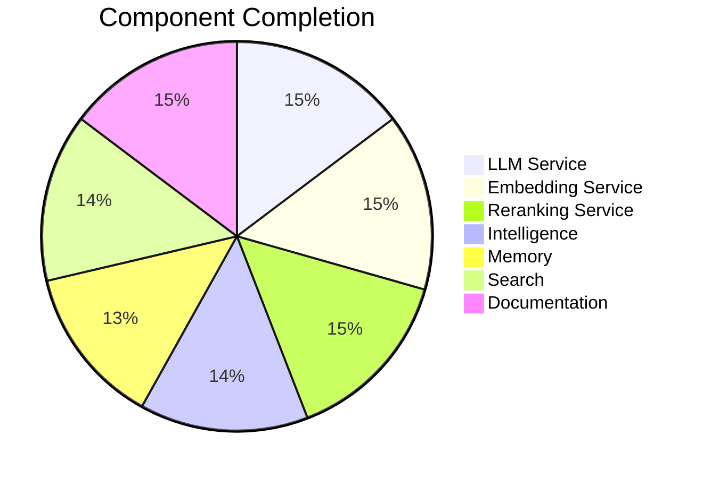

---

## 📂 Documentation Links

### Core Documentation

| Document | Description |
|----------|-------------|
| [claude.md](./claude.md) | Complete project context with all diagrams |
| [README.md](./README.md) | Project overview and quick start |
| [morgan-rag/docs/ARCHITECTURE.md](./morgan-rag/docs/ARCHITECTURE.md) | Detailed architecture |

### Component Documentation

| Document | Description |
|----------|-------------|
| [morgan-server/README.md](./morgan-server/README.md) | Server documentation |
| [morgan-cli/README.md](./morgan-cli/README.md) | CLI documentation |
| [docker/README.md](./docker/README.md) | Docker deployment |

### Migration & Setup

| Document | Description |
|----------|-------------|
| [MIGRATION.md](./MIGRATION.md) | Migration guide |
| [SYSTEM_STATUS.md](./SYSTEM_STATUS.md) | Current system status |

### Planning & Specs

| Document | Description |
|----------|-------------|
| [.kiro/CODEBASE_REORGANIZATION_SUMMARY.md](./.kiro/CODEBASE_REORGANIZATION_SUMMARY.md) | Reorganization summary |
| [.kiro/specs/codebase-reorganization/tasks.md](./.kiro/specs/codebase-reorganization/tasks.md) | Implementation tasks |

---

## 💡 Getting Help

1. **Check Documentation** - Search this index
2. **Check claude.md** - Complete project context with diagrams
3. **Check Logs** - Server and service logs
4. **GitHub Issues** - Report bugs or request features

---

## 📄 License

```
Copyright 2025 Morgan AI Assistant Contributors
Licensed under the Apache License, Version 2.0
```

See [LICENSE](./LICENSE) for the full license text.

---

**Morgan** - Your private, emotionally intelligent AI companion.
