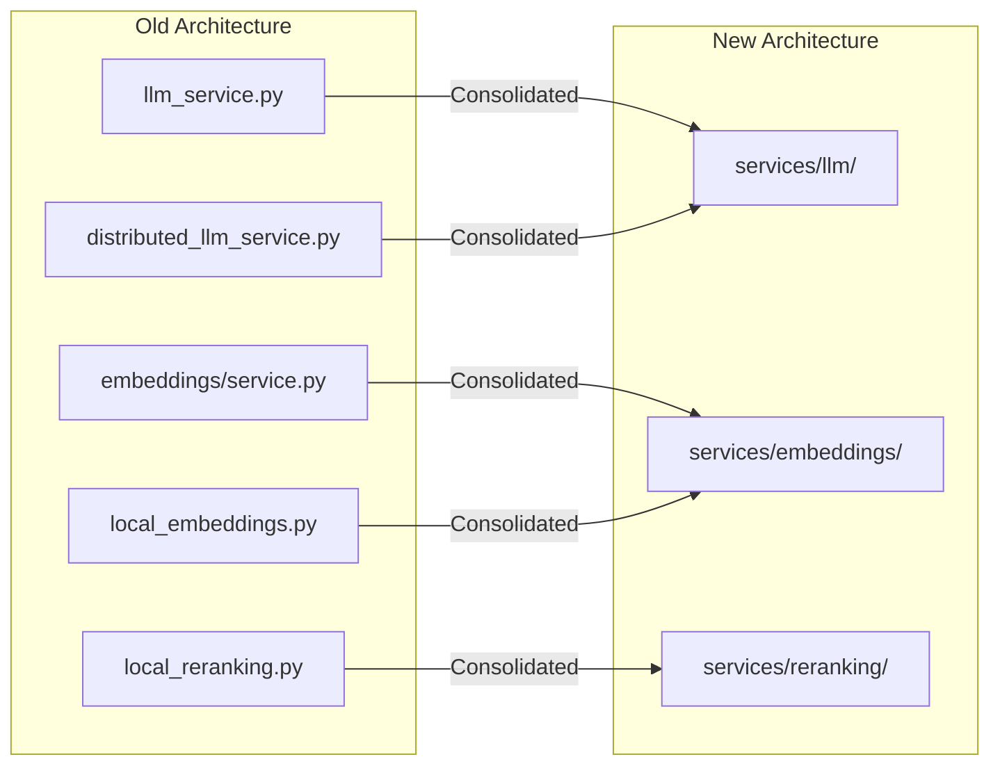
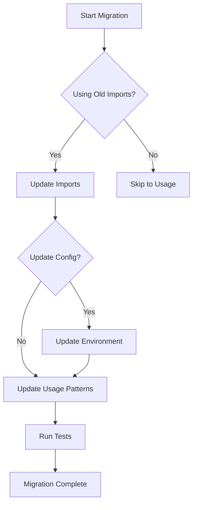
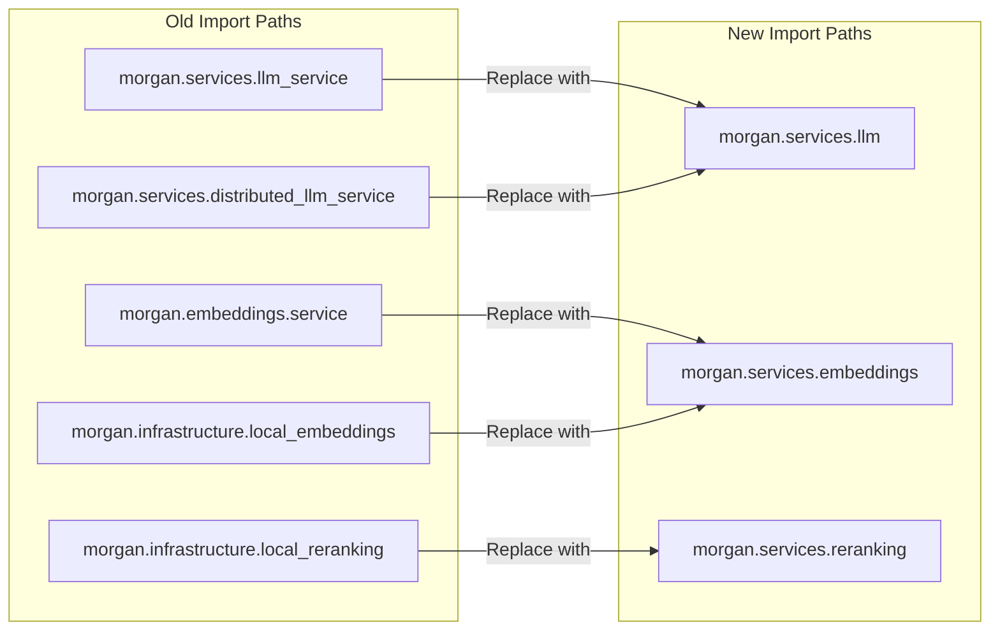
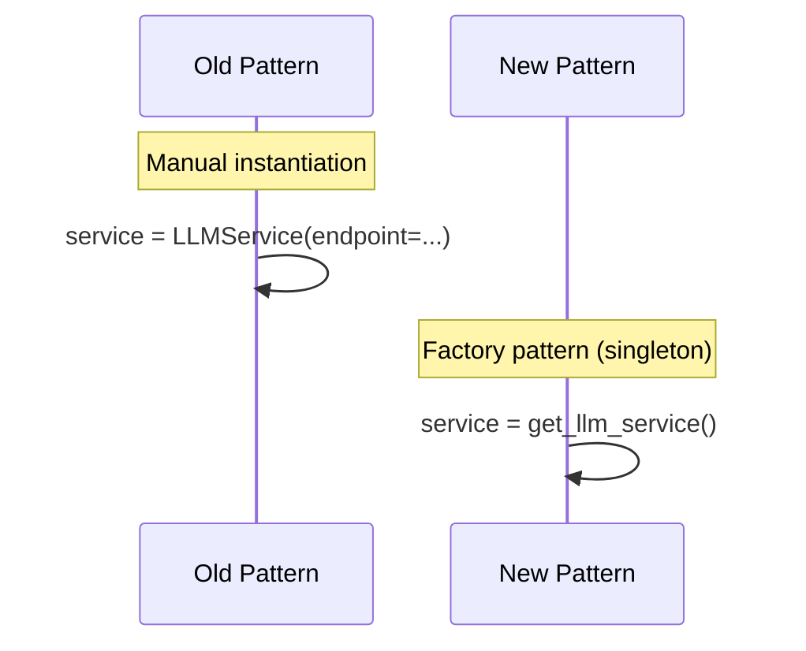
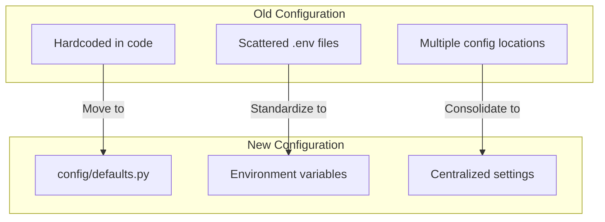
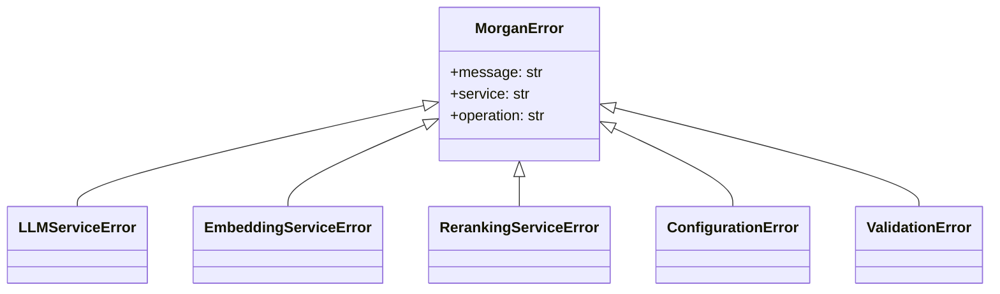
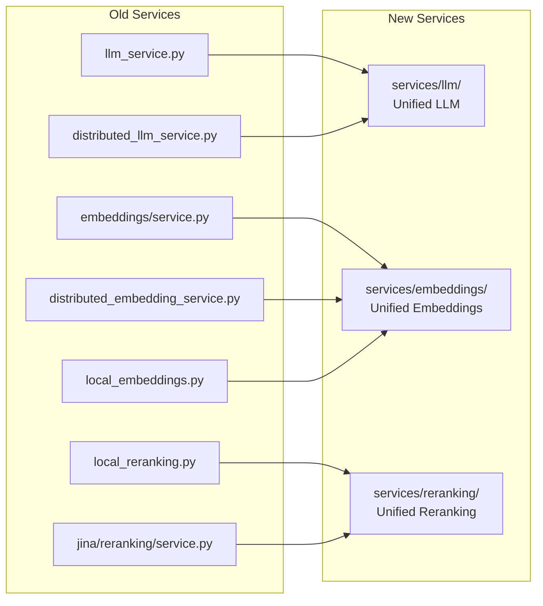
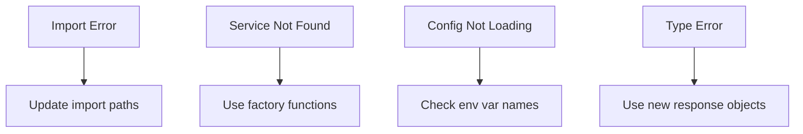

# Migration Guide

**Last Updated**: December 26, 2025

This guide helps you migrate from older Morgan implementations to the current unified architecture.

---

## Overview

### Architecture Evolution



### Migration Flow



---

## Quick Start (New Installation)

If you're starting fresh, skip migration and just install:

```bash
# Start services with Docker
cd docker
cp env.example .env
docker-compose up -d

# Pull LLM model
docker-compose exec ollama ollama pull qwen2.5:7b

# Install CLI
pip install -e ../morgan-cli

# Start chatting
export MORGAN_SERVER_URL=http://localhost:8080
morgan chat
```

---

## Import Migration

### Import Path Changes



### LLM Service Migration

**Old imports (no longer work):**

```python
# ❌ These imports are removed
from morgan.services.llm_service import LLMService
from morgan.services.distributed_llm_service import DistributedLLMService
```

**New imports:**

```python
# ✅ Use these instead
from morgan.services import get_llm_service
from morgan.services.llm import LLMService, LLMResponse, LLMMode
```

### Embedding Service Migration

**Old imports (no longer work):**

```python
# ❌ These imports are removed
from morgan.embeddings.service import EmbeddingService
from morgan.infrastructure.local_embeddings import LocalEmbeddingService
from morgan.services.distributed_embedding_service import DistributedEmbeddingService
```

**New imports:**

```python
# ✅ Use these instead
from morgan.services import get_embedding_service
from morgan.services.embeddings import EmbeddingService
```

### Reranking Service Migration

**Old imports (no longer work):**

```python
# ❌ These imports are removed
from morgan.infrastructure.local_reranking import LocalRerankingService
from morgan.jina.reranking.service import JinaRerankingService
```

**New imports:**

```python
# ✅ Use these instead
from morgan.services import get_reranking_service
from morgan.services.reranking import RerankingService, RerankResult
```

---

## Usage Pattern Migration

### Service Initialization



**Old pattern:**

```python
# ❌ Old: Manual instantiation
llm = LLMService(endpoint="http://localhost:11434/v1")
embeddings = EmbeddingService(model="all-MiniLM-L6-v2")
```

**New pattern:**

```python
# ✅ New: Factory functions (singletons)
from morgan.services import get_llm_service, get_embedding_service

llm = get_llm_service()  # Uses defaults or environment
embeddings = get_embedding_service()
```

### LLM Generation

**Old pattern:**

```python
# ❌ Old
response = llm.generate("Hello")
text = response["content"]
```

**New pattern:**

```python
# ✅ New: Typed response object
response = llm.generate("Hello")
text = response.content  # LLMResponse object
model = response.model
usage = response.usage
```

### Embedding Generation

**Old pattern:**

```python
# ❌ Old
vector = embeddings.embed("Text")
vectors = embeddings.embed_batch(["Text 1", "Text 2"])
```

**New pattern:**

```python
# ✅ New: Consistent naming
vector = embeddings.encode("Text")
vectors = embeddings.encode_batch(["Text 1", "Text 2"])

# Async versions
vector = await embeddings.aencode("Text")
vectors = await embeddings.aencode_batch(["Text 1", "Text 2"])
```

### Reranking

**Old pattern:**

```python
# ❌ Old
results = reranker.rerank(query, documents)
for doc, score in results:
    print(f"{score}: {doc}")
```

**New pattern:**

```python
# ✅ New: Typed result objects
results = await reranking.rerank(query, documents, top_k=10)
for result in results:
    print(f"{result.score}: {result.text}")
    print(f"  Original index: {result.index}")
```

---

## Configuration Migration

### Configuration Flow



### Environment Variables

**Old (scattered):**

```bash
# Various names in different places
LLM_ENDPOINT=http://localhost:11434/v1
EMBEDDING_MODEL=all-MiniLM-L6-v2
QDRANT_HOST=localhost
```

**New (standardized):**

```bash
# Consistent MORGAN_ prefix
MORGAN_LLM_ENDPOINT=http://localhost:11434/v1
MORGAN_LLM_MODEL=qwen2.5:7b
MORGAN_EMBEDDING_ENDPOINT=http://localhost:11434/v1
MORGAN_EMBEDDING_MODEL=qwen3-embedding:4b
MORGAN_QDRANT_URL=http://localhost:6333
MORGAN_REDIS_URL=redis://localhost:6379
```

### Using Defaults

```python
from morgan.config.defaults import Defaults

# Access default values
endpoint = Defaults.LLM_ENDPOINT
model = Defaults.LLM_MODEL
dimensions = Defaults.EMBEDDING_DIMENSIONS
```

---

## Exception Handling Migration

### Exception Hierarchy



**Old pattern:**

```python
# ❌ Old: Generic exceptions
try:
    response = llm.generate("Hello")
except Exception as e:
    print(f"Error: {e}")
```

**New pattern:**

```python
# ✅ New: Typed exceptions
from morgan.exceptions import LLMServiceError, MorganError

try:
    response = llm.generate("Hello")
except LLMServiceError as e:
    print(f"LLM error: {e.message}")
    print(f"Service: {e.service}")
    print(f"Operation: {e.operation}")
except MorganError as e:
    print(f"Morgan error: {e}")
```

---

## Feature Mapping

### Services



| Old Location | New Location | Notes |
|-------------|--------------|-------|
| `services/llm_service.py` | `services/llm/` | Unified with distributed |
| `services/distributed_llm_service.py` | `services/llm/` | Merged |
| `embeddings/service.py` | `services/embeddings/` | Unified with fallback |
| `infrastructure/local_embeddings.py` | `services/embeddings/` | Merged |
| `infrastructure/local_reranking.py` | `services/reranking/` | Merged |
| `jina/reranking/service.py` | `services/reranking/` | Merged |

### Utilities

| Old Pattern | New Location | Notes |
|-------------|--------------|-------|
| Repeated singletons | `utils/singleton.py` | SingletonFactory |
| Repeated cache setup | `utils/model_cache.py` | Unified cache |
| Repeated deduplication | `utils/deduplication.py` | ResultDeduplicator |

---

## Troubleshooting

### Common Issues



### Import Errors

**Error:**
```
ModuleNotFoundError: No module named 'morgan.services.llm_service'
```

**Solution:**
```python
# Update to new import path
from morgan.services import get_llm_service
llm = get_llm_service()
```

### Service Not Found

**Error:**
```
AttributeError: 'NoneType' object has no attribute 'generate'
```

**Solution:**
```python
# Use factory function, not direct import
from morgan.services import get_llm_service
llm = get_llm_service()  # Creates singleton
```

### Configuration Issues

**Error:**
```
ConfigurationError: LLM_ENDPOINT not found
```

**Solution:**
```bash
# Use MORGAN_ prefix
export MORGAN_LLM_ENDPOINT=http://localhost:11434/v1
```

---

## Verification

### Test Migration

```bash
# Run verification script
cd morgan-rag
python -c "
from morgan.services import get_llm_service, get_embedding_service, get_reranking_service

llm = get_llm_service()
emb = get_embedding_service()
rrk = get_reranking_service()

print('✅ All services loaded successfully')
print(f'  LLM: {type(llm).__name__}')
print(f'  Embeddings: {type(emb).__name__}')
print(f'  Reranking: {type(rrk).__name__}')
"
```

### Run Tests

```bash
cd morgan-rag
pytest tests/ -v
```

---

## Getting Help

1. **Check Documentation** - [DOCUMENTATION.md](./DOCUMENTATION.md)
2. **Check Project Context** - [claude.md](./claude.md)
3. **Check Architecture** - [morgan-rag/docs/ARCHITECTURE.md](./morgan-rag/docs/ARCHITECTURE.md)
4. **GitHub Issues** - Report problems or ask questions

---

**Morgan** - Your private, emotionally intelligent AI companion.
