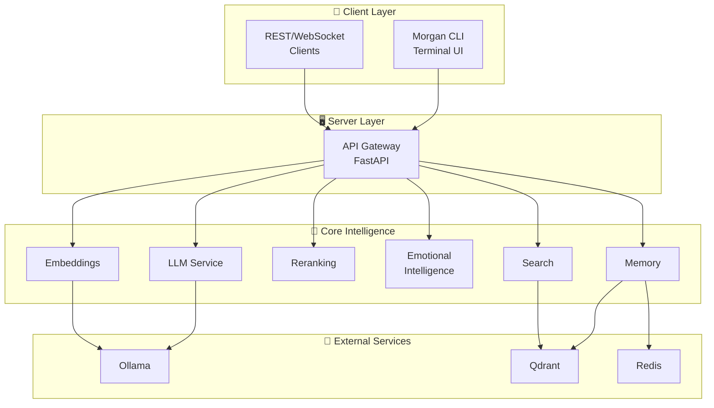
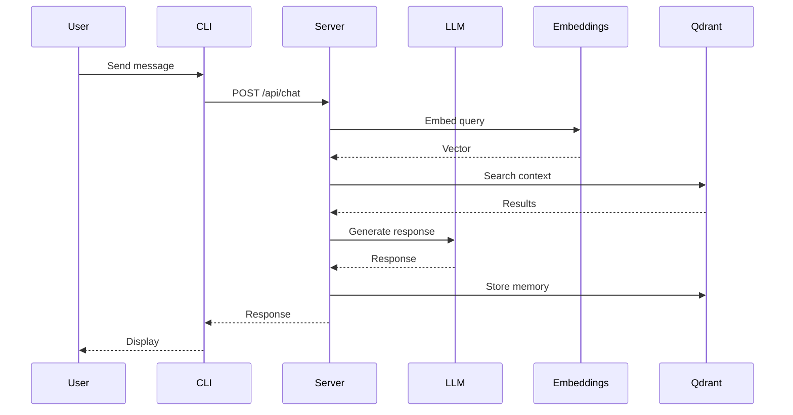
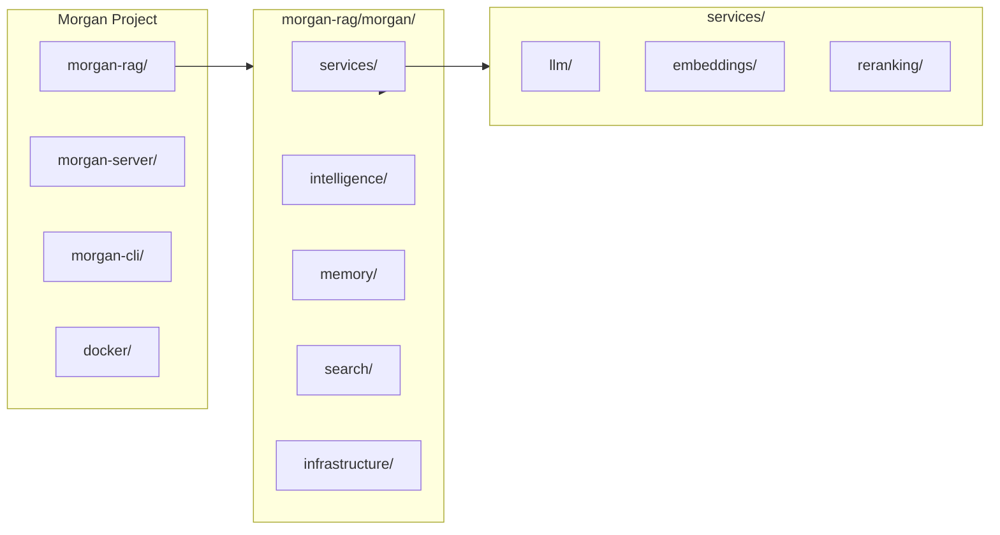
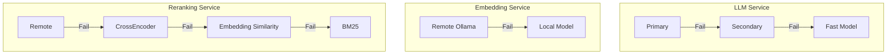
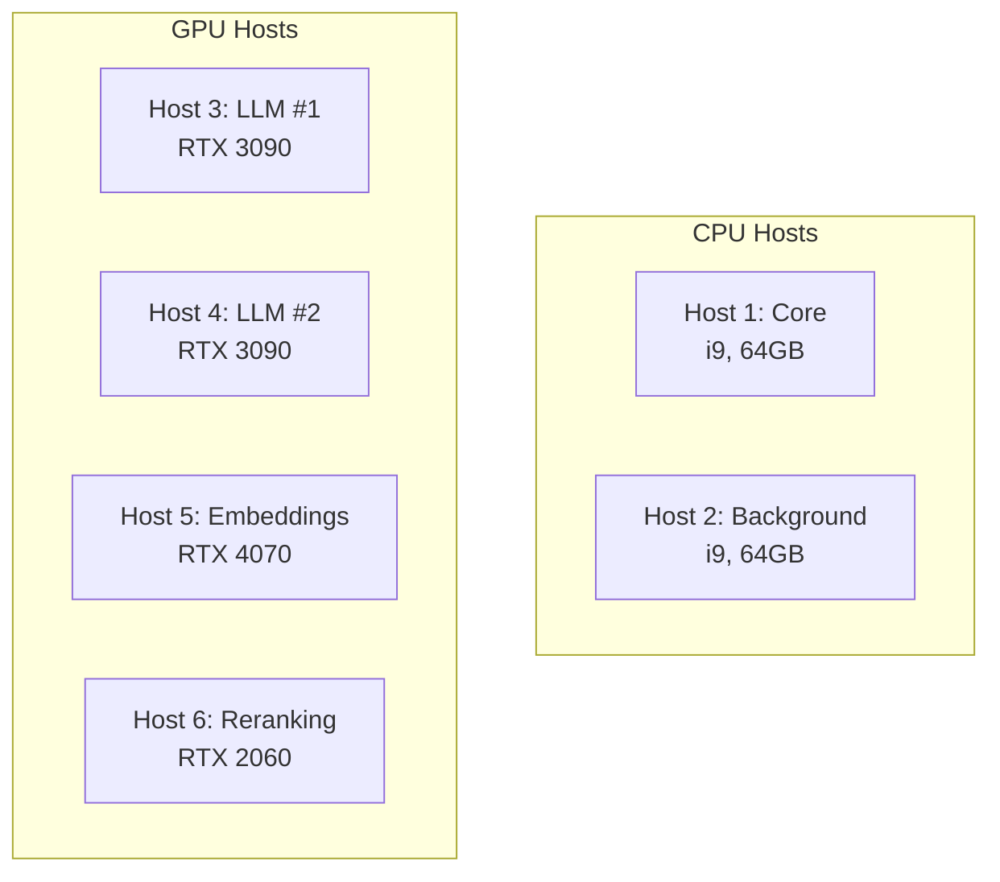
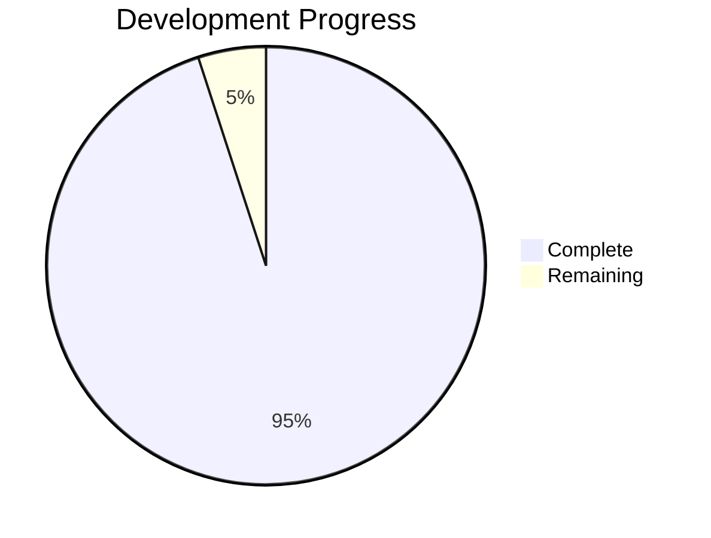

# Morgan AI Assistant

Morgan is a self-hosted, distributed personal AI assistant with emotional intelligence, knowledge management, and natural conversation capabilities. Built with a clean modular architecture for privacy-focused deployment.

## ✨ Features

- **🧠 Emotional Intelligence** - Understands emotions, responds empathetically, builds relationships
- **📚 Knowledge Engine** - RAG system with vector database and semantic search
- **🎯 Personalization** - User profiles, preferences, and conversation memory
- **🏠 Self-Hosted** - Run entirely on your own hardware, no external APIs required
- **⚡ Distributed** - Scale across multiple hosts with load balancing and failover
- **🔒 Privacy First** - All data stays on your hardware

## 🏗️ Architecture

### System Overview



### Request Flow



### Component Architecture

```
┌─────────────────────────────────────────────────────────────┐
│                        Morgan Stack                         │
├─────────────────────────────────────────────────────────────┤
│  ┌─────────────┐  ┌─────────────┐  ┌─────────────────────┐  │
│  │ morgan-cli  │  │morgan-server│  │     morgan-rag      │  │
│  │   (TUI)     │◄─┤   (API)     │◄─┤  (Core Intelligence)│  │
│  └─────────────┘  └─────────────┘  └─────────────────────┘  │
│                                              │              │
│                          ┌───────────────────┼──────────────┤
│                          │                   │              │
│  ┌─────────────┐  ┌──────▼──────┐   ┌────────▼────────┐     │
│  │   Ollama    │  │   Qdrant    │   │     Redis       │     │
│  │   (LLM)     │  │ (Vector DB) │   │   (Cache)       │     │
│  └─────────────┘  └─────────────┘   └─────────────────┘     │
└─────────────────────────────────────────────────────────────┘
```

### Components

| Component | Description | Status |
|-----------|-------------|--------|
| **morgan-rag** | Core intelligence: services, emotional intelligence, memory, search | ✅ Active |
| **morgan-server** | FastAPI server with REST/WebSocket API | ✅ Active |
| **morgan-cli** | Terminal UI client | ✅ Active |
| **docker** | Docker deployment configurations | ✅ Active |

## 🚀 Quick Start

### Using Docker Compose (Recommended)

```bash
# Clone repository
git clone https://github.com/lazarevtill/morgan.git
cd morgan

# Start services
cd docker
cp env.example .env
docker-compose up -d

# Pull LLM model
docker-compose exec ollama ollama pull qwen2.5:7b

# Install client
pip install -e ../morgan-cli

# Start chatting
export MORGAN_SERVER_URL=http://localhost:8080
morgan chat
```

### Manual Installation

```bash
# Start dependencies
docker run -d -p 6333:6333 qdrant/qdrant
ollama serve &
ollama pull qwen2.5:7b

# Install and start server
cd morgan-server
pip install -e .
python -m morgan_server

# Install and start client
cd ../morgan-cli
pip install -e .
morgan chat
```

## 📁 Project Structure



### Directory Layout

```
Morgan/
├── morgan-rag/              # Core RAG intelligence
│   └── morgan/
│       ├── services/        # Unified service layer
│       │   ├── llm/         # LLM service (single + distributed)
│       │   ├── embeddings/  # Embedding service
│       │   └── reranking/   # Reranking service
│       ├── intelligence/    # Emotional intelligence
│       ├── memory/          # Conversation memory
│       ├── search/          # Multi-stage search
│       ├── learning/        # Pattern learning
│       └── ...
│
├── morgan-server/           # FastAPI server
├── morgan-cli/              # Terminal client
├── docker/                  # Docker configs
├── shared/                  # Shared utilities
└── archive/                 # Archived deprecated code
```

## 🔧 Configuration

### Environment Variables

```bash
# LLM
MORGAN_LLM_ENDPOINT=http://localhost:11434/v1
MORGAN_LLM_MODEL=qwen2.5:7b

# Embeddings
MORGAN_EMBEDDING_ENDPOINT=http://localhost:11434/v1
MORGAN_EMBEDDING_MODEL=qwen3-embedding:4b

# Vector Database
MORGAN_QDRANT_URL=http://localhost:6333

# Cache
MORGAN_REDIS_URL=redis://localhost:6379
```

### Configuration File

```yaml
# Server settings
host: "0.0.0.0"
port: 8080

# LLM settings
llm_provider: "ollama"
llm_endpoint: "http://localhost:11434"
llm_model: "qwen2.5:7b"

# Vector database
vector_db_url: "http://localhost:6333"

# Embedding settings
embedding_model: "qwen3-embedding:4b"
embedding_dimensions: 2048
```

## 💻 Usage

### Python API

```python
from morgan.services import (
    get_llm_service,
    get_embedding_service,
    get_reranking_service,
)

# Get service instances
llm = get_llm_service()
embeddings = get_embedding_service()

# Generate response
response = llm.generate("What is Python?")
print(response.content)

# Async generation
response = await llm.agenerate("Explain Docker")

# Embeddings
embedding = embeddings.encode("Document text")
```

### CLI Commands

```bash
morgan chat              # Start interactive chat
morgan ask "question"    # Single question
morgan learn file.pdf    # Learn from document
morgan health            # Check system health
```

### REST API

```bash
# Chat
curl -X POST http://localhost:8080/api/chat \
  -H "Content-Type: application/json" \
  -d '{"message": "Hello, Morgan!"}'

# Health check
curl http://localhost:8080/health
```

## 🔄 Service Fallback Strategy



## 📚 Documentation

| Document | Description |
|----------|-------------|
| [claude.md](./claude.md) | Complete project context with diagrams |
| [DOCUMENTATION.md](./DOCUMENTATION.md) | Documentation index |
| [MIGRATION.md](./MIGRATION.md) | Migration guide |
| [docker/README.md](./docker/README.md) | Docker deployment guide |
| [morgan-server/README.md](./morgan-server/README.md) | Server documentation |
| [morgan-cli/README.md](./morgan-cli/README.md) | CLI documentation |
| [morgan-rag/docs/ARCHITECTURE.md](./morgan-rag/docs/ARCHITECTURE.md) | Architecture details |

## 🖥️ Hardware Requirements

### Minimum (Single Host)
- **CPU:** 4+ cores
- **RAM:** 16GB
- **GPU:** 8GB VRAM (for local LLM)
- **Disk:** 50GB free space

### Recommended (Distributed - 6 Hosts)



## 🛠️ Development

### Running Tests

```bash
cd morgan-rag && pytest
cd morgan-server && pytest
cd morgan-cli && pytest
```

### Code Quality

```bash
black morgan_server morgan_cli
ruff check .
mypy morgan_server
```

## 📋 Status



| Phase | Description | Status |
|-------|-------------|--------|
| Phase 1 | Infrastructure & Services | ✅ 95% Complete |
| Phase 2 | Multi-Step Reasoning | ⏳ Planned |
| Phase 3 | Proactive Features | ⏳ Planned |
| Phase 4 | Enhanced Context | ⏳ Planned |
| Phase 5 | Production Polish | ⏳ Planned |

## 🤝 Contributing

Contributions are welcome! Please read the contributing guidelines.

## 📄 License

```
Copyright 2025 Morgan AI Assistant Contributors

Licensed under the Apache License, Version 2.0 (the "License");
you may not use this file except in compliance with the License.
You may obtain a copy of the License at

    http://www.apache.org/licenses/LICENSE-2.0

Unless required by applicable law or agreed to in writing, software
distributed under the License is distributed on an "AS IS" BASIS,
WITHOUT WARRANTIES OR CONDITIONS OF ANY KIND, either express or implied.
See the License for the specific language governing permissions and
limitations under the License.
```

See [LICENSE](./LICENSE) for the full license text.

---

**Morgan** - Your private, emotionally intelligent AI companion.
