# Morgan - Personal AI Assistant Project

**Status**: Phase 1 - Infrastructure Complete (95%)
**Version**: 2.0.0-alpha (Active Development)
**Last Updated**: December 26, 2025

---

## Project Overview

Morgan is a fully self-hosted, distributed personal AI assistant designed as an intelligent companion with:

- **Deep emotional intelligence** - Understands and responds empathetically (95% complete)
- **Multi-step reasoning** - Chain-of-thought planning and problem decomposition (planned)
- **Proactive assistance** - Anticipates needs and offers help before being asked (planned)
- **Complete privacy** - All processing on local hardware, zero external APIs
- **Continuous learning** - Adapts and improves from every interaction

**Key Principle**: Quality over speed (5-10s response time acceptable for thoughtful, accurate responses)

---

## System Architecture

### High-Level Architecture Diagram

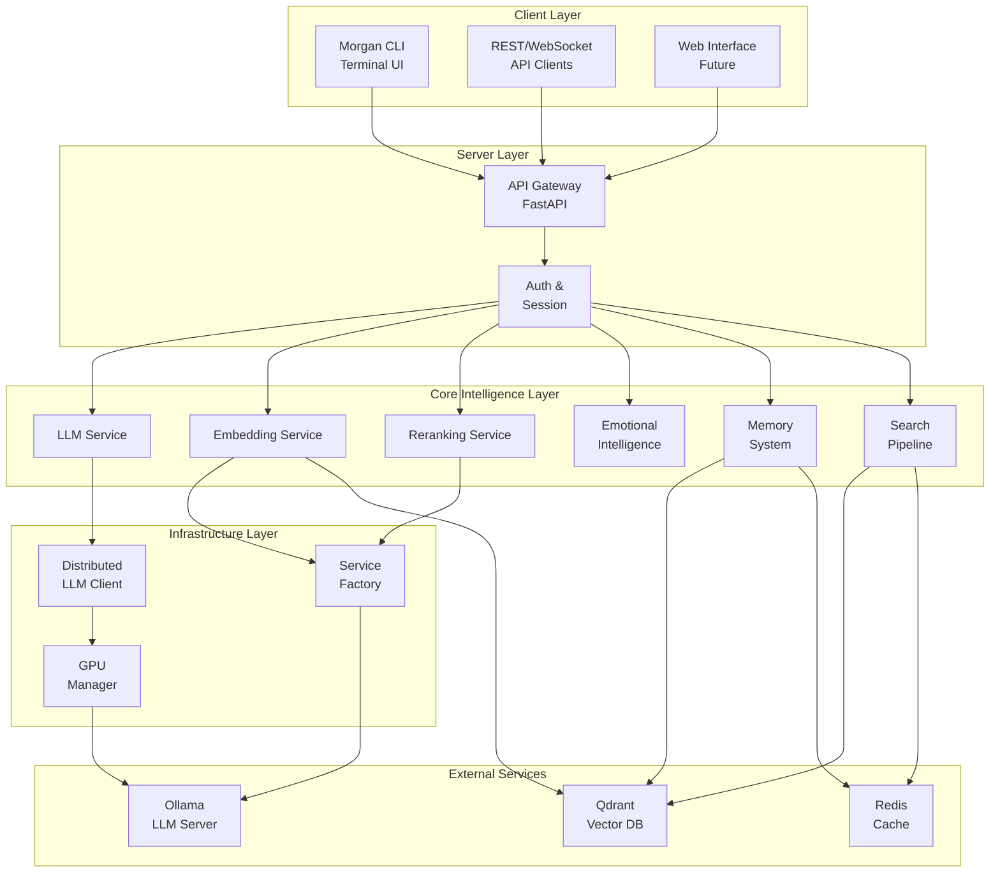

### Request Flow Sequence Diagram

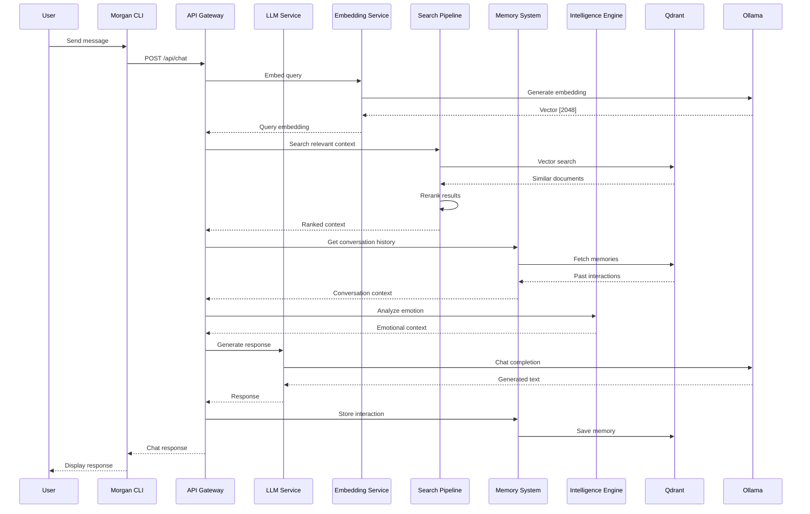

---

## Hardware Architecture (6 Hosts)

### Network Topology Diagram

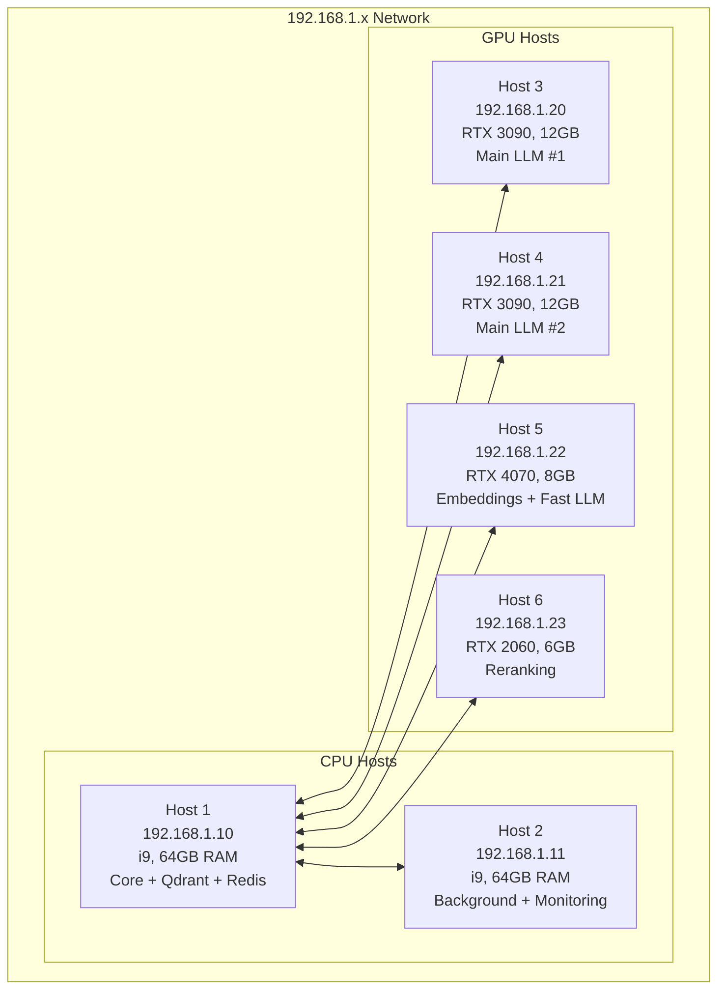

### Host Specifications

| Host | IP | Hardware | Role | Services |
|------|-----|----------|------|----------|
| **Host 1** | 192.168.1.10 | i9, 64GB RAM | Core | Morgan Orchestrator, Qdrant, Redis |
| **Host 2** | 192.168.1.11 | i9, 64GB RAM | Background | Prometheus, Grafana, Background Jobs |
| **Host 3** | 192.168.1.20 | RTX 3090, 12GB | LLM Primary | Ollama (Qwen2.5-32B) |
| **Host 4** | 192.168.1.21 | RTX 3090, 12GB | LLM Secondary | Ollama (Qwen2.5-32B) |
| **Host 5** | 192.168.1.22 | RTX 4070, 8GB | Embeddings | Ollama (Qwen3-Embedding, Qwen2.5-7B) |
| **Host 6** | 192.168.1.23 | RTX 2060, 6GB | Reranking | CrossEncoder Service |

---

## Technology Stack

### Self-Hosted Models
- **Main LLM**: Qwen2.5-32B-Instruct (Q4_K_M, ~19GB) - Complex reasoning
- **Fast LLM**: Qwen2.5-7B-Instruct (Q5_K_M, ~4.4GB) - Simple queries
- **Embeddings**: Qwen3-Embedding:4b (2048 dims) via Ollama - RAG and semantic search
- **Reranking**: CrossEncoder ms-marco-MiniLM-L-6-v2 (~90MB) - Result relevance

### Infrastructure
- **LLM Serving**: Ollama (OpenAI-compatible API)
- **Vector Database**: Qdrant
- **Caching**: Redis
- **Services**: FastAPI
- **Language**: Python 3.11+

---

## Services Layer Architecture

### Service Class Diagram

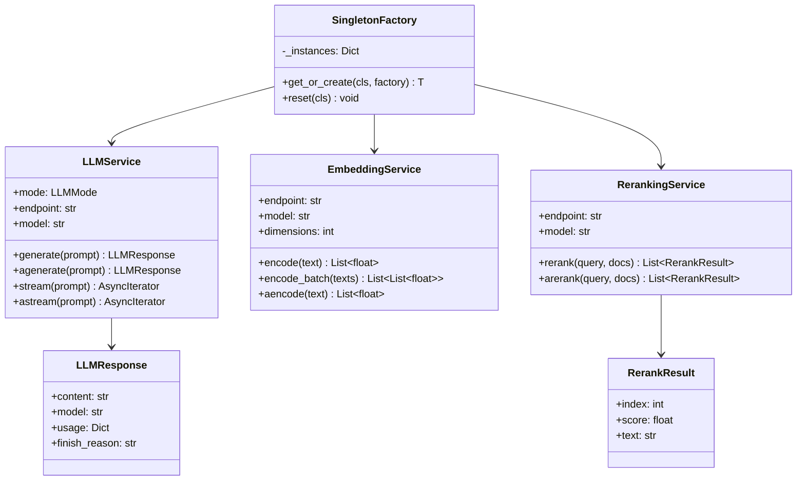

### Service Fallback Strategy

```mermaid
flowchart TD
    subgraph LLM["LLM Service"]
        L1[Primary Endpoint] --> L2{Healthy?}
        L2 -->|Yes| L3[Generate]
        L2 -->|No| L4[Secondary Endpoint]
        L4 --> L5{Healthy?}
        L5 -->|Yes| L3
        L5 -->|No| L6[Fast Model Fallback]
    end
    
    subgraph EMB["Embedding Service"]
        E1[Remote Ollama] --> E2{Available?}
        E2 -->|Yes| E3[Generate Embedding]
        E2 -->|No| E4[Local sentence-transformers]
        E4 --> E3
    end
    
    subgraph RERANK["Reranking Service"]
        R1[Remote Endpoint] --> R2{Available?}
        R2 -->|Yes| R3[Rerank]
        R2 -->|No| R4[Local CrossEncoder]
        R4 --> R5{Available?}
        R5 -->|Yes| R3
        R5 -->|No| R6[Embedding Similarity]
        R6 --> R7{Available?}
        R7 -->|Yes| R3
        R7 -->|No| R8[BM25 Lexical]
        R8 --> R3
    end
```

---

## Project Structure

```
Morgan/
├── morgan-rag/                    # Main RAG project
│   ├── morgan/
│   │   ├── services/              # ✅ Unified services layer
│   │   │   ├── __init__.py        # Service exports
│   │   │   ├── llm/               # LLM service
│   │   │   │   ├── __init__.py
│   │   │   │   ├── models.py      # LLMResponse, LLMMode
│   │   │   │   └── service.py     # LLMService class
│   │   │   ├── embeddings/        # Embedding service
│   │   │   │   ├── __init__.py
│   │   │   │   ├── models.py      # EmbeddingStats
│   │   │   │   └── service.py     # EmbeddingService class
│   │   │   ├── reranking/         # Reranking service
│   │   │   │   ├── __init__.py
│   │   │   │   ├── models.py      # RerankResult, RerankStats
│   │   │   │   └── service.py     # RerankingService class
│   │   │   └── external_knowledge/# External knowledge sources
│   │   │
│   │   ├── infrastructure/        # ✅ Distributed infrastructure
│   │   │   ├── distributed_llm.py # Load balancing
│   │   │   ├── distributed_gpu_manager.py
│   │   │   ├── multi_gpu_manager.py
│   │   │   └── factory.py         # Infrastructure factory
│   │   │
│   │   ├── intelligence/          # ✅ Emotional intelligence
│   │   │   ├── emotions/          # Emotion detection
│   │   │   ├── empathy/           # Empathic responses
│   │   │   └── core/              # Intelligence engine
│   │   │
│   │   ├── learning/              # ✅ Pattern learning
│   │   ├── memory/                # ✅ Conversation memory
│   │   ├── companion/             # ✅ Relationship management
│   │   ├── search/                # ✅ Multi-stage search
│   │   ├── reasoning/             # ✅ Multi-step reasoning
│   │   ├── proactive/             # ✅ Proactive assistance
│   │   ├── communication/         # ✅ Communication preferences
│   │   │
│   │   ├── config/                # ✅ Configuration
│   │   │   ├── defaults.py        # Default values
│   │   │   ├── settings.py        # Application settings
│   │   │   └── distributed_config.py
│   │   │
│   │   ├── utils/                 # ✅ Utilities
│   │   │   ├── singleton.py       # Singleton factory
│   │   │   ├── model_cache.py     # Model caching
│   │   │   ├── deduplication.py   # Result deduplication
│   │   │   └── logger.py          # Logging
│   │   │
│   │   ├── core/                  # Core assistant logic
│   │   └── exceptions.py          # ✅ Exception hierarchy
│   │
│   ├── tests/                     # Test suite
│   ├── examples/                  # Usage examples
│   └── scripts/                   # Utility scripts
│
├── morgan-server/                 # Server component
├── morgan-cli/                    # CLI client
├── docker/                        # Docker configurations
├── archive/                       # Archived deprecated code
├── shared/                        # Shared models and utilities
└── .kiro/                         # Kiro specs and planning docs
```

---

## Service Usage Examples

### LLM Service Flow

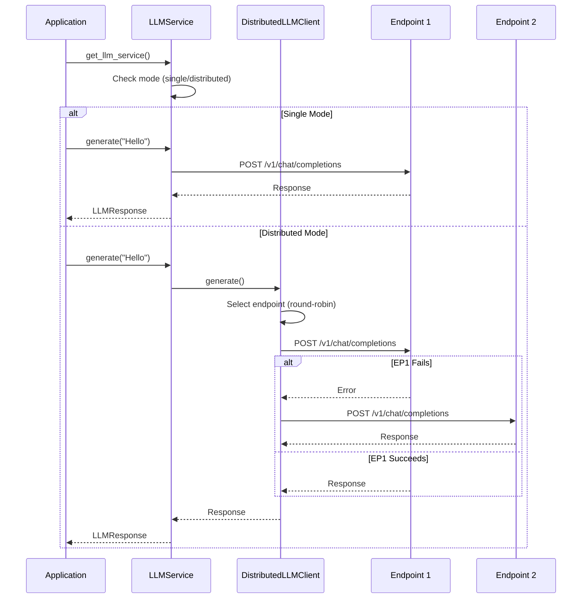

### Code Examples

```python
# Import from unified services layer
from morgan.services import (
    get_llm_service,
    get_embedding_service,
    get_reranking_service,
)

# Get service instances (singletons)
llm = get_llm_service()
embeddings = get_embedding_service()
reranking = get_reranking_service()

# LLM Generation
response = llm.generate("What is Python?")
print(response.content)

# Async LLM Generation
response = await llm.agenerate("Explain Docker")

# Embeddings
embedding = embeddings.encode("Document text")
embeddings_batch = embeddings.encode_batch(["Doc 1", "Doc 2"])

# Reranking
results = await reranking.rerank(
    query="Python programming",
    documents=["Doc 1", "Doc 2", "Doc 3"],
    top_k=10
)
```

### Distributed LLM (Advanced)

```python
from morgan.services.llm import get_llm_service

# Distributed mode with multiple endpoints
llm = get_llm_service(
    mode="distributed",
    endpoints=[
        "http://192.168.1.20:11434/v1",  # Host 3 (3090 #1)
        "http://192.168.1.21:11434/v1"   # Host 4 (3090 #2)
    ]
)

response = await llm.agenerate(
    prompt="Explain quantum computing",
    temperature=0.7
)
```

---

## Exception Hierarchy

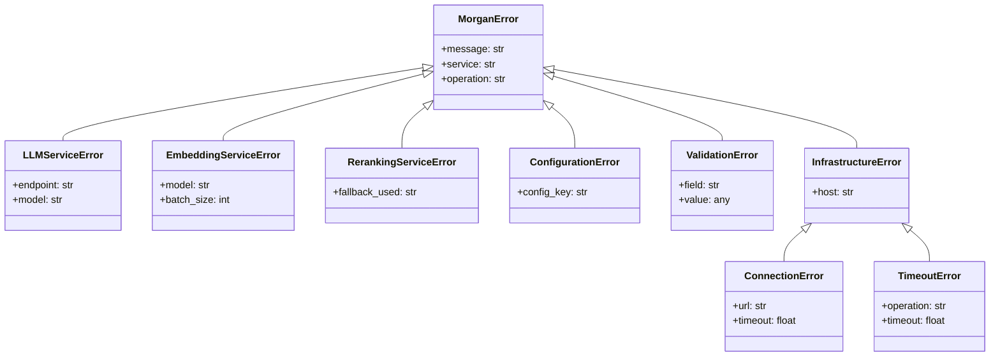

### Usage

```python
from morgan.exceptions import (
    MorganError,           # Base exception
    LLMServiceError,       # LLM failures
    EmbeddingServiceError, # Embedding failures
    RerankingServiceError, # Reranking failures
    ConfigurationError,    # Configuration issues
    ValidationError,       # Input validation errors
)

try:
    response = llm.generate("Hello")
except LLMServiceError as e:
    print(f"LLM failed: {e.message}")
    print(f"Service: {e.service}")
    print(f"Operation: {e.operation}")
```

---

## Search Pipeline

### Multi-Stage Search Flow

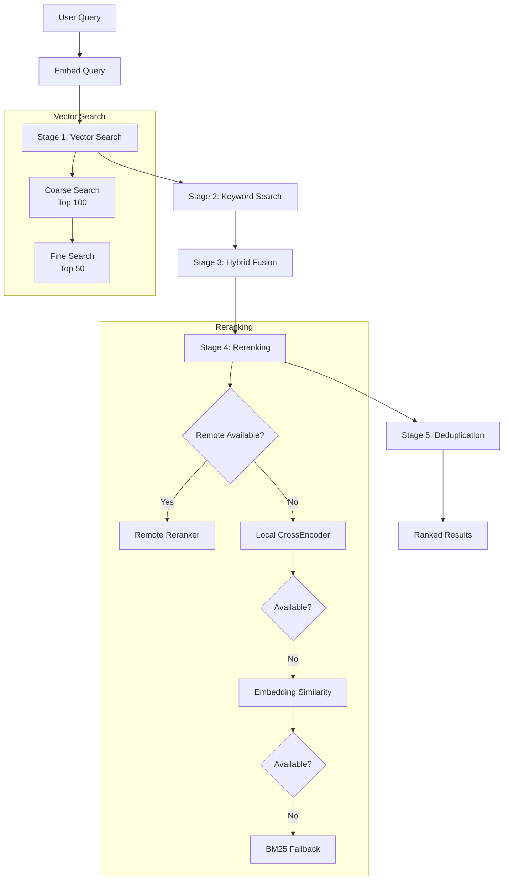

---

## Memory System

### Memory Flow Diagram

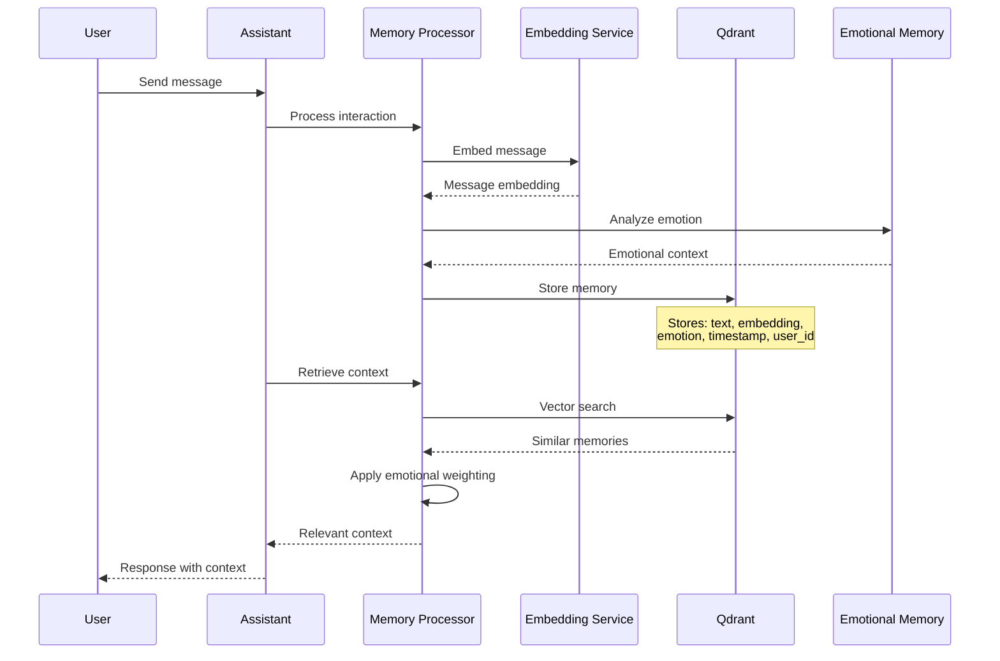

---

## Emotional Intelligence

### Emotion Processing Flow

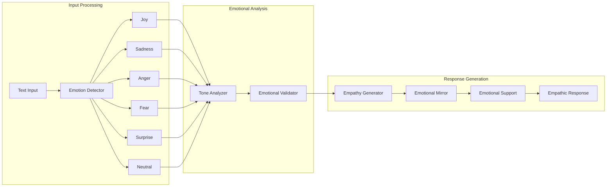

---

## Performance Targets

| Operation | Target | Status |
|-----------|--------|--------|
| Embeddings (batch) | <200ms | ✅ Achieved |
| Search + rerank | <500ms | ✅ Achieved |
| Simple queries | 1-2s | ⏳ Target |
| Complex reasoning | 5-10s | ⏳ Acceptable |

---

## Development Progress

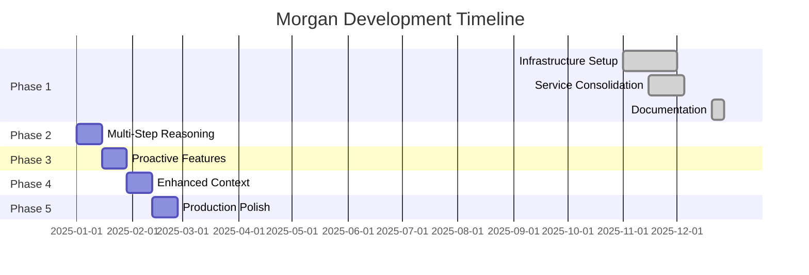

---

## Quick Reference

| Component | Location | Status |
|-----------|----------|--------|
| LLM Service | `morgan/services/llm/` | ✅ Complete |
| Embedding Service | `morgan/services/embeddings/` | ✅ Complete |
| Reranking Service | `morgan/services/reranking/` | ✅ Complete |
| Infrastructure | `morgan/infrastructure/` | ✅ Complete |
| Emotional Intelligence | `morgan/intelligence/` | ✅ Excellent |
| Memory System | `morgan/memory/` | ✅ Strong |
| Search Pipeline | `morgan/search/` | ✅ Excellent |
| Configuration | `morgan/config/` | ✅ Complete |
| Exceptions | `morgan/exceptions.py` | ✅ Complete |
| Documentation | Various `.md` files | ✅ Complete |

---

## Key Design Principles

1. **Privacy First** - All data stays on your hardware, no external APIs
2. **Quality Over Speed** - 5-10s for thoughtful responses is acceptable
3. **KISS (Keep It Simple)** - Simple, focused modules with clear responsibilities
4. **Modular Enhancement** - Keep excellent existing code, add missing capabilities
5. **Fault Tolerance** - Distributed architecture with failover and health monitoring

---

**Remember**: Morgan is a personal AI companion focused on emotional intelligence, proactive assistance, and complete privacy through self-hosting. Quality over speed, privacy over convenience.
