# Morgan RAG - Architecture Documentation

**Last Updated**: December 26, 2025

## Overview

Morgan RAG is the core intelligence engine of the Morgan AI Assistant. It provides:

- **Unified Services Layer** - Clean access to LLM, embeddings, and reranking
- **Emotional Intelligence** - Emotion detection, empathy, and relationship management
- **Memory System** - Conversation memory with emotional context
- **Search Pipeline** - Multi-stage semantic search with reranking
- **Distributed Infrastructure** - Scale across multiple hosts

---

## System Architecture

### High-Level Architecture

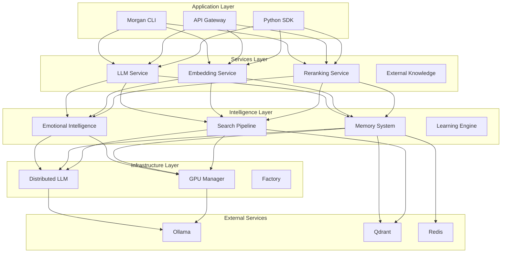
```mermaid
graph TB
    subgraph Application["Application Layer"]
        CLI[Morgan CLI]
        API[API Gateway]
        SDK[Python SDK]
    end
    
    subgraph Services["Services Layer"]
        LLM[LLM Service]
        EMB[Embedding Service]
        RRK[Reranking Service]
        EXT[External Knowledge]
    end
    
    subgraph Intelligence["Intelligence Layer"]
        INT[Emotional Intelligence]
        MEM[Memory System]
        SRC[Search Pipeline]
        LRN[Learning Engine]
    end
    
    subgraph Infrastructure["Infrastructure Layer"]
        DIST[Distributed LLM]
        GPU[GPU Manager]
        FAC[Factory]
    end
    
    subgraph External["External Services"]
        OLL[Ollama]
        QDR[Qdrant]
        RED[Redis]
    end
    
    CLI & API & SDK --> LLM & EMB & RRK
    LLM & EMB & RRK --> INT & MEM & SRC
    INT & MEM & SRC --> DIST & GPU
    DIST & GPU --> OLL
    MEM & SRC --> QDR
    MEM --> RED
```

### Layer Responsibilities


```mermaid
flowchart LR
    subgraph App["Application Layer"]
        direction TB
        A1[Request Handling]
        A2[Response Formatting]
        A3[Session Management]
    end
    
    subgraph Svc["Services Layer"]
        direction TB
        S1[LLM Generation]
        S2[Text Embedding]
        S3[Document Reranking]
    end
    
    subgraph Int["Intelligence Layer"]
        direction TB
        I1[Emotion Detection]
        I2[Memory Management]
        I3[Context Search]
    end
    
    subgraph Inf["Infrastructure Layer"]
        direction TB
        N1[Load Balancing]
        N2[Failover]
        N3[Health Monitoring]
    end
    
    App --> Svc --> Int --> Inf
```

---

## Directory Structure

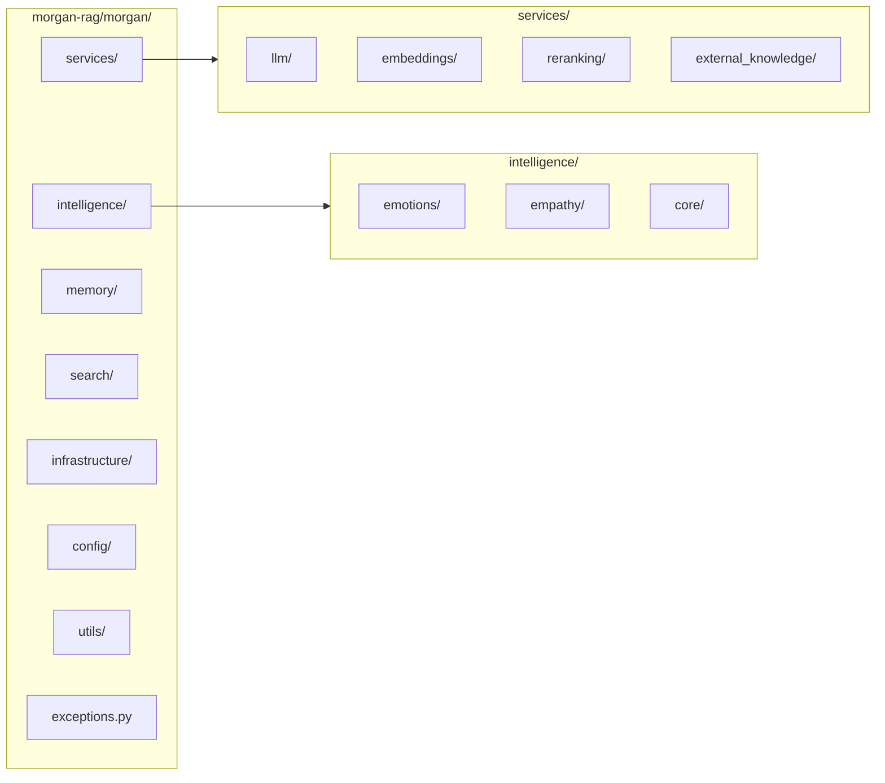
```mermaid
graph LR
    subgraph Root["morgan-rag/morgan/"]
        SVC["services/"]
        INT["intelligence/"]
        MEM["memory/"]
        SRC["search/"]
        INF["infrastructure/"]
        CFG["config/"]
        UTL["utils/"]
        EXC["exceptions.py"]
    end
    
    subgraph Services["services/"]
        LLM["llm/"]
        EMB["embeddings/"]
        RRK["reranking/"]
        EXT["external_knowledge/"]
    end
    
    subgraph Intelligence["intelligence/"]
        EMO["emotions/"]
        EMP["empathy/"]
        COR["core/"]
    end
    
    SVC --> Services
    INT --> Intelligence
```

### Full Directory Layout

```
morgan-rag/morgan/
├── services/                    # Unified Services Layer
│   ├── __init__.py              # Service exports
│   ├── llm/                     # LLM Service
│   │   ├── __init__.py
│   │   ├── models.py            # LLMResponse, LLMMode
│   │   └── service.py           # LLMService class
│   ├── embeddings/              # Embedding Service
│   │   ├── __init__.py
│   │   ├── models.py            # EmbeddingStats
│   │   └── service.py           # EmbeddingService class
│   ├── reranking/               # Reranking Service
│   │   ├── __init__.py
│   │   ├── models.py            # RerankResult, RerankStats
│   │   └── service.py           # RerankingService class
│   └── external_knowledge/      # External Knowledge Sources
│       ├── context7.py
│       ├── mcp_client.py
│       └── web_search.py
│
├── infrastructure/              # Infrastructure Layer
│   ├── __init__.py
│   ├── distributed_llm.py       # Distributed LLM with load balancing
│   ├── distributed_gpu_manager.py
│   ├── multi_gpu_manager.py
│   └── factory.py               # Infrastructure factory
│
├── intelligence/                # Emotional Intelligence
│   ├── emotions/
│   │   ├── detector.py          # EmotionDetector
│   │   └── memory.py            # Emotional memory
│   ├── empathy/
│   │   ├── generator.py         # EmpathyGenerator
│   │   ├── mirror.py            # EmotionalMirror
│   │   ├── support.py           # EmotionalSupport
│   │   ├── tone.py              # ToneAnalyzer
│   │   └── validator.py         # ResponseValidator
│   └── core/
│       └── intelligence_engine.py
│
├── memory/                      # Memory System
│   └── memory_processor.py
│
├── search/                      # Search Pipeline
│   ├── multi_stage_search.py
│   └── reranker.py
│
├── learning/                    # Pattern Learning
│   ├── engine.py
│   └── patterns.py
│
├── config/                      # Configuration
│   ├── defaults.py
│   ├── settings.py
│   └── distributed_config.py
│
├── utils/                       # Utilities
│   ├── singleton.py
│   ├── model_cache.py
│   ├── deduplication.py
│   └── logger.py
│
└── exceptions.py                # Exception hierarchy
```

---

## Services Layer

### Service Class Diagram

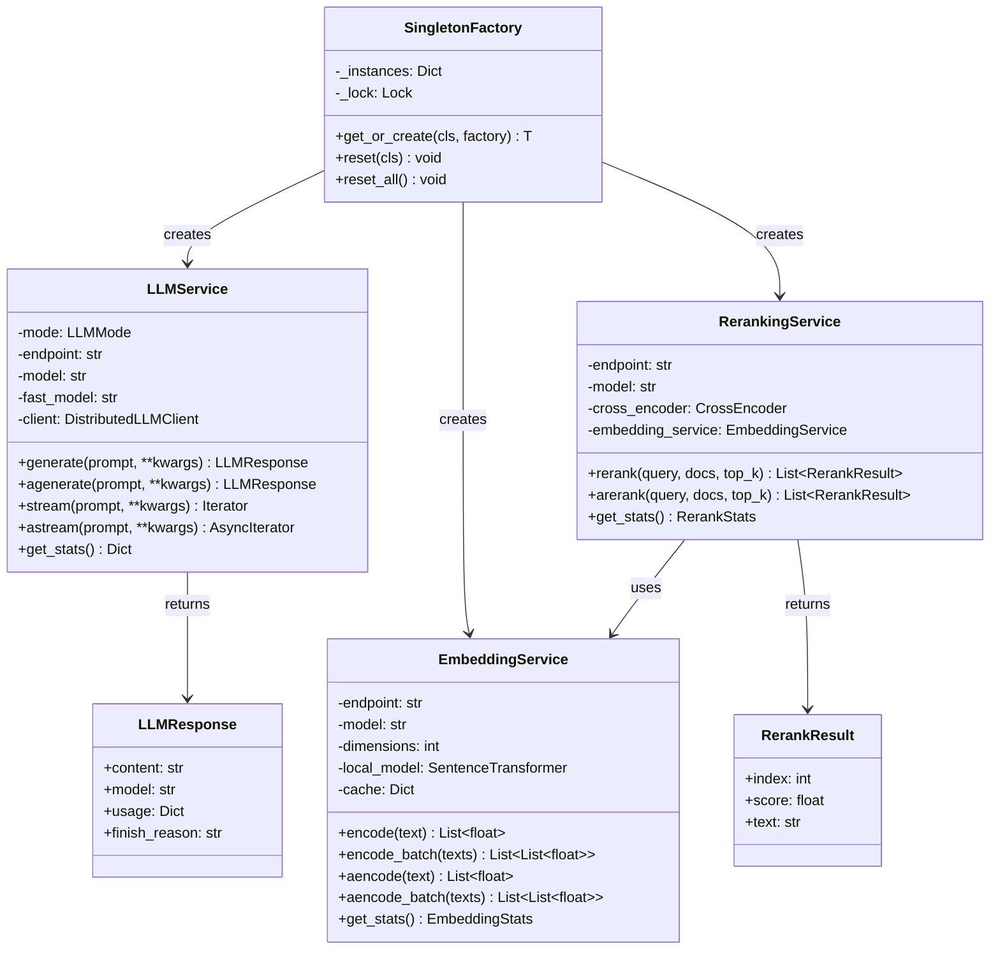
```mermaid
classDiagram
    class LLMService {
        -mode: LLMMode
        -endpoint: str
        -model: str
        -fast_model: str
        -client: DistributedLLMClient
        +generate(prompt, **kwargs) LLMResponse
        +agenerate(prompt, **kwargs) LLMResponse
        +stream(prompt, **kwargs) Iterator
        +astream(prompt, **kwargs) AsyncIterator
        +get_stats() Dict
    }
    
    class EmbeddingService {
        -endpoint: str
        -model: str
        -dimensions: int
        -local_model: SentenceTransformer
        -cache: Dict
        +encode(text) List~float~
        +encode_batch(texts) List~List~float~~
        +aencode(text) List~float~
        +aencode_batch(texts) List~List~float~~
        +get_stats() EmbeddingStats
    }
    
    class RerankingService {
        -endpoint: str
        -model: str
        -cross_encoder: CrossEncoder
        -embedding_service: EmbeddingService
        +rerank(query, docs, top_k) List~RerankResult~
        +arerank(query, docs, top_k) List~RerankResult~
        +get_stats() RerankStats
    }
    
    class LLMResponse {
        +content: str
        +model: str
        +usage: Dict
        +finish_reason: str
    }
    
    class RerankResult {
        +index: int
        +score: float
        +text: str
    }
    
    class SingletonFactory {
        -_instances: Dict
        -_lock: Lock
        +get_or_create(cls, factory) T
        +reset(cls) void
        +reset_all() void
    }
    
    LLMService --> LLMResponse : returns
    RerankingService --> RerankResult : returns
    RerankingService --> EmbeddingService : uses
    SingletonFactory --> LLMService : creates
    SingletonFactory --> EmbeddingService : creates
    SingletonFactory --> RerankingService : creates
```

### LLM Service Sequence Diagram

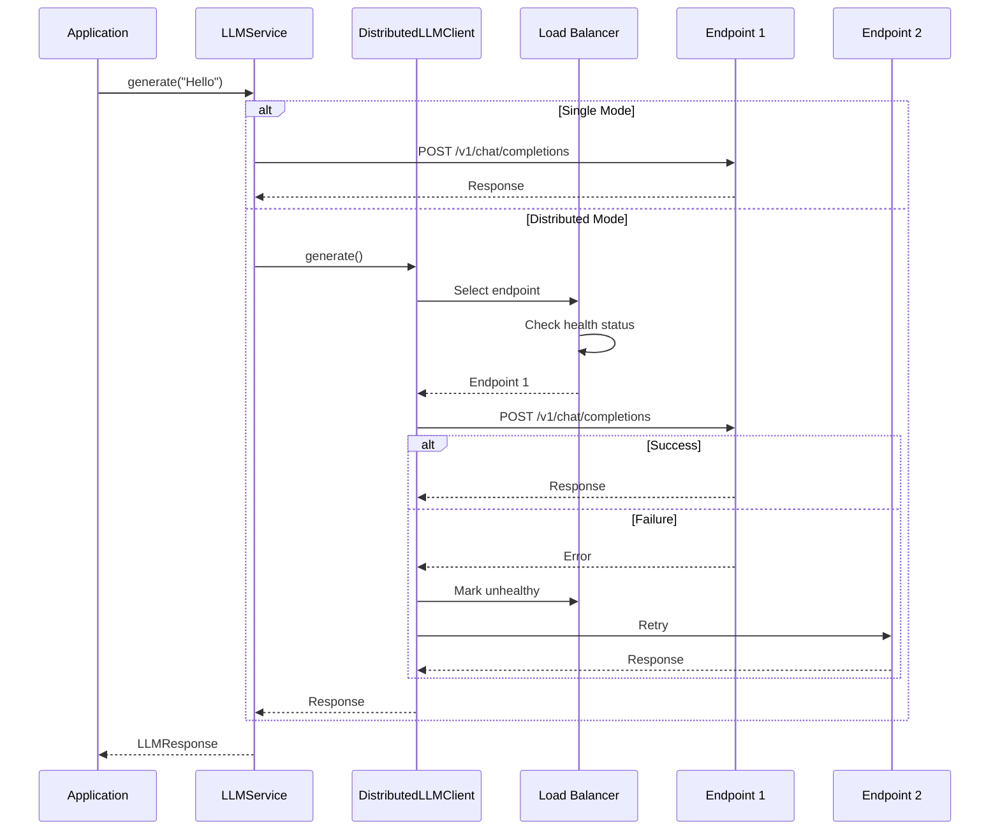
```mermaid
sequenceDiagram
    participant App as Application
    participant LLM as LLMService
    participant Dist as DistributedLLMClient
    participant LB as Load Balancer
    participant EP1 as Endpoint 1
    participant EP2 as Endpoint 2

    App->>LLM: generate("Hello")
    
    alt Single Mode
        LLM->>EP1: POST /v1/chat/completions
        EP1-->>LLM: Response
    else Distributed Mode
        LLM->>Dist: generate()
        Dist->>LB: Select endpoint
        LB->>LB: Check health status
        LB-->>Dist: Endpoint 1
        Dist->>EP1: POST /v1/chat/completions
        
        alt Success
            EP1-->>Dist: Response
        else Failure
            EP1-->>Dist: Error
            Dist->>LB: Mark unhealthy
            Dist->>EP2: Retry
            EP2-->>Dist: Response
        end
        
        Dist-->>LLM: Response
    end
    
    LLM-->>App: LLMResponse
```

### Embedding Service Sequence Diagram

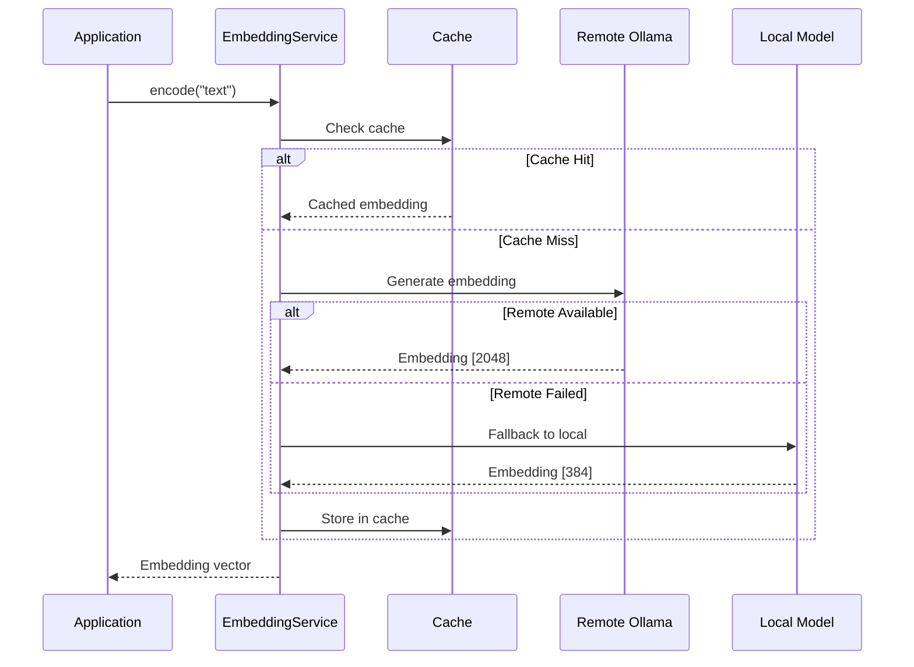
```mermaid
sequenceDiagram
    participant App as Application
    participant EMB as EmbeddingService
    participant Cache as Cache
    participant Remote as Remote Ollama
    participant Local as Local Model

    App->>EMB: encode("text")
    EMB->>Cache: Check cache
    
    alt Cache Hit
        Cache-->>EMB: Cached embedding
    else Cache Miss
        EMB->>Remote: Generate embedding
        
        alt Remote Available
            Remote-->>EMB: Embedding [2048]
        else Remote Failed
            EMB->>Local: Fallback to local
            Local-->>EMB: Embedding [384]
        end
        
        EMB->>Cache: Store in cache
    end
    
    EMB-->>App: Embedding vector
```

### Reranking Service Fallback

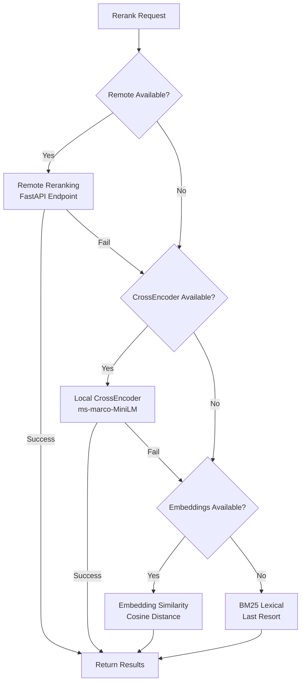
```mermaid
flowchart TD
    Start[Rerank Request] --> R1{Remote Available?}
    
    R1 -->|Yes| Remote[Remote Reranking<br/>FastAPI Endpoint]
    R1 -->|No| R2{CrossEncoder Available?}
    
    Remote -->|Success| Done[Return Results]
    Remote -->|Fail| R2
    
    R2 -->|Yes| Cross[Local CrossEncoder<br/>ms-marco-MiniLM]
    R2 -->|No| R3{Embeddings Available?}
    
    Cross -->|Success| Done
    Cross -->|Fail| R3
    
    R3 -->|Yes| Embed[Embedding Similarity<br/>Cosine Distance]
    R3 -->|No| BM25[BM25 Lexical<br/>Last Resort]
    
    Embed --> Done
    BM25 --> Done
```

---

## Intelligence Layer

### Emotion Detection Flow

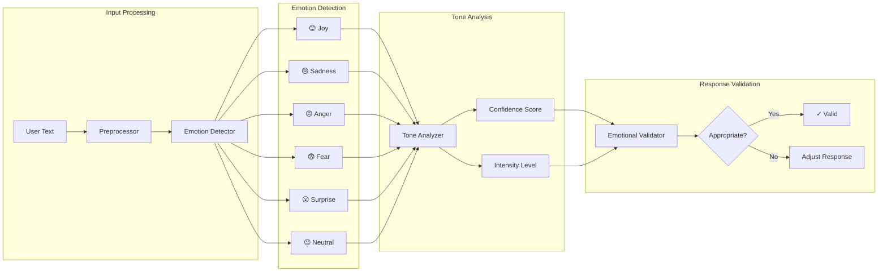
```mermaid
flowchart LR
    subgraph Input["Input Processing"]
        T[User Text] --> PP[Preprocessor]
        PP --> ED[Emotion Detector]
    end
    
    subgraph Detection["Emotion Detection"]
        ED --> Joy[😊 Joy]
        ED --> Sad[😢 Sadness]
        ED --> Ang[😠 Anger]
        ED --> Fear[😨 Fear]
        ED --> Sur[😮 Surprise]
        ED --> Neu[😐 Neutral]
    end
    
    subgraph Analysis["Tone Analysis"]
        Joy & Sad & Ang & Fear & Sur & Neu --> TA[Tone Analyzer]
        TA --> Conf[Confidence Score]
        TA --> Intensity[Intensity Level]
    end
    
    subgraph Validation["Response Validation"]
        Conf & Intensity --> EV[Emotional Validator]
        EV --> Appropriate{Appropriate?}
        Appropriate -->|Yes| Pass[✓ Valid]
        Appropriate -->|No| Adjust[Adjust Response]
    end
```

### Empathy Generation Pipeline

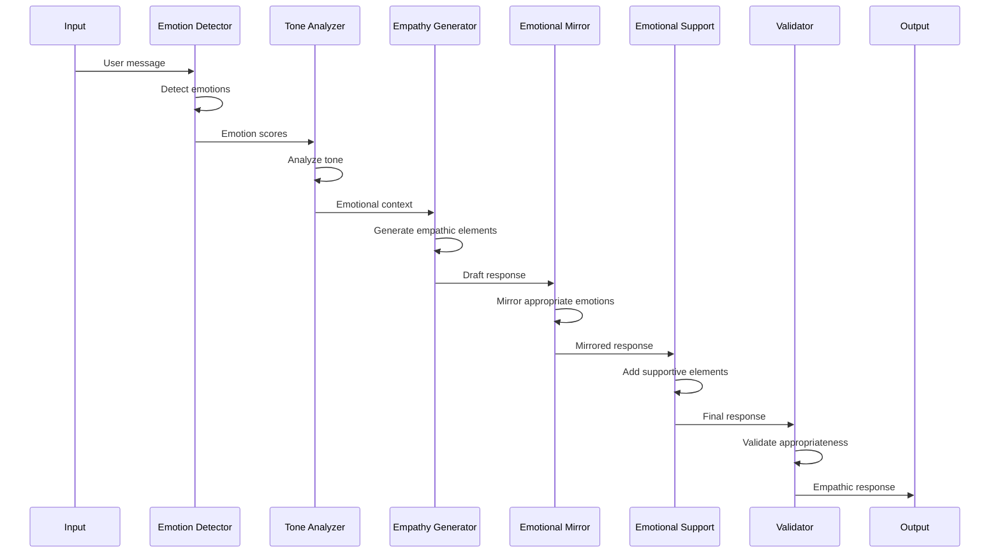
```mermaid
sequenceDiagram
    participant I as Input
    participant ED as Emotion Detector
    participant TA as Tone Analyzer
    participant EG as Empathy Generator
    participant EM as Emotional Mirror
    participant ES as Emotional Support
    participant V as Validator
    participant O as Output

    I->>ED: User message
    ED->>ED: Detect emotions
    ED->>TA: Emotion scores
    TA->>TA: Analyze tone
    TA->>EG: Emotional context
    EG->>EG: Generate empathic elements
    EG->>EM: Draft response
    EM->>EM: Mirror appropriate emotions
    EM->>ES: Mirrored response
    ES->>ES: Add supportive elements
    ES->>V: Final response
    V->>V: Validate appropriateness
    V->>O: Empathic response
```

---

## Memory System

### Memory Architecture

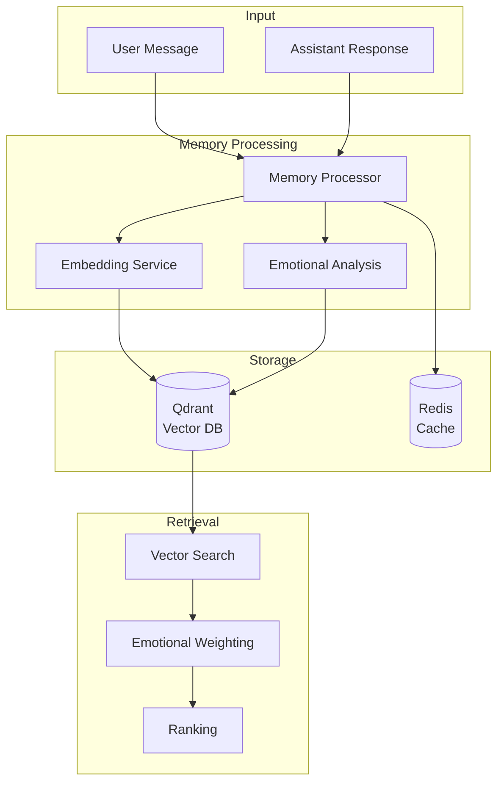
```mermaid
graph TB
    subgraph Input["Input"]
        MSG[User Message]
        RSP[Assistant Response]
    end
    
    subgraph Processing["Memory Processing"]
        MP[Memory Processor]
        ES[Embedding Service]
        EA[Emotional Analysis]
    end
    
    subgraph Storage["Storage"]
        Q[(Qdrant<br/>Vector DB)]
        R[(Redis<br/>Cache)]
    end
    
    subgraph Retrieval["Retrieval"]
        VS[Vector Search]
        EW[Emotional Weighting]
        RK[Ranking]
    end
    
    MSG & RSP --> MP
    MP --> ES --> Q
    MP --> EA --> Q
    MP --> R
    
    Q --> VS --> EW --> RK
```

### Memory Storage Sequence

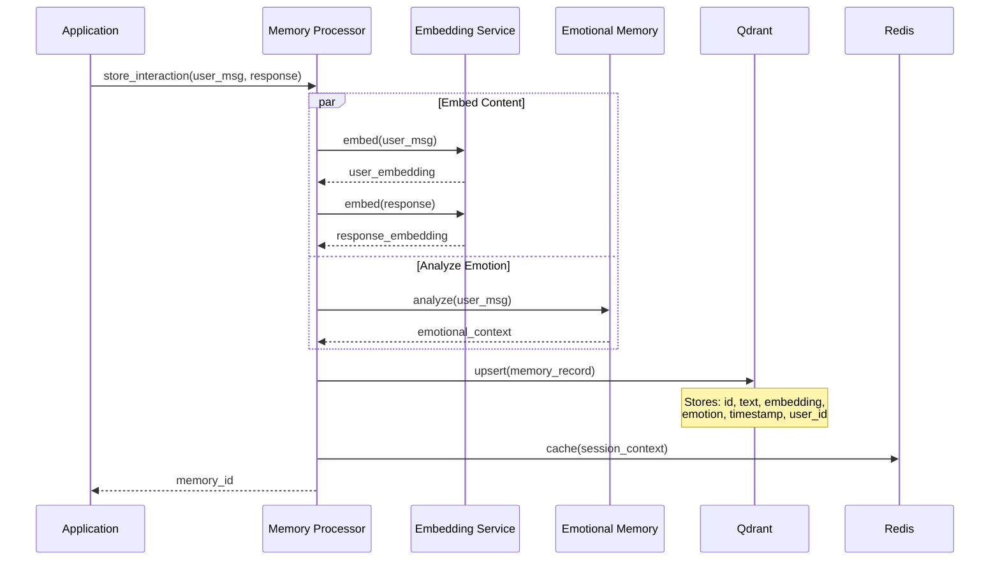
```mermaid
sequenceDiagram
    participant A as Application
    participant MP as Memory Processor
    participant ES as Embedding Service
    participant EM as Emotional Memory
    participant Q as Qdrant
    participant R as Redis

    A->>MP: store_interaction(user_msg, response)
    
    par Embed Content
        MP->>ES: embed(user_msg)
        ES-->>MP: user_embedding
        MP->>ES: embed(response)
        ES-->>MP: response_embedding
    and Analyze Emotion
        MP->>EM: analyze(user_msg)
        EM-->>MP: emotional_context
    end
    
    MP->>Q: upsert(memory_record)
    Note over Q: Stores: id, text, embedding,<br/>emotion, timestamp, user_id
    
    MP->>R: cache(session_context)
    
    MP-->>A: memory_id
```

### Memory Retrieval Sequence

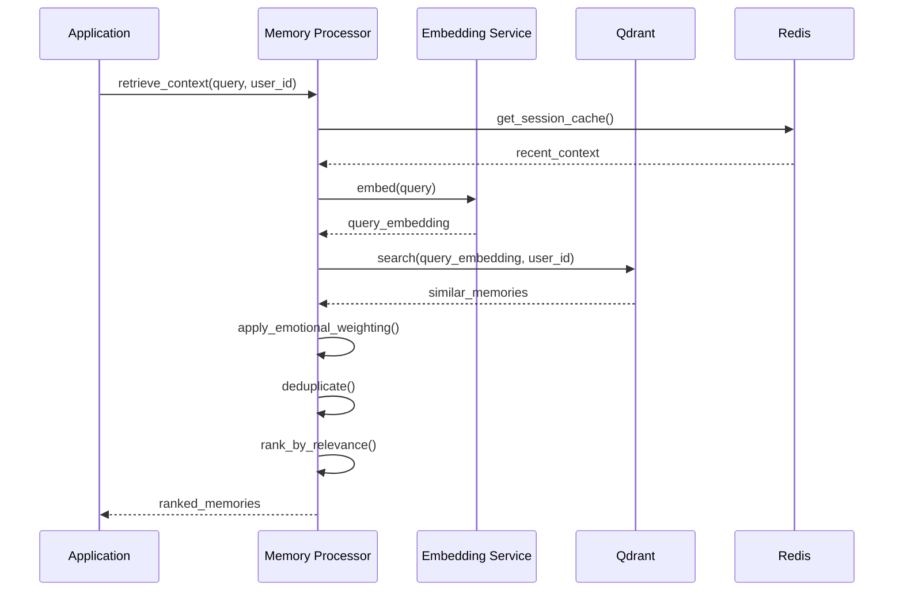
```mermaid
sequenceDiagram
    participant A as Application
    participant MP as Memory Processor
    participant ES as Embedding Service
    participant Q as Qdrant
    participant R as Redis

    A->>MP: retrieve_context(query, user_id)
    
    MP->>R: get_session_cache()
    R-->>MP: recent_context
    
    MP->>ES: embed(query)
    ES-->>MP: query_embedding
    
    MP->>Q: search(query_embedding, user_id)
    Q-->>MP: similar_memories
    
    MP->>MP: apply_emotional_weighting()
    MP->>MP: deduplicate()
    MP->>MP: rank_by_relevance()
    
    MP-->>A: ranked_memories
```

---

## Search Pipeline

### Multi-Stage Search Architecture

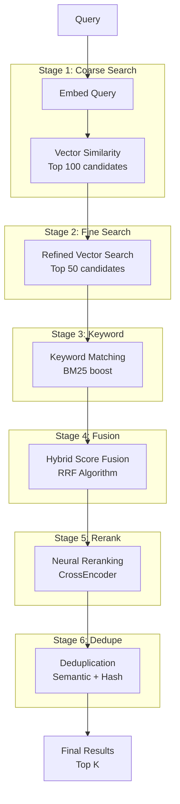
```mermaid
flowchart TD
    Q[Query] --> E[Embed Query]
    
    subgraph Stage1["Stage 1: Coarse Search"]
        E --> CS[Vector Similarity<br/>Top 100 candidates]
    end
    
    subgraph Stage2["Stage 2: Fine Search"]
        CS --> FS[Refined Vector Search<br/>Top 50 candidates]
    end
    
    subgraph Stage3["Stage 3: Keyword"]
        FS --> KW[Keyword Matching<br/>BM25 boost]
    end
    
    subgraph Stage4["Stage 4: Fusion"]
        KW --> HF[Hybrid Score Fusion<br/>RRF Algorithm]
    end
    
    subgraph Stage5["Stage 5: Rerank"]
        HF --> RR[Neural Reranking<br/>CrossEncoder]
    end
    
    subgraph Stage6["Stage 6: Dedupe"]
        RR --> DD[Deduplication<br/>Semantic + Hash]
    end
    
    DD --> R[Final Results<br/>Top K]
```

### Search Sequence Diagram

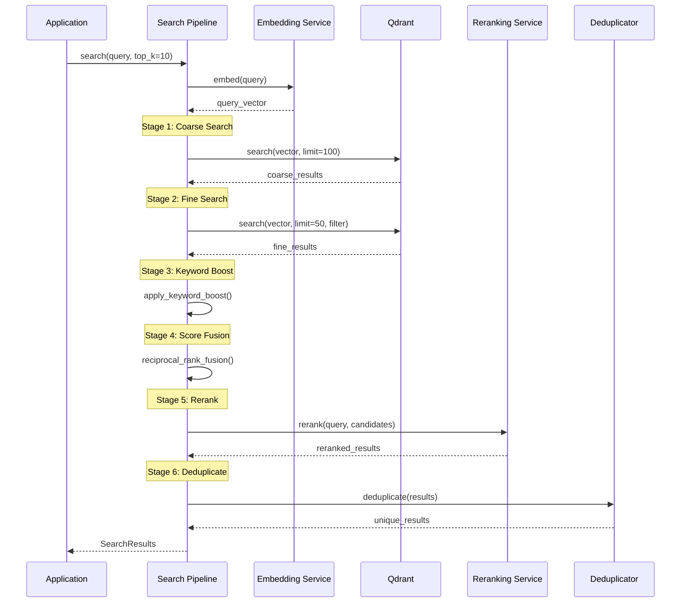
```mermaid
sequenceDiagram
    participant A as Application
    participant SP as Search Pipeline
    participant ES as Embedding Service
    participant Q as Qdrant
    participant RR as Reranking Service
    participant DD as Deduplicator

    A->>SP: search(query, top_k=10)
    
    SP->>ES: embed(query)
    ES-->>SP: query_vector
    
    Note over SP: Stage 1: Coarse Search
    SP->>Q: search(vector, limit=100)
    Q-->>SP: coarse_results
    
    Note over SP: Stage 2: Fine Search
    SP->>Q: search(vector, limit=50, filter)
    Q-->>SP: fine_results
    
    Note over SP: Stage 3: Keyword Boost
    SP->>SP: apply_keyword_boost()
    
    Note over SP: Stage 4: Score Fusion
    SP->>SP: reciprocal_rank_fusion()
    
    Note over SP: Stage 5: Rerank
    SP->>RR: rerank(query, candidates)
    RR-->>SP: reranked_results
    
    Note over SP: Stage 6: Deduplicate
    SP->>DD: deduplicate(results)
    DD-->>SP: unique_results
    
    SP-->>A: SearchResults
```

---

## Infrastructure Layer

### Distributed LLM Architecture

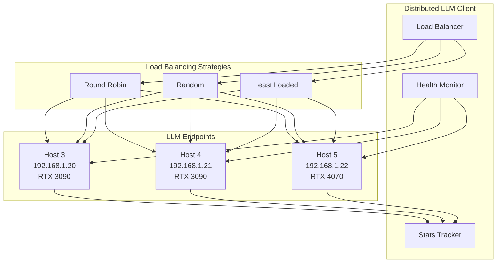
```mermaid
graph TB
    subgraph Client["Distributed LLM Client"]
        LB[Load Balancer]
        HM[Health Monitor]
        ST[Stats Tracker]
    end
    
    subgraph Strategies["Load Balancing Strategies"]
        RR[Round Robin]
        RD[Random]
        LL[Least Loaded]
    end
    
    subgraph Endpoints["LLM Endpoints"]
        E1[Host 3<br/>192.168.1.20<br/>RTX 3090]
        E2[Host 4<br/>192.168.1.21<br/>RTX 3090]
        E3[Host 5<br/>192.168.1.22<br/>RTX 4070]
    end
    
    LB --> RR & RD & LL
    RR & RD & LL --> E1 & E2 & E3
    HM --> E1 & E2 & E3
    E1 & E2 & E3 --> ST
```

### Health Monitoring Flow

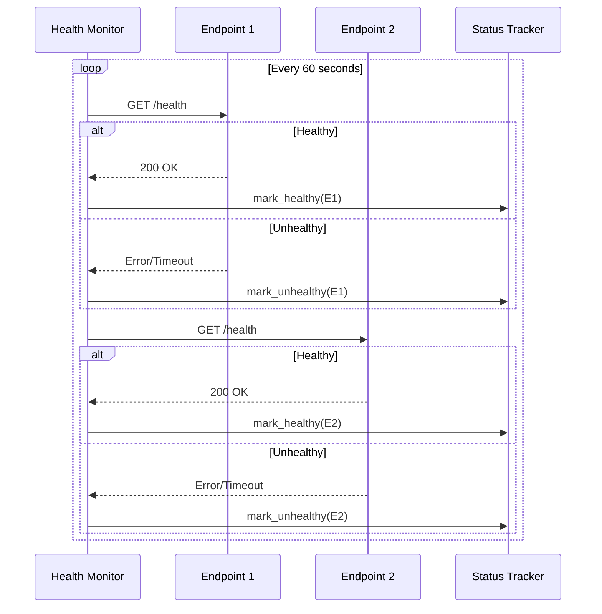
```mermaid
sequenceDiagram
    participant HM as Health Monitor
    participant E1 as Endpoint 1
    participant E2 as Endpoint 2
    participant ST as Status Tracker

    loop Every 60 seconds
        HM->>E1: GET /health
        alt Healthy
            E1-->>HM: 200 OK
            HM->>ST: mark_healthy(E1)
        else Unhealthy
            E1-->>HM: Error/Timeout
            HM->>ST: mark_unhealthy(E1)
        end
        
        HM->>E2: GET /health
        alt Healthy
            E2-->>HM: 200 OK
            HM->>ST: mark_healthy(E2)
        else Unhealthy
            E2-->>HM: Error/Timeout
            HM->>ST: mark_unhealthy(E2)
        end
    end
```

### Failover Mechanism

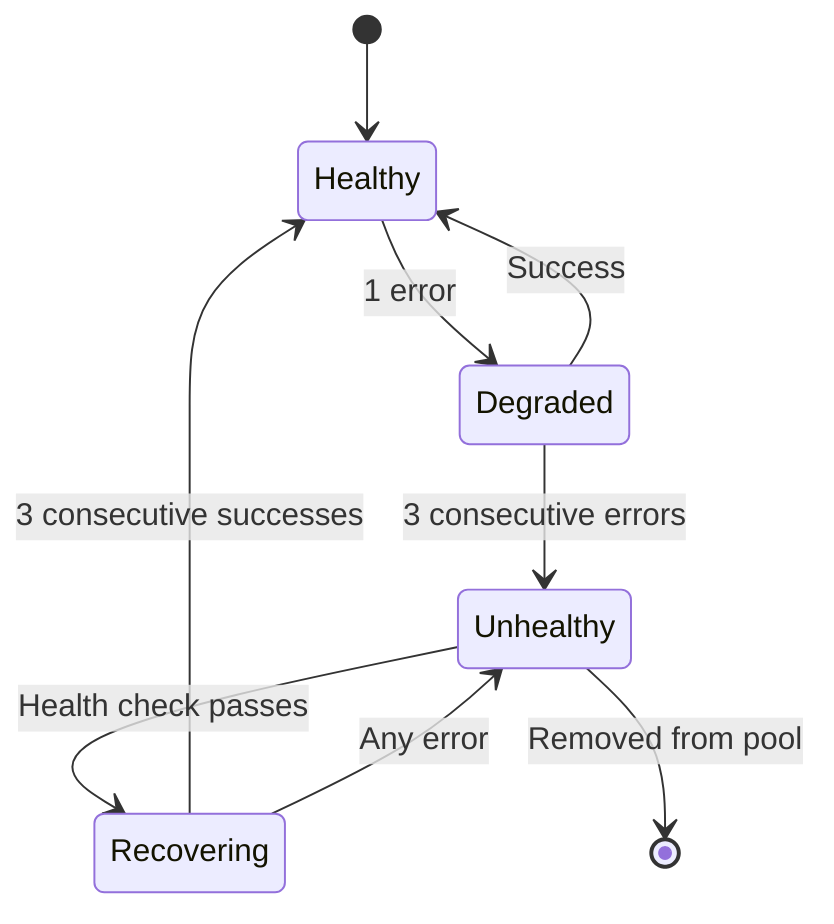
```mermaid
stateDiagram-v2
    [*] --> Healthy
    
    Healthy --> Degraded: 1 error
    Degraded --> Healthy: Success
    Degraded --> Unhealthy: 3 consecutive errors
    
    Unhealthy --> Recovering: Health check passes
    Recovering --> Healthy: 3 consecutive successes
    Recovering --> Unhealthy: Any error
    
    Unhealthy --> [*]: Removed from pool
```

---

## Exception Hierarchy

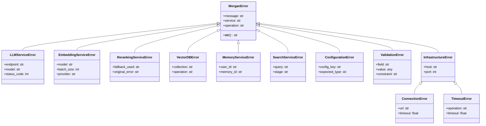
```mermaid
classDiagram
    class MorganError {
        +message: str
        +service: str
        +operation: str
        +__str__() str
    }
    
    class LLMServiceError {
        +endpoint: str
        +model: str
        +status_code: int
    }
    
    class EmbeddingServiceError {
        +model: str
        +batch_size: int
        +provider: str
    }
    
    class RerankingServiceError {
        +fallback_used: str
        +original_error: str
    }
    
    class VectorDBError {
        +collection: str
        +operation: str
    }
    
    class MemoryServiceError {
        +user_id: str
        +memory_id: str
    }
    
    class SearchServiceError {
        +query: str
        +stage: str
    }
    
    class ConfigurationError {
        +config_key: str
        +expected_type: str
    }
    
    class ValidationError {
        +field: str
        +value: any
        +constraint: str
    }
    
    class InfrastructureError {
        +host: str
        +port: int
    }
    
    class ConnectionError {
        +url: str
        +timeout: float
    }
    
    class TimeoutError {
        +operation: str
        +timeout: float
    }
    
    MorganError <|-- LLMServiceError
    MorganError <|-- EmbeddingServiceError
    MorganError <|-- RerankingServiceError
    MorganError <|-- VectorDBError
    MorganError <|-- MemoryServiceError
    MorganError <|-- SearchServiceError
    MorganError <|-- ConfigurationError
    MorganError <|-- ValidationError
    MorganError <|-- InfrastructureError
    InfrastructureError <|-- ConnectionError
    InfrastructureError <|-- TimeoutError
```

---

## Configuration

### Configuration Flow

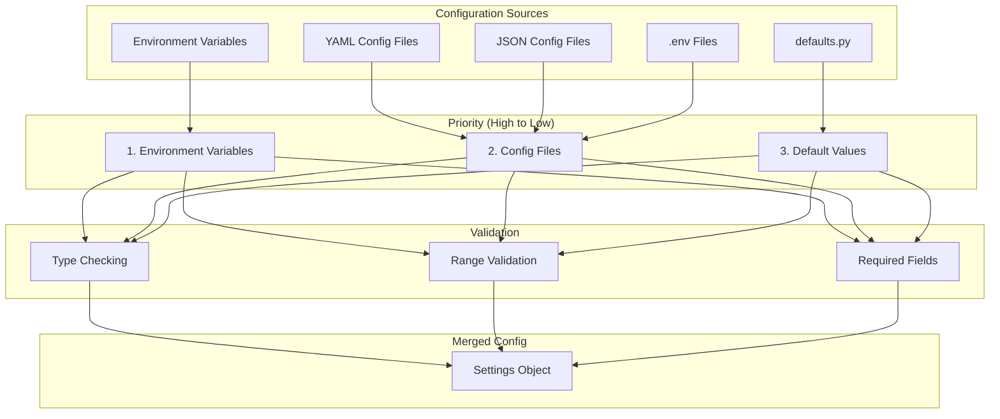
```mermaid
flowchart TD
    subgraph Sources["Configuration Sources"]
        ENV[Environment Variables]
        YAML[YAML Config Files]
        JSON[JSON Config Files]
        DOTENV[.env Files]
        DEF[defaults.py]
    end
    
    subgraph Priority["Priority (High to Low)"]
        P1[1. Environment Variables]
        P2[2. Config Files]
        P3[3. Default Values]
    end
    
    subgraph Validation["Validation"]
        V1[Type Checking]
        V2[Range Validation]
        V3[Required Fields]
    end
    
    subgraph Output["Merged Config"]
        CFG[Settings Object]
    end
    
    ENV --> P1
    YAML & JSON & DOTENV --> P2
    DEF --> P3
    
    P1 & P2 & P3 --> V1 & V2 & V3
    V1 & V2 & V3 --> CFG
```

### Key Configuration Values

```python
from morgan.config.defaults import Defaults

# LLM Defaults
Defaults.LLM_ENDPOINT = "http://localhost:11434/v1"
Defaults.LLM_MODEL = "qwen2.5:32b-instruct-q4_K_M"
Defaults.LLM_FAST_MODEL = "qwen2.5:7b-instruct-q5_K_M"

# Embedding Defaults
Defaults.EMBEDDING_ENDPOINT = "http://localhost:11434/v1"
Defaults.EMBEDDING_MODEL = "qwen3-embedding:4b"
Defaults.EMBEDDING_DIMENSIONS = 2048

# Reranking Defaults
Defaults.RERANKING_ENDPOINT = "http://localhost:8080/rerank"
Defaults.RERANKING_MODEL = "cross-encoder/ms-marco-MiniLM-L-6-v2"

# Infrastructure Defaults
Defaults.QDRANT_URL = "http://localhost:6333"
Defaults.REDIS_URL = "redis://localhost:6379"
```

---

## Performance Targets

| Operation | Target | Status | Notes |
|-----------|--------|--------|-------|
| Embeddings (single) | <50ms | ✅ | With caching |
| Embeddings (batch 100) | <200ms | ✅ | Parallel processing |
| Vector search | <100ms | ✅ | Qdrant optimized |
| Reranking (top 50) | <300ms | ✅ | CrossEncoder |
| Search + rerank | <500ms | ✅ | Full pipeline |
| Simple LLM query | 1-2s | ⏳ | Fast model |
| Complex LLM query | 5-10s | ⏳ | Main model |

---

## Testing

### Test Structure

```
morgan-rag/tests/
├── unit/
│   ├── test_llm_service.py
│   ├── test_embedding_service.py
│   ├── test_reranking_service.py
│   └── test_memory_processor.py
├── integration/
│   ├── test_search_pipeline.py
│   ├── test_distributed_llm.py
│   └── test_full_flow.py
└── conftest.py
```

### Running Tests

```bash
# All tests
pytest tests/

# With coverage
pytest --cov=morgan tests/

# Specific module
pytest tests/unit/test_llm_service.py

# Integration tests
pytest tests/integration/ -v
```

---

## License

```
Copyright 2025 Morgan AI Assistant Contributors
Licensed under the Apache License, Version 2.0
```

See [LICENSE](../../LICENSE) for the full license text.

---

**Morgan RAG** - The intelligent core of Morgan AI Assistant.
