# Morgan RAG - Architecture Documentation

**Last Updated**: December 26, 2025

## Overview

Morgan RAG is the core intelligence engine of the Morgan AI Assistant. It provides:

- **Unified Services Layer** - Clean access to LLM, embeddings, and reranking
- **Emotional Intelligence** - Emotion detection, empathy, and relationship management
- **Memory System** - Conversation memory with emotional context
- **Search Pipeline** - Multi-stage semantic search with reranking
- **Distributed Infrastructure** - Scale across multiple hosts

---

## System Architecture

### High-Level Architecture


### Layer Responsibilities


---

## Directory Structure


### Full Directory Layout

```
morgan-rag/morgan/
├── services/                    # Unified Services Layer
│   ├── __init__.py              # Service exports
│   ├── llm/                     # LLM Service
│   │   ├── __init__.py
│   │   ├── models.py            # LLMResponse, LLMMode
│   │   └── service.py           # LLMService class
│   ├── embeddings/              # Embedding Service
│   │   ├── __init__.py
│   │   ├── models.py            # EmbeddingStats
│   │   └── service.py           # EmbeddingService class
│   ├── reranking/               # Reranking Service
│   │   ├── __init__.py
│   │   ├── models.py            # RerankResult, RerankStats
│   │   └── service.py           # RerankingService class
│   └── external_knowledge/      # External Knowledge Sources
│       ├── context7.py
│       ├── mcp_client.py
│       └── web_search.py
│
├── infrastructure/              # Infrastructure Layer
│   ├── __init__.py
│   ├── distributed_llm.py       # Distributed LLM with load balancing
│   ├── distributed_gpu_manager.py
│   ├── multi_gpu_manager.py
│   └── factory.py               # Infrastructure factory
│
├── intelligence/                # Emotional Intelligence
│   ├── emotions/
│   │   ├── detector.py          # EmotionDetector
│   │   └── memory.py            # Emotional memory
│   ├── empathy/
│   │   ├── generator.py         # EmpathyGenerator
│   │   ├── mirror.py            # EmotionalMirror
│   │   ├── support.py           # EmotionalSupport
│   │   ├── tone.py              # ToneAnalyzer
│   │   └── validator.py         # ResponseValidator
│   └── core/
│       └── intelligence_engine.py
│
├── memory/                      # Memory System
│   └── memory_processor.py
│
├── search/                      # Search Pipeline
│   ├── multi_stage_search.py
│   └── reranker.py
│
├── learning/                    # Pattern Learning
│   ├── engine.py
│   └── patterns.py
│
├── config/                      # Configuration
│   ├── defaults.py
│   ├── settings.py
│   └── distributed_config.py
│
├── utils/                       # Utilities
│   ├── singleton.py
│   ├── model_cache.py
│   ├── deduplication.py
│   └── logger.py
│
└── exceptions.py                # Exception hierarchy
```

---

## Services Layer

### Service Class Diagram


### LLM Service Sequence Diagram


### Embedding Service Sequence Diagram


### Reranking Service Fallback


---

## Intelligence Layer

### Emotion Detection Flow

```mermaid
flowchart LR
    subgraph Input["Input Processing"]
        T[User Text] --> PP[Preprocessor]
        PP --> ED[Emotion Detector]
    end
    
    subgraph Detection["Emotion Detection"]
        ED --> Joy[😊 Joy]
        ED --> Sad[😢 Sadness]
        ED --> Ang[😠 Anger]
        ED --> Fear[😨 Fear]
        ED --> Sur[😮 Surprise]
        ED --> Neu[😐 Neutral]
    end
    
    subgraph Analysis["Tone Analysis"]
        Joy & Sad & Ang & Fear & Sur & Neu --> TA[Tone Analyzer]
        TA --> Conf[Confidence Score]
        TA --> Intensity[Intensity Level]
    end
    
    subgraph Validation["Response Validation"]
        Conf & Intensity --> EV[Emotional Validator]
        EV --> Appropriate{Appropriate?}
        Appropriate -->|Yes| Pass[✓ Valid]
        Appropriate -->|No| Adjust[Adjust Response]
    end
```



### Empathy Generation Pipeline


---

## Memory System

### Memory Architecture


### Memory Storage Sequence


### Memory Retrieval Sequence


---

## Search Pipeline

### Multi-Stage Search Architecture


### Search Sequence Diagram


---

## Infrastructure Layer

### Distributed LLM Architecture


### Health Monitoring Flow


### Failover Mechanism


---

## Exception Hierarchy


---

## Configuration

### Configuration Flow


### Key Configuration Values

```python
from morgan.config.defaults import Defaults

# LLM Defaults
Defaults.LLM_ENDPOINT = "http://localhost:11434/v1"
Defaults.LLM_MODEL = "qwen2.5:32b-instruct-q4_K_M"
Defaults.LLM_FAST_MODEL = "qwen2.5:7b-instruct-q5_K_M"

# Embedding Defaults
Defaults.EMBEDDING_ENDPOINT = "http://localhost:11434/v1"
Defaults.EMBEDDING_MODEL = "qwen3-embedding:4b"
Defaults.EMBEDDING_DIMENSIONS = 2048

# Reranking Defaults
Defaults.RERANKING_ENDPOINT = "http://localhost:8080/rerank"
Defaults.RERANKING_MODEL = "cross-encoder/ms-marco-MiniLM-L-6-v2"

# Infrastructure Defaults
Defaults.QDRANT_URL = "http://localhost:6333"
Defaults.REDIS_URL = "redis://localhost:6379"
```

---

## Performance Targets

| Operation | Target | Status | Notes |
|-----------|--------|--------|-------|
| Embeddings (single) | <50ms | ✅ | With caching |
| Embeddings (batch 100) | <200ms | ✅ | Parallel processing |
| Vector search | <100ms | ✅ | Qdrant optimized |
| Reranking (top 50) | <300ms | ✅ | CrossEncoder |
| Search + rerank | <500ms | ✅ | Full pipeline |
| Simple LLM query | 1-2s | ⏳ | Fast model |
| Complex LLM query | 5-10s | ⏳ | Main model |

---

## Testing

### Test Structure

```
morgan-rag/tests/
├── unit/
│   ├── test_llm_service.py
│   ├── test_embedding_service.py
│   ├── test_reranking_service.py
│   └── test_memory_processor.py
├── integration/
│   ├── test_search_pipeline.py
│   ├── test_distributed_llm.py
│   └── test_full_flow.py
└── conftest.py
```

### Running Tests

```bash
# All tests
pytest tests/

# With coverage
pytest --cov=morgan tests/

# Specific module
pytest tests/unit/test_llm_service.py

# Integration tests
pytest tests/integration/ -v
```

---

## License

```
Copyright 2025 Morgan AI Assistant Contributors
Licensed under the Apache License, Version 2.0
```

See [LICENSE](../../LICENSE) for the full license text.

---

**Morgan RAG** - The intelligent core of Morgan AI Assistant.
